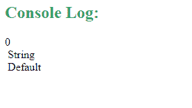

# JavaScript 符号. Symbol.toPrimitive 属性

> 原文: [https://www.geeksforgeeks.org/javascript-symbol-toprimitive-property/](https://www.geeksforgeeks.org/javascript-symbol-toprimitive-property/)

在 Javascript 中，通过使用 `Symbol.toPrimitive` 属性（用作函数值），可以将对象转换为其对应的基元值。要调用该函数，需要传递一个名为 `hint` 的字符串参数。`hint` 参数指定结果基元值的首选返回类型。`hint` 参数可以将 `'number'`、`'string'` 和 `'default'` 作为它的值。

## 示例

```html
<script>
    function myFunction() {

// Creation of an object with the 
        // Symbol.toPrimitive property 
        const obj2 = {
            [Symbol.toPrimitive](hint) {

// If hint is number 
                if (hint === 'number') {
                    return 0;
                }

// If the hint is string
                if (hint == 'string') {
                    return 'String';
                }

// If hint is default
                if (hint == 'default') {
                    return 'Default';
                }
            }
        };

// Hint passed is integer
        console.log(+obj2);

// Hint passed is string
        console.log(`${obj2}`);

// Hint passed is default
        console.log(obj2 + '');
    }
    myFunction();
</script>
```

## 输出



在上面的示例中，根据参数中传递的提示类型，我们获得了所需的输出。