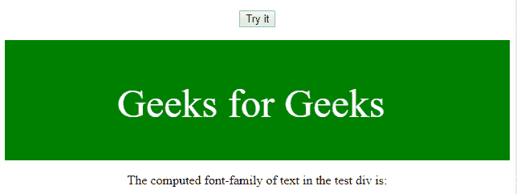
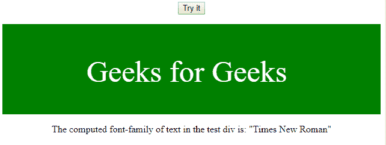

# JavaScript | Window getComputedStyle()方法

> 原文: [https://www.geeksforgeeks.org/javascript-window-getcomputedstyle-method/](https://www.geeksforgeeks.org/javascript-window-getcomputedstyle-method/)

`getComputedStyle()`方法用于获取指定元素的所有计算出的 CSS 属性和值。计算样式的使用是在应用了来自多个来源的样式之后显示元素。方法返回一个 `CSSStyleDeclaration` 对象。

## 语法:

```
window.getComputedStyle(element, pseudoElement)
```

## 参数:

*   `element`: 为其获取计算样式的元素
*   `pseudoElement`: 要获取的伪元素。这是一个可选参数。

## 示例: 返回 div 中文本的字体系列。

```html
<!DOCTYPE html>
<html>

<head>
    <title>
        HTML | DOM Window getComputedStyle() Method
    </title>

    <style>
        div {
            color: white;
            text-align: justify;
        }
    </style>
</head>

<body>
    <center>
        <p>
            <button onclick="myFunction()">
                Try it
            </button>
        </p>
        <div id="test" style="height: 100px; 
                    background-color: green; 
                    font-size: 50px;
                    padding-left: 140px;
                    padding-top: 50px;">
            Geeks for Geeks
        </div>
        <p>
          The computed font-family of text 
          in the test div is:
          <span id="demo"></span>
        </p>

        <script>
            function myFunction() {
                var elem = document.getElementById("test");
                var theCSSprop =
                    window.getComputedStyle(
                        elem, null).getPropertyValue("font-family");
                document.getElementById("demo").innerHTML = 
                                  theCSSprop;
            }
        </script>
    </center>
</body>

</html>
```

## 输出:

**点击按钮前:**


**点击按钮后:**


## 支持的浏览器:

以下是 `Window getComputedStyle()`方法支持的浏览器:

*   谷歌 Chrome 11.0
*   Internet Explorer 9.0
*   Firefox 4.0
*   歌剧 11.5
*   Safari 5