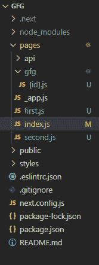
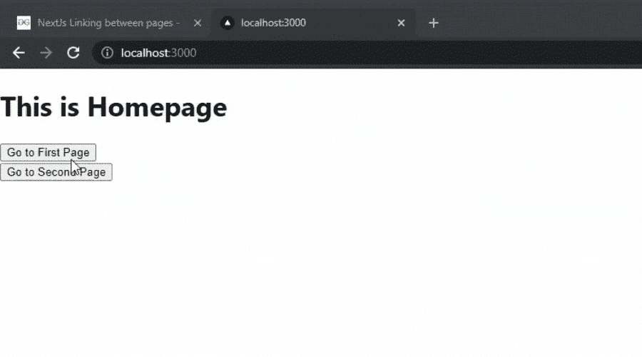

# Next.js 中页面之间的链接

> 原文: [https://www.geeksforgeeks.org/linking-between-pages-in-next-js/](https://www.geeksforgeeks.org/linking-between-pages-in-next-js/)

在本文中，我们将看到如何在 Next.js 中将一个页面链接到另一个页面。

## 创建新的 Next.js 应用程序

要创建新的 Next.js 应用程序，请在您的终端中运行以下命令：

```bash
npx create-next-app GFG
```

创建项目文件夹（即 `GFG`）后，使用以下命令移动到该文件夹：

```bash
cd GFG
```

## 项目结构

项目结构会是这样的。



## 创建页面

首先，我们将在 Next.js 项目中创建两个不同的页面。为此，在 `pages` 文件夹内创建两个名为 `first` 和 `second` 的新 JavaScript 文件。

**文件名: `first.js`**

```javascript
import React from 'react'

export default function first() {
    return (
        <div>
            This is the first page.
        </div>
    )
}
```

**文件名: `second.js`**

```javascript
import React from 'react'

export default function second() {
    return (
        <div>
            This is the second page.
        </div>
    )
}
```

## 链接页面

现在要链接页面，我们将使用 `next/link` 中的 `Link` 组件。我们可以在 `Link` 组件中添加 `<a>` 标签。我们可以在脚本中添加下面一行来导入这个组件。

```javascript
import Link from 'next/link'
```

为了将 `first` 和 `second` 页面与主页链接起来，我们将在 `pages` 文件夹的 `index.js` 文件中添加下面的行。

**文件名: `index.js`**

```javascript
// Importing the Link component
import Link from 'next/link'

export default function Home() {
    return (
        <div>
            {/* Adding Heading */}
            <h1>
                This is Homepage
            </h1>

            {/* Adding the Link Component */}
            <Link href="/first">
                <a><button>Go to First Page</button></a>
            </Link>
            <br />
            <Link href="/second">
                <a><button>Go to Second Page</button></a>
            </Link>
        </div>
    )
}
```

**文件名: `first.js`**

现在我们也要在 `first` 和 `second` 页面中添加 `Link` 组件。

```javascript
// Importing the Link component
import Link from 'next/link'

export default function first() {
    return (
        <div>
            This is the first page.
            <br />
            {/* Adding the Link Component */}
            <Link href="/first">
                <a><button>Go to First Page</button></a>
            </Link>
            <br />
            <Link href="/second">
                <a><button>Go to Second Page</button></a>
            </Link>
        </div>
    )
}
```

**文件名: `second.js`**

```javascript
// Importing the Link component
import Link from 'next/link'

export default function second() {
    return (
        <div>
            This is the second page.
            <br />
            {/* Adding the Link Component */}
            <Link href="/first">
                <a><button>Go to First Page</button></a>
            </Link>
            <br />
            <Link href="/second">
                <a><button>Go to Second Page</button></a>
            </Link>
        </div>
    )
}
```

## 运行应用程序

现在使用以下命令运行应用程序：

```bash
npm start
```

## 输出

