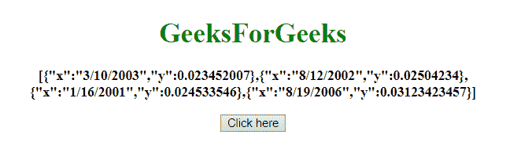
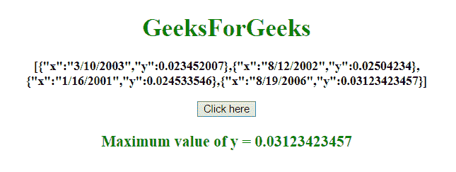
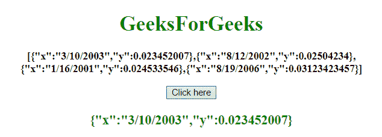

# JavaScript 中对象数组中属性的最大/最小值

> 原文: [https://www.geeksforgeeks.org/max-min-value-of-an-attribute-in-an-array-of-objects-in-javascript/](https://www.geeksforgeeks.org/max-min-value-of-an-attribute-in-an-array-of-objects-in-javascript/)

给定一个对象数组，任务是从对象数组中获取最大值和最小值。下面讨论使用的几种方法:

## `apply()` 方法
它是一个写入方法，用于不同的对象。此方法与函数 `call()` 的不同之处在于它将参数作为数组接收。

**语法:**
```
apply()
```

**返回值:** 返回给定函数的方法值。

## `Array.map()` 方法
此方法用于创建一个新数组，其结果是调用数组的每个元素上的函数。此方法按顺序为数组中的每个元素调用给定函数一次。

**语法:**
```
array.map(function(cValue, index, arr), thisValue)
```

**参数:**
*   **函数(`cValue`，`index`，`arr`):** 必选参数。它是为数组中的每个元素运行的函数。
    *   **`cValue`:** 必选参数。它指定当前元素的值。
    *   **`index`:** 为可选参数。它指定当前元素的数组索引。
    *   **`arr`:** 为可选参数。它指定当前元素所属的数组对象。
*   **`thisValue`:** 为可选参数。它指定要传递给函数的值，用作它的“this”值。如果不使用，值“undefined”将作为其“this”值传递。

**返回值:** 它返回一个数组，该数组具有为原始数组的每个元素调用提供的函数的结果。

## `Array.reduce()` 方法
此方法将数组缩减为单个值。此方法为数组的每个值运行一个定义的函数（从左到右）。函数的返回值存储在累加器（result 或 total）中。

**语法:**
```
array.reduce(function(total, curValue, curIndex, arr), initialValue)
```

**参数:**
*   **函数(`total`、`curValue`、`curIndex`、`arr`):** 必选参数。它是为数组中的每个元素运行的函数。
    *   **`total`:** 必输参数。它指定 `initialValue`，或者函数先前返回的值。
    *   **`curValue`:** 必选参数。它指定当前元素的值。
    *   **`curIndex`:** 必选参数。它指定当前元素的数组索引。
    *   **`arr`:** 为可选参数。它指定当前元素所属的数组对象。
*   **`initialValue`:** 可选参数。它指定要作为初始值传递给函数的值。

**返回值:** 返回回调函数最后一次调用的累计结果。

## 示例 1
本示例使用 `apply()` 和 `map()` 方法获取 `y` 属性的最大值。

```html
<!DOCTYPE HTML> 
<html> 
    <head> 
        <title> 
            Max value of an attribute in an array of objects
        </title> 
    </head>

<body style = "text-align:center;">

<h1 style = "color:green;" > 
            GeeksForGeeks 
        </h1>

<p id = "GFG_UP" style = "font-size: 16px; font-weight: bold;">
        </p>

<button onclick = "gfg_Run()"> 
            Click here
        </button>

<p id = "GFG_DOWN" style = 
            "color:green; font-size: 20px; font-weight: bold;">
        </p>

<script>
            var el_up = document.getElementById("GFG_UP");
            var el_down = document.getElementById("GFG_DOWN");

var array = [
                { "x": "3/10/2003", "y": 0.023452007 }, 
                { "x": "8/12/2002", "y": 0.02504234 }, 
                { "x": "1/16/2001", "y": 0.024533546 },
                { "x": "8/19/2006", "y": 0.03123423457 }];

el_up.innerHTML = JSON.stringify(array);

function gfg_Run() {
                el_down.innerHTML = "Maximum value of y = " + 
                Math.max.apply(Math, array.map(function(o) {
                    return o.y; 
                }));
            }         
        </script> 
    </body> 
</html>
```

**输出:**
*   **点击按钮前:**
    
*   **点击按钮后:**
    

## 示例 2
本示例使用 `array.reduce()` 方法获取 `y` 属性的最小值。它返回整个对象。

```html
<!DOCTYPE HTML> 
<html> 
    <head> 
        <title> 
            Min value of an attribute in an array of objects
        </title> 
    </head>

<body style = "text-align:center;">

<h1 style = "color:green;" > 
            GeeksForGeeks 
        </h1>

<p id = "GFG_UP" style = "font-size: 16px; font-weight: bold;">
        </p>

<button onclick = "gfg_Run()"> 
            Click here
        </button>

<p id = "GFG_DOWN" style = 
            "color:green; font-size: 20px; font-weight: bold;">
        </p>

<script>
            var el_up = document.getElementById("GFG_UP");
            var el_down = document.getElementById("GFG_DOWN");

var array = [
                { "x": "3/10/2003", "y": 0.023452007 }, 
                { "x": "8/12/2002", "y": 0.02504234 }, 
                { "x": "1/16/2001", "y": 0.024533546 }, 
                { "x": "8/19/2006", "y": 0.03123423457 }];

el_up.innerHTML = JSON.stringify(array);

function gfg_Run() {
                el_down.innerHTML = 
                JSON.stringify(array.reduce(function(prev, current) {
                    return (prev.y < current.y) ? prev : current
                }));
            }         
        </script> 
    </body> 
</html>
```

**输出:**
*   **点击按钮前:**
    
*   **点击按钮后:**
    