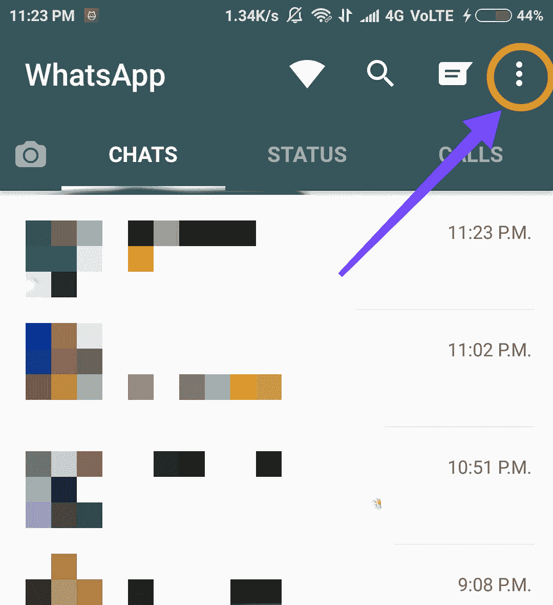
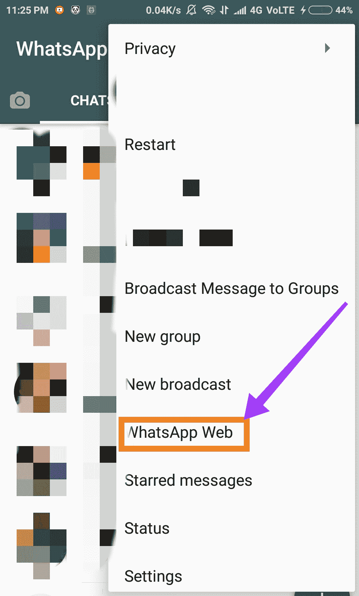
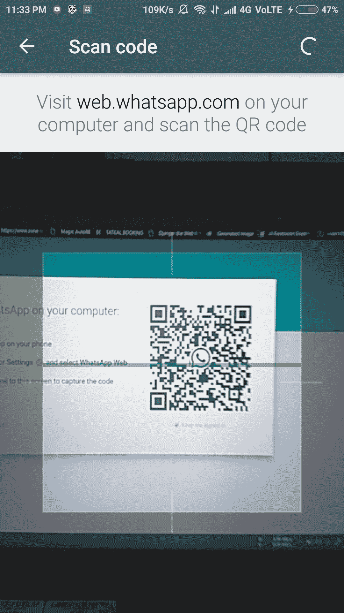
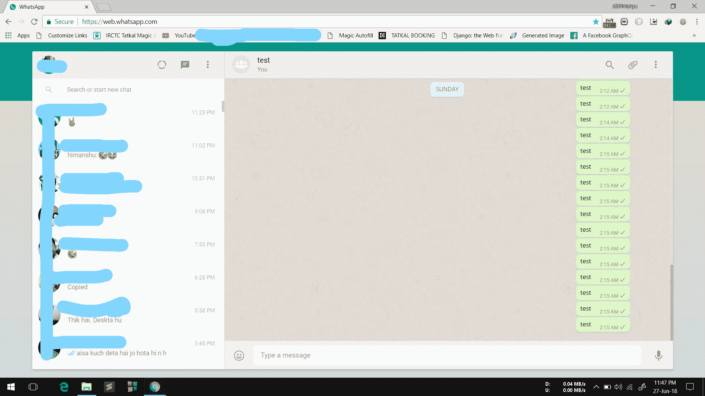

# 使用 JavaScript 发送无限的 Whatsapp 消息

> 原文: [https://www.geeksforgeeks.org/send-unlimited-whatsapp-messages-using-javascript/](https://www.geeksforgeeks.org/send-unlimited-whatsapp-messages-using-javascript/)

说到网页开发，JavaScript 可以创造奇迹！让我向你展示 JavaScript 的另一个奇迹。
如果我们可以一键发送无限的 WhatsApp 消息，岂不是很酷？成为第一个向我们所爱的人祝生日/纪念日/特别活动的人？在您的 WhatsApp 上为任何联系人/群组安排任何消息？还有更多吗？

是的，我们可以在 JavaScript 的帮助下实现所有这些事情。最有趣的是，你只需要一部带 WhatsApp 的手机、一台笔记本电脑/个人电脑和一个网络浏览器（谷歌 Chrome、Edge、Mozilla 等）中启用了 Javascript（通常默认情况下是启用的）。不需要安装其他东西。

我们开始吧。

## 在手机上设置 WhatsApp Web

打开手机上的 WhatsApp。

*   点击右上角的 3 个点。
    
*   点击 WhatsApp Web。
    
*   按照说明在您的计算机上打开 WhatsApp web。
    
*   假设到此时您已经在计算机上运行了 WhatsApp Web，请检查它是否与下图类似：
    

## 在浏览器控制台中运行脚本

现在让我们把注意力转移到电脑上。

*   在浏览器中按 `Ctrl`、`Shift` 和 `I` 一起打开一个开发者控制台。
*   找到“控制台”选项卡，然后点击它。
*   现在我们差不多完成了。
*   双击下面的代码进行编辑。
*   查找下列变量并赋值：`name`、`message` 和 `counter`。

该代码的工作原理是通过再现发送动作来模拟发送，如果尚未发起对话，它就无法搜索联系人。

阅读代码中的注释，您就知道该怎么做了🙂

```html
<script>
    function simulateMouseEvents(element, eventName) {
        var mouseEvent = document.createEvent('MouseEvents');
        mouseEvent.initEvent(eventName, true, true);
        element.dispatchEvent(mouseEvent);
    }

    /*Schedule your message section starts here
    var now = new Date();

    // Replace Hours, Mins and secs with your 
    // desired time in 24 hour time format e.g.
    // var rt = new Date(now.getFullYear(), now.getMonth(), 
    // now.getDate(), Hours, Minutes, Sec, 0) - now; 
    // to send message at 2.30PM 
    var rt = new Date(now.getFullYear(), now.getMonth(),
                now.getDate(), 14, 30, 00, 0) - now;

    if (rt < 0) {
        rt += 86400000; 
    }

    setTimeout(startTimer, rt);
    Schedule your message section ends here*/

    // Replace My Contact Name with the name 
    // of your WhatsApp contact or group e.g. title="Peter Parker"
    name = "My Contact Name"

    simulateMouseEvents(document.querySelector('[title="' + name + '"]'), 'mousedown');

    function startTimer() {
        setTimeout(myFunc, 3000);
    }

    startTimer();

    var eventFire = (MyElement, ElementType) => {
        var MyEvent = document.createEvent("MouseEvents");
        MyEvent.initMouseEvent
            (ElementType, true, true, window, 0, 0, 0, 0, 0, false, false, false, false, 0, null);
        MyElement.dispatchEvent(MyEvent);
    };

    function myFunc() {
        messageBox = document.querySelectorAll("[contenteditable='true']")[1];

        message = "My Message"; // Replace My Message with your message use %20 to add spaces to your message

        counter = 5; // Replace 5 with the number of times you want to send your message

        for (i = 0; i < counter; i++) {
            event = document.createEvent("UIEvents");
            messageBox.innerHTML = message.replace(/ /gm, ''); // test it
            event.initUIEvent("input", true, true, window, 1);
            messageBox.dispatchEvent(event);

            eventFire(document.querySelector('span[data-icon="send"]'), 'click');
        }
    }
</script>
```

现在复制修改后的代码，并将其粘贴到之前打开的控制台窗口中。你现在可以走了！

***点击进入，瞧！*** 只需点击一下，您想要的消息数量就会发送出去。

**额外乐趣**：要安排你的消息，删除代码中“安排你的消息部分”的注释，按照你的意愿设置时间！

**注意**：确保您愿意发送消息的联系人/群组在浏览器中可见，无需向下滚动。

> WhatsApp 可能会阻止您的帐户过度使用此类脚本。所以使用自担风险！

> 本网站提供的所有信息仅用于教育目的。文章的网站和作者对任何滥用信息的行为概不负责。

可以根据需要随意调整代码，玩得开心！快乐编码🙂