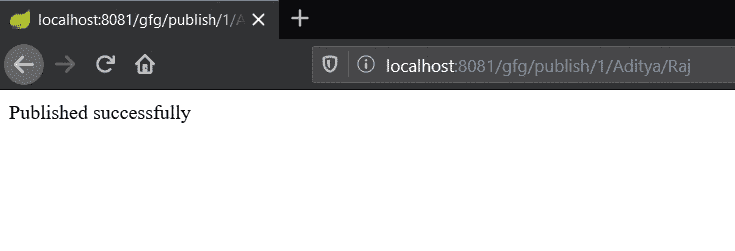
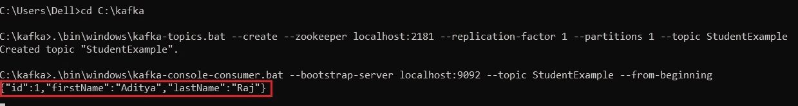

# Spring Boot 如何在 Apache Kafka 上发布 JSON 消息

> 原文: [https://www.geeksforgeeks.org/spring-boot-how-to-publish-json-messages-on-apache-kafka/](https://www.geeksforgeeks.org/spring-boot-how-to-publish-json-messages-on-apache-kafka/)

[Apache Kafka](https://www.geeksforgeeks.org/apache-kafka/) 是一个发布-订阅消息系统。消息队列允许您在进程、应用程序和服务器之间发送消息。在本文中，我们将看到如何在 Spring Boot 应用程序中向 Apache Kafka 发送 JSON 消息。

为了学习如何创建一个 Spring Boot 项目，参考[这篇文章](https://www.geeksforgeeks.org/how-to-create-a-basic-application-in-java-spring-boot/?ref=rp)。

JSON 的完整形式是 JavaScript 对象符号。JSON 是一种轻量级的数据交换格式，人类可以轻松读写，机器可以轻松解析和生成。虽然它是从 JavaScript 的一个子集派生出来的，但是它是独立于语言的。这是一种完全独立于语言的文本格式。为了向 Apache Kafka 发布 JSON 消息，可以遵循以下步骤:

## 步骤

1.  转到 [Spring Initializr](https://start.spring.io/) 并创建一个包含以下依赖项的初始项目:
    *   Spring Web
    *   Spring for Apache Kafka
2.  在集成开发环境中打开项目，并同步依赖项。在本文中，我们将创建一个学生模型，并在其中发布学生的详细信息。因此，创建一个模型类 `Student`。添加数据成员并创建[构造器](https://www.geeksforgeeks.org/constructors-in-java/)并创建获取器和设置器。以下是 `Student` 类的实现:

```java
// Java program to implement a
// student class

// Creating a student class
public class Student {

    // Data members of the
    // student class
    int id;
    String firstName;
    String lastName;

    // Constructor of the student
    // class
    public Student(int id, String firstName,
                   String lastName)
    {
        this.id = id;
        this.firstName = firstName;
        this.lastName = lastName;
    }

    // Implementing the getters
    // and setters
    public int getId()
    {
        return id;
    }

    public void setId(int id)
    {
        this.id = id;
    }

    public String getFirstName()
    {
        return firstName;
    }

    public void setFirstName(String firstName)
    {
        this.firstName = firstName;
    }

    public String getLastName()
    {
        return lastName;
    }

    public void setLastName(String lastName)
    {
        this.lastName = lastName;
    }
}
```

3.  现在，用注释 `@RestController` 创建一个新的类 `Controller`。创建一个 [GET API](https://www.geeksforgeeks.org/rest-api-introduction/) 并用参数作为字符串和模型类对象初始化 `KafkaTemplate`。以下是控制器的实现:

```java
// Java program to implement a
// controller

@RestController
@RequestMapping("gfg")
public class UserResource {

    @Autowired
    private KafkaTemplate<String, Student>
        kafkaTemplate;

    private static final String TOPIC
        = "StudentExample";

    @GetMapping("/publish/{id}/"
                + "{firstName}/{lastName}")
    public String post(
        @PathVariable("id") final int id,
        @PathVariable("firstName") final
            String firstName,
        @PathVariable("lastName") final
            String lastName)
    {
        kafkaTemplate.send(
            TOPIC,
            new Student(
                id, firstName,
                lastName));

        return "Published successfully";
    }
}
```

4.  创建一个带有注释 `@Configuration` 的类 `StudentConfig`。在这个类中，我们将序列化模型类的对象。

```java
// Java program to serialize the
// object of the model class

@Configuration
public class StudentConfig {

    @Bean
    public ProducerFactory<String, Student>
    producerFactory()
    {
        // Create a map of a string
        // and object
        Map<String, Object> config
            = new HashMap<>();

        config.put(
            ProducerConfig.BOOTSTRAP_SERVERS_CONFIG,
            "127.0.0.1:9092");

        config.put(
            ProducerConfig.KEY_SERIALIZER_CLASS_CONFIG,
            StringSerializer.class);

        config.put(
            ProducerConfig.VALUE_SERIALIZER_CLASS_CONFIG,
            JsonSerializer.class);

        return new DefaultKafkaProducerFactory<>(config);
    }

    @Bean
    public KafkaTemplate<String, Student>
    kafkaTemplate()
    {
        return new KafkaTemplate<>(
            producerFactory());
    }
}
```

5.  现在，启动 Zookeeper 和 Kafka 服务器。我们需要创建一个名为 `StudentExample` 的新主题。为此，请打开一个新的命令提示符窗口，并将目录更改为 Kafka 文件夹。
6.  现在，使用下面给出的命令创建一个新主题:

> 适用于 macOS 和 Linux: `bin/kafka-topics.sh --create --zookeeper localhost:2181 --replication-factor 1 --partitions 1 --topic <topic_name>`
>
> 对于 Windows: `\bin\windows\kafka-topics.bat --create --zookeeper localhost:2181 --replication-factor 1 --partitions 1 --topic <topic_name>`

7.  现在要实时查看 Kafka 服务器上的消息，请使用下面的命令:

> 适用于 macOS 和 Linux: `bin/kafka-console-consumer.sh --bootstrap-server localhost:9092 --topic <topic_name> --from-beginning`
>
> 对于 Windows: `\bin\windows\kafka-console-consumer.bat --bootstrap-server localhost:9092 --topic <topic_name> --from-beginning`

8.  运行应用程序并调用 API，格式如下:

> `localhost:8080/gfg/publish/{id}/{firstName}/{lastName}`

**注意:** 如果使用了不同的端口，则用该端口替换 `8080`。

## 输出

*   调用 API:
    [](https://media.geeksforgeeks.org/wp-content/uploads/20200611010735/json11.jpg)
*   实时查看消息:
    [](https://media.geeksforgeeks.org/wp-content/uploads/20200611010752/json2.jpg)