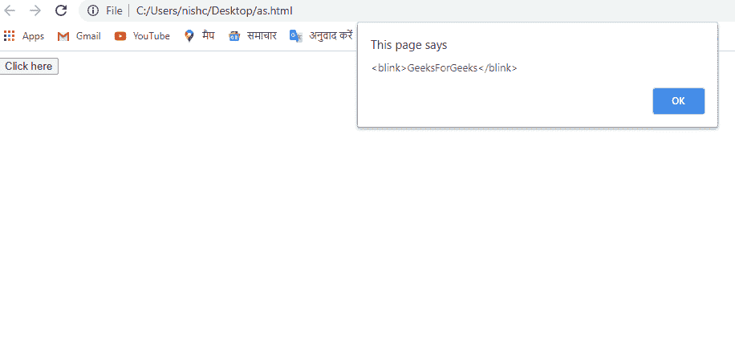

# JavaScript 中的字符串 `blink()` 方法

> 原文：[https://www.geeksforgeeks.org/string-blink-method-in-javascript/](https://www.geeksforgeeks.org/string-blink-method-in-javascript/)

本教程解释了如何使用 JavaScript `blink()` 方法。

在 JavaScript 中，`blink()` 方法是一个字符串方法，用于在 `<blink>` 标记中显示字符串。

## 语法

```javascript
string.blink()
```

## 参数值

无。

## 返回值

返回一个带闪烁标签的字符串值。

## JavaScript 版本

JavaScript 1.0

## 程序 1

```html
<!DOCTYPE html>
<html>
<head>
<title>Blink Method</title>
</head>
<body>
  <button onclick="blinkMethod()">Click here</button>
    <script>
     function blinkMethod(){
         var simpleString="GeeksForGeeks";
           window.alert(simpleString.blink());
     }
      </script>
</body>
</html>
```

## 输出

[](https://media.geeksforgeeks.org/wp-content/uploads/20200819155141/gfg.png)

## 程序 2

```javascript
<script>
function func(){
var simpleString="GeeksForGeeks";
console.log(simpleString.blink());
}
func();
</script>
```

## 输出

```html
<blink>GeeksForGeeks</blink>
```

在之前的程序中可以看到，`blink()` 方法创建了一个包含标签的字符串。

## 支持的浏览器

*   微软公司出品的 web 浏览器
*   火狐浏览器
*   谷歌 Chrome
*   旅行队
*   歌剧