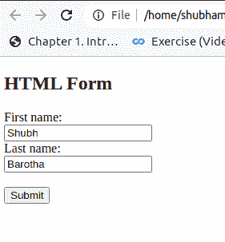
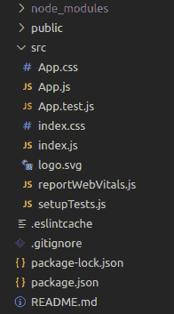
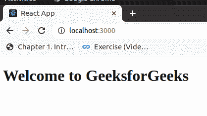

# JSX 和 HTML 有什么区别？

> 原文：[https://www.geeksforgeeks.org/what-are-the-differences-between-jsx-and-html/](https://www.geeksforgeeks.org/what-are-the-differences-between-jsx-and-html/)

## HTML 简介

HTML 是一种超文本标记语言，是用于文档的标准标记语言，旨在网页浏览器中显示和查看网页。

下面是一个用 HTML 创建基本表单的代码：

```html
<!DOCTYPE html>
<html>
<body>

<h2>HTML Form</h2>

<form>
  <label for="firstname">First name:</label>
  <br>
  <input type="text" id="firstname" name="firstname" value="Shubh">
  <br>
  <label for="lastname">Last name:</label><br>
  <input type="text" id="lastname" name="lastname" value="Barotha">
  <br><br>
  <input type="submit" value="Submit">
</form>

</body>
</html>
```

**输出：**


## JSX 简介

JSX (JavaScript + XML) 是 JavaScript 的一个扩展，允许你直接在 JavaScript 中写下 HTML，它有几个好处，让你的代码更易读，并在 HTML 中发挥 JavaScript 的全部功能。JSX 在某些方面几乎像 HTML，然而，它确实伴随着某些明显的差异，我们将在下一节中讨论这些差异。因为 JSX 不是一个合法的 JS 代码，所以它必须用巴贝尔之类的工具编译成 JS。

JSX 的一个简单例子：

```jsx
const App = <h1>欢迎来到极客 forgeeks</h1>;
```

下面是在 JSX 创建一个简单示例的代码：

使用以下命令在 reactjs 中创建新应用程序：

```bash
npx create-react-app myapp
```

您的项目结构如下所示：



我们将在 react 代码中编写一个基本的 jsx。

首先，打开 `App.js` 并进行以下更改：

```jsx
import React from 'react';
import ReactDOM from 'react-dom';

const App=()=> {
 return(
   <div><h1>Welcome to GeeksforGeeks</h1></div>
 )
}
export default App;
```

使用项目目录中的命令保存并关闭文件，然后运行项目：

```bash
npm start
```

**输出：**



如果您单击提交按钮，页面将重新加载。由于您正在构建一个单页应用程序，因此您将阻止具有 `type="submit"` 的按钮的这种标准行为。相反，您将在组件内部处理提交事件。

### JSX 与 HTML

JSX 和 HTML 的基本区别如下：

| HTML | JSX |
| :--- | :--- |
| 在 HTML 中，可以返回多个元素。例如：<br>`<ul>`<br>`<li>Disordered list</li>`<br>`<li>Ordered list</li>`<br>`</ul>` | 嵌套的 JSX 必须返回一个元素，我们称之为包裹所有其他嵌套层级的父元素：<br>`<div>`<br>`<p>pink</p>`<br>`</div>`<br>在 React 中，我们可以使用 React 渲染 API，即渲染 React 元素的公式如下：<br>`ReactDOM.render(componentToRender, targetNode)`<br>`ReactDOM.render()` 必须在 JSX 元素声明后调用。 |
| HTML 元素都有属性。例如 `maxlength` 在 `<input maxlength="16"/>` 中 | JSX 元素有 props。例如 `maxLength` 在 `<input maxLength="16"/>` 中 |
| 属性、ID 和事件引用不需要使用驼峰命名法。你可以随意使用驼峰式、小写或连字符命名。 | JSX 中所有的 HTML 属性和事件引用都变成了驼峰式，所以 `onclick` 事件变成了 `onClick`，`onchange` 变成了 `onChange`。 |
| `class` 属性可以用于任何 HTML 元素。CSS 和 JavaScript 可以使用类名来对具有指定类名的元素执行某些任务。 | 不能使用 `class` 来定义 HTML 类，因为 `class` 是 JavaScript 中的保留字，所以最好使用 `className`。 |
| 在 HTML 中，几乎所有标签都有开始标签和结束标签，除了少数例外，如 `<br/>`。 | 然而，在 JSX 中，任何元素都可以写成自闭合标签，例如：`<div/>`。<br>示例：<br>`const string = <input/>;` |

由于 JSX 组件代表 HTML，所以您可以将几个组件放在一起，以创建更复杂的 HTML 页面。

JSX 看起来像 HTML 的事实并没有使它成为 HTML 的一部分，事实上，你仍然可以绕过类似 HTML 的语法编写正常的函数。

底线是，JSX 不是 HTML 或模板引擎。