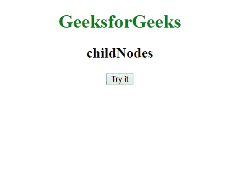
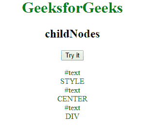
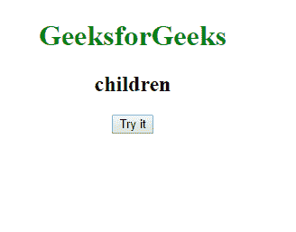
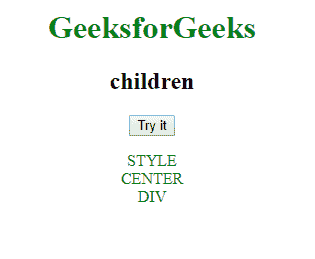

# JavaScript 中的 childNodes 和 children 有什么区别？

> 原文：[https://www.geeksforgeeks.org/what-is-the-difference-between-children-and-childnodes-in-javascript/](https://www.geeksforgeeks.org/what-is-the-difference-between-children-and-childnodes-in-javascript/)

## childNodes

`childNodes` 属性是 JavaScript 中 `Node` 的一个属性，用于返回子节点的 `NodeList`。`NodeList` 中的项是对象，而不是字符串，可以使用索引号访问。第一个 `childNodes` 从索引 **0** 开始。

**语法**

```
element.childNodes
```

## children

`children` 是元素（element）的一个属性，它以对象的形式返回一个元素的子元素。

**语法**

```
element.children
```

## 主要区别

`children` 和 `childNodes` 属性的主要区别在于，`children` 只处理元素节点，而 `childNodes` 处理所有类型的节点，包括非元素节点，如文本节点和注释节点。

## 示例 1

此示例说明了 `childNodes` 的属性。

```
<!DOCTYPE html>
<html>

<body>
    <style>
        p {
            color: green;
        }
    </style>
<center>
    <h1 style="color:green">GeeksforGeeks</h1>
    <h2>childNodes</h2>
    <button onclick="childNode()">
        Try it
    </button>

<p id="geek"></p>

<script>
        function childNode() {
            //accessing all the child nodes present in our code
            var childNode = 
                document.body.childNodes;
            var string = "";
            var i;

for (i = 0; i < childNode.length; i++) {
                string = string + childNode[i].nodeName + "<br>";
            }

//appending the child nodes to paragraph with id "geek"
            document.getElementById(
            "geek").innerHTML = string;
        }
    </script>
</center>
</body>

</html>
```

**输出:**

**前:**


**后:**


## 示例 2

这个例子说明了 `children` 的属性。

```
<!DOCTYPE html>
<html>

<body>
    <style>
        p {
            color: green;
        }
    </style>
<center>
    <h1 style="color:green">GeeksforGeeks</h1>
    <h2>children</h2>

<button onclick="myChildren()">
      Try it
  </button>

<p id="geek"></p>

<script>
        function myChildren() {
            var c = document.body.children;
            var string = "";
            var i;
            for (i = 0; i < c.length; i++) {
                string = string + c[i].tagName + "<br>";
            }

document.getElementById(
              "geek").innerHTML = string;
        }
    </script>
</center>
</body>

</html>
```

**输出:**

**前:**


**后:**


## 支持的浏览器

1.  谷歌 Chrome
2.  Mozilla Firefox
3.  苹果 Safari
4.  歌剧
5.  互联网浏览器/边缘