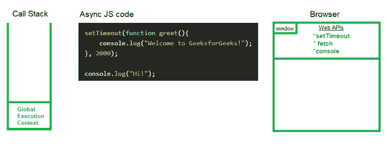
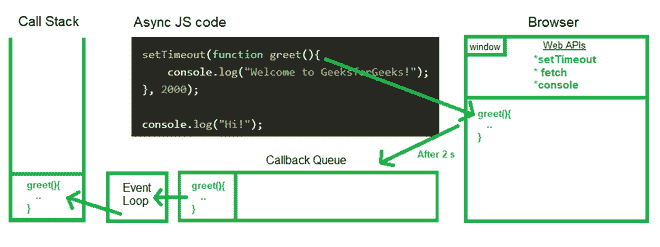

# 异步 JavaScript 中的微任务队列和回调队列有什么区别？

> 原文：[https://www.geeksforgeeks.org/what-is-the-difference-between-microtask-queue-and-callback-queue-in-asynchronous-javascript/](https://www.geeksforgeeks.org/what-is-the-difference-between-microtask-queue-and-callback-queue-in-asynchronous-javascript/)

要知道**微任务队列**和**回调队列**的区别，我们需要清楚异步 JavaScript 是如何执行的，以及微任务队列和回调队列扮演什么角色。

与其他功能或操作并行运行的功能或操作在 JavaScript 中称为[异步](https://www.geeksforgeeks.org/synchronous-and-asynchronous-in-javascript/)功能或操作。异步 JavaScript 代码需要[回调](https://www.geeksforgeeks.org/javascript-callbacks/)函数，这些函数在期望的时间后执行。

**示例：** 下面的代码说明了在 JavaScript 中使用 `setTimeout()` 函数。

## JavaScript

```javascript
<script>
  setTimeout(function greet() {
    console.log("Welcome to GeeksforGeeks!");
  }, 2000);
</script>
```

现在，在这个期望的时间之后，代码需要被传递到[调用栈](https://www.geeksforgeeks.org/what-is-the-call-stack-in-javascript/)，但是这个调用栈没有提供一个计时器，通过这个计时器我们可以延迟代码的执行。因此，它使用了网络应用编程接口 `setTimeout()` 的帮助，该接口在浏览器的窗口全局对象中可用。一段时间后，调用栈通过[事件循环](https://www.geeksforgeeks.org/node-js-event-loop/)获取代码，事件循环获取回调函数到调用栈。但是，回调函数不能直接进入事件循环。



因此，微任务队列和回调队列的作用就来了。这些队列作为一个中介，一旦计时器超时，回调函数就被连续地放入这些队列中。每当调用堆栈为空时，事件循环就按照先进先出的顺序将它们读入调用堆栈。

但是，我们需要[微任务队列和回调队列](https://www.geeksforgeeks.org/what-are-the-microtask-and-macrotask-within-an-event-loop-in-javascript/)用于不同的目的。让我们看看他们之间的比较。

## 回调队列

定时器到期后，回调函数被放入回调队列中，事件循环检查调用堆栈是否为空，如果为空，则将回调函数从回调队列推到调用堆栈，回调函数从回调队列中移除。然后调用栈创建一个执行上下文并执行它。



## 微任务队列

微任务队列类似于回调队列，但微任务队列的**优先级更高**。所有通过 [`Promise`](https://www.geeksforgeeks.org/javascript-promises/) 和 [`MutationObserver`](https://developer.mozilla.org/en-US/docs/Web/API/MutationObserver) 进入微任务队列的回调函数。例如 [`fetch()`](https://www.geeksforgeeks.org/javascript-fetch-method/) 的回调函数到达微任务队列。`Promise` 处理总是有更高的优先级，所以 JavaScript 引擎执行微任务队列中的所有任务，然后移动到回调队列。

## 比较

| **回调队列** | **微任务队列** |
| --- | --- |
| 回调队列在定时器到期后，从 `setTimeout()` API 获取普通的回调函数。 | 微任务队列通过 `Promise` 和 `MutationObserver` 获取回调函数。 |
| 回调队列将回调函数提取到事件循环中的优先级低于微任务队列。 | 微任务队列比回调队列具有更高的优先级，其回调函数可以被提取到事件循环中。 |