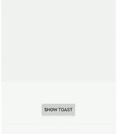

# 如何在Android中使用Kotlin创建自定义Toast

> 原文：[https://www.geeksforgeeks.org/how-to-add-a-custom-styled-toast-in-android-using-kotlin/](https://www.geeksforgeeks.org/how-to-add-a-custom-styled-toast-in-android-using-kotlin/)

Toast是在短时间内显示在[Android](https://www.geeksforgeeks.org/introduction-to-android-development/)屏幕上的简短提醒信息。Android Toast是一个简短的弹出通知，用于在应用中执行操作时显示信息。在本文中，让我们学习如何使用Kotlin在[Android](https://www.geeksforgeeks.org/introduction-to-android-development/)中创建自定义Toast。



> **注意**：要使用Java在Android中创建自定义样式的Toast，请参考[如何在Android中添加自定义样式的Toast](https://www.geeksforgeeks.org/how-to-add-a-custom-styled-toast-in-android/)。

## 属性表

| 属性 | 描述 |
| --- | --- |
| `layoutInflater` | 将布局XML文件实例化到其对应的视图对象中 |
| `inflate` | 从指定的XML资源展开新的视图层次结构。 |
| `setGravity` | 用于更改Toast的位置 |

## 方法

### 步骤1：创建Toast布局

转到 `res -> 布局(右键) -> 新建 -> 布局资源文件` -> 创建 `custom_toast_layout.xml` 文件。添加一个`CardView`来包含自定义的Toast信息，同时添加一个[TextView](https://www.geeksforgeeks.org/textview-in-kotlin/)来显示自定义Toast信息中的文本。[FrameLayout](https://www.geeksforgeeks.org/android-framelayout-in-kotlin/)用于指定多个视图放置在彼此顶部的位置，以表示单个视图屏幕。

#### XML

```xml
<?xml version="1.0" encoding="utf-8"?>
<RelativeLayout
    xmlns:android="http://schemas.android.com/apk/res/android"
    xmlns:app="http://schemas.android.com/apk/res-auto"
    android:layout_width="match_parent"
    android:layout_height="match_parent"
    android:id="@+id/toast_container">

    <RelativeLayout
        android:id="@+id/button_parent"
        android:layout_width="match_parent"
        android:layout_height="60dp"
        android:layout_centerHorizontal="true"
        android:layout_centerVertical="true">

        <androidx.cardview.widget.CardView
            android:id="@+id/button_card_parent"
            android:layout_width="match_parent"
            android:layout_height="56dp"
            android:layout_centerHorizontal="true"
            android:layout_centerVertical="true"
            android:layout_marginLeft="25dp"
            app:cardElevation="20dp"
            android:layout_marginRight="25dp"
            app:cardCornerRadius="4dp">

            <RelativeLayout
                android:id="@+id/button_click_parent"
                android:layout_width="match_parent"
                android:layout_height="match_parent"
                android:background="?attr/selectableItemBackground"
                android:clickable="true"
                android:focusable="true">

                <FrameLayout
                    android:id="@+id/button_accent_border"
                    android:layout_width="4dp"
                    android:layout_height="match_parent"
                    android:background="#3EAA56" />

                <TextView
                    android:id="@+id/toast_text"
                    android:layout_width="wrap_content"
                    android:layout_height="wrap_content"
                    android:layout_centerVertical="true"
                    android:layout_marginStart="17dp"
                    android:ellipsize="end"
                    android:lines="1"
                    android:text="This is a custom Toast"
                    android:textColor="#131313"
                    android:textSize="18sp"
                    android:textStyle="bold" />

            </RelativeLayout>

        </androidx.cardview.widget.CardView>

    </RelativeLayout>

</RelativeLayout>
```

### 步骤2：新建Kotlin文件

现在创建一个新的Kotlin文件，并将其命名为 `WrapToast.kt`，以使代码可重用。转到 `项目包(右键) -> 新建 -> Kotlin 文件/类` -> 创建 `WrapToast.kt` 文件。现在我们要用 `showCustomToast()` 扩展 `Toast::class`，它将字符串和上下文作为参数。

> **注：**
> - 使用 `layoutInflater` 扩展之前创建的布局 `custom_toast_layout.xml`。
> - 之后，`inflate` 布局，找到它的视图。在这种情况下，设置消息的`TextView`的文本。
> - 最后一步是创建一个关于 `Toast::class` 的新实例。然后，使用其应用扩展功能设置重力、持续时间和布局。最后，调用 `show()` 方法。

#### Kotlin

```kt
import android.app.Activity
import android.view.Gravity
import android.widget.TextView
import android.widget.Toast

fun Toast.showCustomToast(message: String, activity: Activity)
{
    val layout = activity.layoutInflater.inflate (
        R.layout.custom_toast_layout,
        activity.findViewById(R.id.toast_container)
    )

    // set the text of the TextView of the message
    val textView = layout.findViewById<TextView>(R.id.toast_text)
    textView.text = message

    // use the application extension function
    this.apply {
        setGravity(Gravity.BOTTOM, 0, 40)
        duration = Toast.LENGTH_LONG
        view = layout
        show()
    }
}
```

### 步骤3：创建一个按钮来显示Activity中的Toast

在`ConstraintLayout`中添加一个[按钮](https://www.geeksforgeeks.org/button-in-kotlin/)。因此，当用户点击按钮时，屏幕上会弹出定制的Toast。

#### XML

```xml
<?xml version="1.0" encoding="utf-8"?>
<androidx.constraintlayout.widget.ConstraintLayout
    xmlns:android="http://schemas.android.com/apk/res/android"
    xmlns:app="http://schemas.android.com/apk/res-auto"
    xmlns:tools="http://schemas.android.com/tools"
    android:layout_width="match_parent"
    android:layout_height="match_parent"
    tools:context=".MainActivity">

    <Button
        android:id="@+id/btn_show_toast"
        android:layout_width="100dp"
        android:layout_height="wrap_content"
        android:text="Show Toast"
        android:background="#3EAA56"
        android:textColor="#fff"
        app:layout_constraintBottom_toBottomOf="parent"
        app:layout_constraintLeft_toLeftOf="parent"
        app:layout_constraintRight_toRightOf="parent"
        app:layout_constraintTop_toTopOf="parent" />

</androidx.constraintlayout.widget.ConstraintLayout>
```

### 步骤4：制作Toast

之后，创建显示Toast的按钮，应用 `onClickListener()` ，并传递Toast消息和Activity的上下文。

#### Kotlin

```kt
import androidx.appcompat.app.AppCompatActivity
import android.os.Bundle
import android.widget.Toast
import kotlinx.android.synthetic.main.activity_main.*

class MainActivity : AppCompatActivity() {
    override fun onCreate(savedInstanceState: Bundle?) {
        super.onCreate(savedInstanceState)
        setContentView(R.layout.activity_main)

        // apply an onClickListener() method
        btn_show_toast.setOnClickListener{
            Toast(this).showCustomToast ("Hello! This is a custom Toast!", this)
        }
    }
}
```

### 输出

<video class="wp-video-shortcode" id="video-453344-1" width="640" height="360" preload="metadata" controls=""><source type="video/mp4" src="https://media.geeksforgeeks.org/wp-content/uploads/20200713125009/custom_toast_in_kotlin.mp4?_=1">[https://media.geeksforgeeks.org/wp-content/uploads/20200713125009/custom_toast_in_kotlin.mp4](https://media.geeksforgeeks.org/wp-content/uploads/20200713125009/custom_toast_in_kotlin.mp4)</video>

> **注：**
> 不再推荐自定义Toast视图。当在前台时，应用程序可以使用 `makeText()` 函数来生成一个普通的文本Toast，或者它们可以创建一个`Snackbar`。自定义Toast视图不会在拥有应用程序时显示，目标是API级别的`Build.VERSION_CODES.R`或以上在后台。目前，在以API级别构建为目标的应用程序中，使用`makeText()`或其变体构建的Toast同样会返回空值`Build.VERSION_CODES`。除非他们用非空视图调用了`setView`。