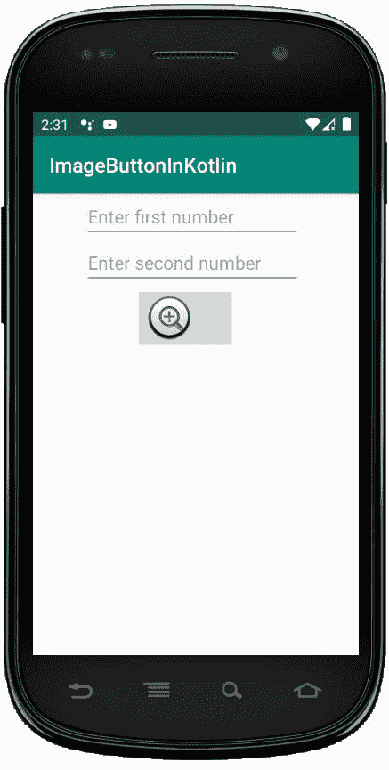
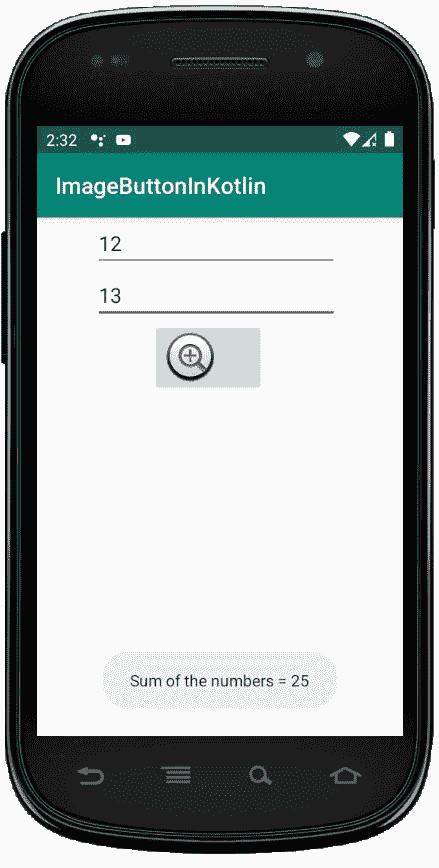

# 科特林中的图像按钮

> 原文: [https://www.geeksforgeeks.org/imagebutton-in-kotlin/](https://www.geeksforgeeks.org/imagebutton-in-kotlin/)

安卓 `ImageButton` 是一个用户界面小部件，用来显示一个有图像的按钮，并且当我们点击它的时候执行完全一样的按钮，但是在这里，我们在 `ImageButton` 上添加了一个图像，而不是文本。安卓系统中有不同类型的按钮，如 `ImageButton`、`ToggleButton` 等。

我们可以简单的使用 `activity_main.xml` 文件中的 `<imagebutton>` 属性 `android:src` 或者使用 `setImageResource()` 方法给按钮添加一个图像。

在安卓系统中，我们可以通过两种方式来创建 `ImageButton` 控件，可以是手动的，也可以是编程的。

首先我们按照以下步骤创建一个新项目:

1.  点击文件，然后 **create a new** => **new project**。
2.  之后，确保包含了 Kotlin 支持，然后点击 **Next**。
3.  根据方便选择最小 SDK，点击 **Next** 按钮。
4.  然后选择 **to clear** activity => **Next** => **to finish**。

## Switch widget 的不同属性

| XML attribute | describe |
| --- | --- |
| `android:id` | 用于唯一标识控件。 |
| `android:src` | 用于指定图片来源的文件。 |
| `android:onClick` | 用于指定点击此按钮时执行的操作。 |
| `android:visibility` | 用于设置图像按钮的可见性。 |
| `android:background` | 用于设置图像按钮的背景颜色。 |
| `android:maxHeight` | 用于设置图像按钮视图的最大高度。 |
| `android:maxWidth` | 用于设置图像按钮视图的最大宽度。 |
| `android:padding` | 用于设置左、右、上、下的内边距。 |

## 在 activity_main.xml 文件中使用 ImageButton

在这个文件中，我们包含了 `EditText` 和 `ImageButton`，并设置了它们的属性，如 `id`、`layout_width`、`hint` 等。

```kt
<?xml version="1.0" encoding="utf-8"?>
<LinearLayout xmlns:android="http://schemas.android.com/apk/res/android"
    android:orientation="vertical"
    android:layout_width="match_parent"
    android:layout_height="match_parent"
    android:id="@+id/linear_layout">

    <EditText
        android:id="@+id/Num1"
        android:layout_width="wrap_content"
        android:layout_height="wrap_content"
        android:layout_marginLeft="50dp"
        android:ems="10"
        android:hint= "Enter first number"/>

    <EditText
        android:id="@+id/Num2"
        android:layout_width="wrap_content"
        android:layout_height="wrap_content"
        android:layout_marginLeft="50dp"
        android:ems="10"
        android:hint= "Enter second number"/>

    <ImageButton
        android:id="@+id/imageBtn"
        android:layout_width="wrap_content"
        android:layout_height="wrap_content"
        android:layout_marginLeft="100dp"
        android:src="@android:drawable/btn_plus" />
</LinearLayout>
```

## 修改 strings.xml 文件添加应用程序名称

```kt
<resources>
    <string name="app_name">ImageButtonInKotlin</string>
</resources>
```

## 在 MainActivity.kt 文件中访问 ImageButton 和 EditText

首先，我们为两个 `EditText` 声明两个变量 `num1` 和 `num2`，并使用 `id` 访问它们。

```kt
val num1 = findViewById(R.id.Num1)
val num2 = findViewById<EditText>(R.id.Num2)
```

然后，我们为 `ImageButton` 声明变量 `imgbtn` 并设置 `OnClickListener` 来检查输入是否为空。

```kt
val imgbtn = findViewById(R.id.imageBtn)
    imgbtn.setOnClickListener {
     if (num1.text.toString().isEmpty() || num2.text.toString().isEmpty()) {
          Toast.makeText(applicationContext,
           "Enter both numbers", Toast.LENGTH_SHORT).show()
    }
```

```kt
package com.geeksforgeeks.myfirstkotlinapp

import android.os.Bundle
import androidx.appcompat.app.AppCompatActivity
import android.widget.EditText
import android.widget.ImageButton
import android.widget.Toast

class MainActivity : AppCompatActivity() {
    override fun onCreate(savedInstanceState: Bundle?) {
        super.onCreate(savedInstanceState)
        setContentView(R.layout.activity_main)
        val num1 = findViewById<EditText>(R.id.Num1)
        val num2 = findViewById<EditText>(R.id.Num2)
        val imgbtn = findViewById<ImageButton>(R.id.imageBtn)
        imgbtn.setOnClickListener {
         if (num1.text.toString().isEmpty() || num2.text.toString().isEmpty()) {
              Toast.makeText(applicationContext,
                  "Enter both numbers", Toast.LENGTH_SHORT).show()
            }
            else {
                val num1 = Integer.parseInt(num1.text.toString())
                val num2 = Integer.parseInt(num2.text.toString())
                Toast.makeText(applicationContext,
                    "Sum of the numbers = " + (num1 + num2),
                    Toast.LENGTH_SHORT).show()
            }
        }
    }
}
```

## AndroidManifest.xml 文件

```kt
<?xml version="1.0" encoding="utf-8"?>
<manifest xmlns:android="http://schemas.android.com/apk/res/android"
package="com.geeksforgeeks.myfirstkotlinapp">

<application
    android:allowBackup="true"
    android:icon="@mipmap/ic_launcher"
    android:label="@string/app_name"
    android:roundIcon="@mipmap/ic_launcher_round"
    android:supportsRtl="true"
    android:theme="@style/AppTheme">
    <activity android:name=".MainActivity">
        <intent-filter>
            <action android:name="android.intent.action.MAIN" />

            <category android:name="android.intent.category.LAUNCHER" />
        </intent-filter>
    </activity>
</application>

</manifest>
```

## 作为模拟器运行:


