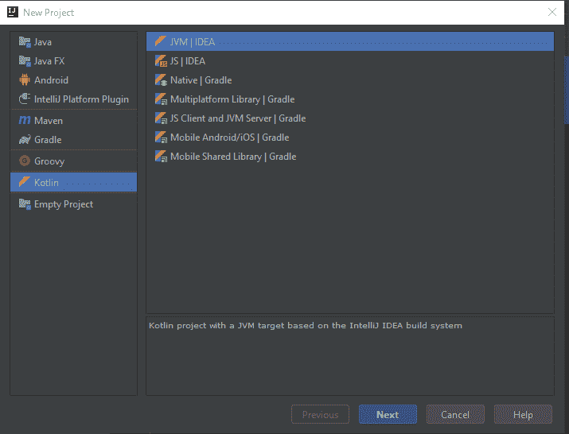
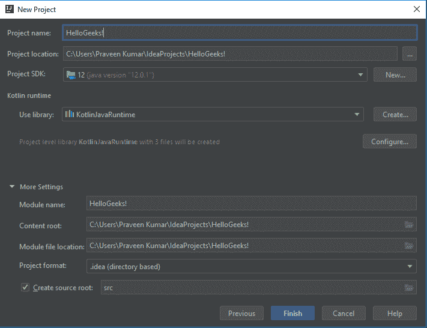
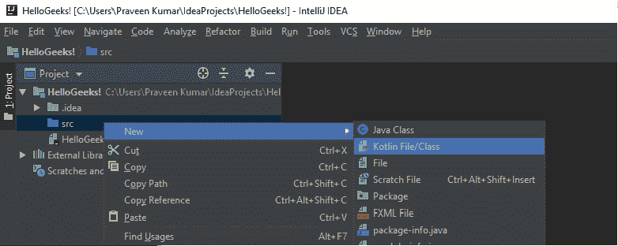
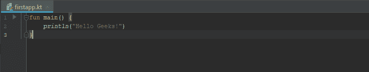
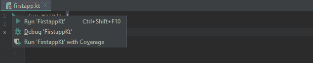
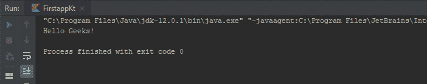

# 用 Intellij IDEA 设置 Kotlin 环境

> 原文：[https://www.geeksforgeeks.org/kotlin-environment-setup-with-intellij-idea/](https://www.geeksforgeeks.org/kotlin-environment-setup-with-intellij-idea/)

**Kotlin** 是由 JetBrains 开发的一种静态类型的通用编程语言，已经构建了像 `IntelliJ IDEA`、`PhpStorm`、`Appcode` 等世界一流的 IDE。它于 2011 年由捷脑科首次推出。Kotlin 是面向对象的语言，也是比 Java 更好的语言，但仍然可以与 Java 代码完全互操作。

## 让我们看看如何使用 Intellij IDEA 为 Kotlin 设置环境，并运行我们的第一个 Kotlin 代码。

1.  要开始，请安装 `IntelliJ IDEA` 的最新版本。可以从[捷脑](http://www.jetbrains.com/idea/download/#section=windows)下载免费社区版。
2.  安装好 `Intellij IDEA` 后，创建一个 Kotlin 应用程序。
    通过 `File -> New -> Project` 创建一个新项目。然后选择 **Kotlin -> JVM | IDEA**。

3.  为你的项目命名并选择 SDK 版本。这里我们将项目命名为 **HelloGeeks!**。

4.  现在你有了新项目 `HelloGeeks!`。在源文件夹（`src`）下创建一个新的 Kotlin 文件，我们将其命名为 **firstapp.kt**。

5.  文件创建后，编写 `main` 函数。`IntelliJ IDEA` 提供了一个模板来更快地完成此操作。只需键入 `main` 并按 `Tab` 键。添加一行代码来打印出 ‘Hello Geeks!’。

6.  运行应用程序。现在应用程序已准备好运行。最简单的方法是单击侧边栏中的绿色 `Run` 按钮，然后选择 `Run ‘FirstappKt’`。你可以直接按 **Ctrl + Shift + F10** 来运行。

7.  如果你的程序编译成功，你将在 `Run Tool Window` 中看到输出。

