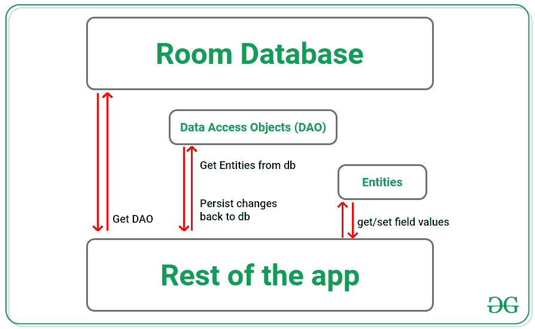

# 安卓架构组件房间概述

> 原文：[https://www.geeksforgeeks.org/overview-of-room-in-android-architecture-components/](https://www.geeksforgeeks.org/overview-of-room-in-android-architecture-components/)

房间是安卓中[Jetpack架构组件](https://www.geeksforgeeks.org/jetpack-architecture-components-in-android/)之一。这在SQLite数据库上提供了一个抽象层，用于在本地保存持久数据并对其执行操作。这是谷歌推荐的，而不是SQLite数据库，尽管SQLite APIs更强大，但它们相当低级，使用起来需要大量的时间和精力。但是，Room使创建数据库并对其执行操作变得简单明了。

## 为什么用房间？

*   缓存相关的数据片段，这样当用户的设备离线时，他们仍然可以离线浏览和查看内容。
*   编译时SQLite查询验证可以防止应用程序崩溃。
*   它提供的注释最小化了样板代码。
*   这还提供了与其他架构组件（如`LiveData`、`Lifecycle`等）的轻松集成。可以在这里取谷歌[提供的codelab](https://developer.android.com/codelabs/android-room-with-a-view)。

## 房间和SQLite的区别

| 房间 | SQLite |
| :--- | :--- |
| 不需要编写原始查询。 | 需要编写原始查询。 |
| SQL查询的编译时验证。 | 没有SQL查询的编译时样板验证。 |
| 不需要将数据转换成Java对象。因为Room在内部将数据库对象映射到Java对象。 | 需要编写SQL查询来将数据转换为Java对象。 |
| 这方便地支持与其他架构组件的集成。 | 这需要大量的样板代码来与其他架构组件集成。 |
| Room为使用`LiveData`和执行操作提供了更简单的方法。 | SQLite不提供直接访问`LiveData`的方式，需要编写外部代码才能访问`LiveData`。 |
| 当数据库模式发生变化时，不需要更改代码。 | 每当数据库模式发生变化时，就需要更改其查询。 |

## 房间主要部件

1.  **数据库类**：这为应用程序的持久化数据提供了到底层连接的主要访问点。这是用`@Database`标注的。
2.  **数据实体**：代表现有数据库中的所有表。并用`@Entity`标注。
3.  **DAO（数据访问对象）**：包含对数据库执行操作的方法。并注有`@Dao`。

## 房间图书馆建筑

从下图中，我们可以推断出房间数据库的工作情况，因为应用程序首先获取与现有的房间数据库关联的数据访问对象（DAOs）。获取`DAO`s后，通过`DAO`s从数据库表中访问实体。然后它可以对这些实体执行操作，并将更改保存回数据库。



## 在安卓应用中实现房间数据库的步骤

### 步骤1：创建一个空的活动项目

*   创建一个空的活动Android Studio项目。参考[安卓|如何在安卓工作室创建/启动新项目？](https://www.geeksforgeeks.org/android-how-to-create-start-a-new-project-in-android-studio/)，来看看如何创建一个空的活动Android Studio项目。
*   并选择`Kotlin`作为语言。

### 步骤2：添加所需的依赖关系

*   将以下依赖项添加到**应用级**`build.gradle`文件中。前往**项目名称 -> app -> build.gradle**。

```gradle
// room_version 可能会有所不同
def room_version = "2.3.0"

implementation "androidx.room:room-runtime:$room_version"
kapt "androidx.room:room-compiler:$room_version"
implementation "androidx.room:room-ktx:$room_version"
testImplementation "androidx.room:room-testing:$room_version"
```

**现在逐个创建房间的组件：**

> **注意：**这里创建的每个接口和类的实体都很重要，需要注意。

### 步骤3：创建数据实体

*   创建一个命名为`User.kt`的示例数据类。
*   并调用以下包含实体`User`作为实体的代码，实体代表一行，名字、姓氏、年龄代表表的列名。

```kt
import androidx.room.ColumnInfo
import androidx.room.Entity
import androidx.room.PrimaryKey

@Entity
data class User(
    @PrimaryKey(autoGenerate = true) val uid: Int,
    @ColumnInfo(name = "name") val firstName: String?,
    @ColumnInfo(name = "city") val lastName: String?
)
```

### 步骤4：创建数据访问对象（Dao）

*   现在创建一个名为`UserDao.kt`的接口。
*   并调用下面的代码，该代码提供了应用程序用来与用户交互的各种方法。

```kt
import androidx.room.Dao
import androidx.room.Delete
import androidx.room.Insert
import androidx.room.Query

@Dao
interface UserDao {
    @Query("SELECT * FROM user")
    fun getAll(): List<User>

    @Query("SELECT * FROM user WHERE uid IN (:userIds)")
    fun loadAllByIds(userIds: IntArray): List<User>

    @Insert
    fun insertAll(vararg users: User)

    @Delete
    fun delete(user: User)
}
```

### 步骤5：创建数据库

*   现在创建定义实际应用程序数据库的数据库，它是应用程序持久化数据的主要访问点。该类必须满足：
    1.  该类必须是抽象的。
    2.  班级要用`@Database`标注。
    3.  数据库类必须定义一个不带参数的抽象方法，并返回一个DAO实例。
*   现在在`AppDatabase.kt`文件中调用以下代码。

```kt
import androidx.room.Database
import androidx.room.RoomDatabase

@Database(entities = arrayOf(User::class), version = 1)
abstract class UserDatabase : RoomDatabase() {
    abstract fun userDao(): UserDao
}
```

### 步骤6：使用房间数据库

*   在`MainActivity.kt`文件中，我们可以通过为数据库提供自定义名称来创建一个数据库。

```kt
import android.os.Bundle
import androidx.appcompat.app.AppCompatActivity
import androidx.room.Room

class MainActivity : AppCompatActivity() {

    // application's Database name
    private val DATABASE_NAME: String = "USER_DATABASE"

    override fun onCreate(savedInstanceState: Bundle?) {
        super.onCreate(savedInstanceState)
        setContentView(R.layout.activity_main)

        // get the instance of the application's database
        val db = Room.databaseBuilder(
            applicationContext, UserDatabase::class.java, DATABASE_NAME
        ).build()

        // create instance of DAO to access the entities
        val userDao = db.userDao()

        // using the same DAO perform the Database operations
        val users: List<User> = userDao.getAll()
    }
}
```

> **注意：**通过使用这个关于房间数据库的基本知识，可以参考[使用房间数据库构建一个基本的CRUD应用程序如何在Android的房间数据库中执行CRUD操作？](https://www.geeksforgeeks.org/how-to-perform-crud-operations-in-room-database-in-android/)。