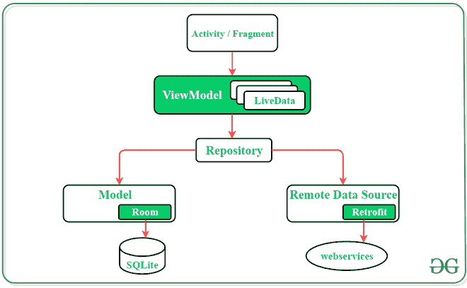
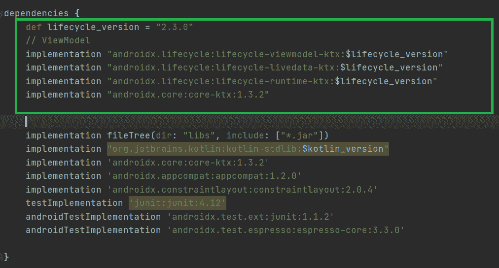
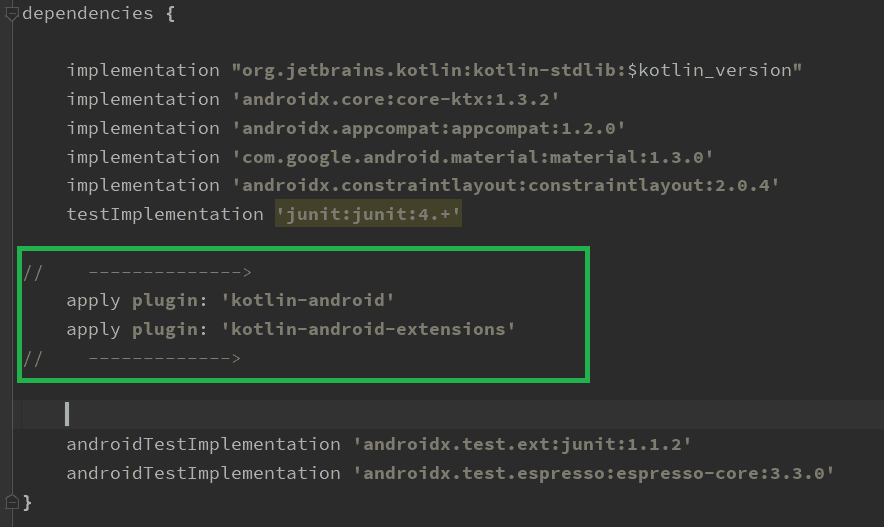
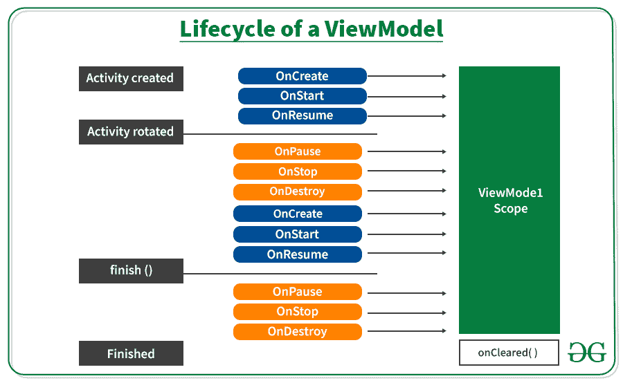

# 安卓架构组件中的视图模型

> 原文：[https://www.geeksforgeeks.org/viewmodel-in-android-architecture-components/](https://www.geeksforgeeks.org/viewmodel-in-android-architecture-components/)

`ViewModel` 是[安卓架构组件](https://www.geeksforgeeks.org/jetpack-architecture-components-in-android/)的一部分。安卓架构组件是用于构建健壮、干净和可扩展的应用程序的组件。安卓架构组件包含一些类来管理用户界面组件和数据持久性。`ViewModel` 类旨在以生命周期感知的方式存储和管理用户界面相关数据。`ViewModel` 类用于存储数据，即使是像旋转屏幕这样的配置变化。`ViewModel` 是支持用户界面组件数据的安卓喷气背包架构组件中最关键的一类。其目的是保存和管理用户界面相关的数据。此外，它的主要功能是保持完整性，并允许数据在配置更改（如屏幕旋转）期间提供服务。安卓设备中的任何配置变化都倾向于重新创建应用程序的整个活动。这意味着如果没有从被破坏的活动中正确保存和恢复数据，数据将会丢失。为了避免这些问题，建议将所有用户界面数据存储在 `ViewModel` 中，而不是活动中。



**活动必须扩展 `ViewModel` 类来创建视图模型：**

```kt
class MainActivityViewModel : ViewModel() {
    ……
    ……..
}
```

## 在安卓应用中实现视图模型

安卓架构组件为负责为用户界面准备数据的用户界面控制器提供 `ViewModel` 助手类。在配置更改期间，`ViewModel` 对象会自动保留，我们将在下面的示例中看到这一点。现在让我们进入代码，

**步骤 1：** 在 `build.gradle` 文件中添加这些依赖项

```gradle
def lifecycle_version = "2.3.0"

// ViewModel
implementation "androidx.lifecycle:lifecycle-viewmodel-ktx:$lifecycle_version"
implementation "androidx.lifecycle:lifecycle-livedata-ktx:$lifecycle_version"
implementation "androidx.lifecycle:lifecycle-runtime-ktx:$lifecycle_version"
implementation "androidx.core:core-ktx:1.3.2"
```



另外，在 `build.gradle(Module:app)` 文件中添加以下依赖项。我们添加这两个依赖项是因为为了避免在我们的 `MainActivity.kt` 文件中使用 `findViewById()`。试试这个，否则使用正常方式，如 `findViewById()`。

```gradle
apply plugin: 'kotlin-android'
apply plugin: 'kotlin-android-extensions'
```



### 以下代码不使用视图模型

**步骤 2：使用 `activity_main.xml` 文件**

导航到 `应用程序 > res > 布局 > activity_main.xml` 并将下面的代码添加到该文件中。下面是 `activity_main.xml` 文件的代码。

```xml
<?xml version="1.0" encoding="utf-8"?>
<androidx.constraintlayout.widget.ConstraintLayout 
    xmlns:android="http://schemas.android.com/apk/res/android"
    xmlns:app="http://schemas.android.com/apk/res-auto"
    xmlns:tools="http://schemas.android.com/tools"
    android:layout_width="match_parent"
    android:layout_height="match_parent"
    tools:context=".MainActivity">

    <TextView
        android:id="@+id/textView"
        android:layout_width="wrap_content"
        android:layout_height="wrap_content"
        android:text="0"
        app:layout_constraintBottom_toBottomOf="parent"
        app:layout_constraintEnd_toEndOf="parent"
        app:layout_constraintStart_toStartOf="parent"
        app:layout_constraintTop_toTopOf="parent"
        app:layout_constraintVertical_bias="0.369" />

    <Button
        android:id="@+id/button"
        android:layout_width="wrap_content"
        android:layout_height="wrap_content"
        android:layout_marginTop="100dp"
        android:text="Click"
        app:layout_constraintBottom_toBottomOf="parent"
        app:layout_constraintEnd_toEndOf="parent"
        app:layout_constraintHorizontal_bias="0.498"
        app:layout_constraintStart_toStartOf="parent"
        app:layout_constraintTop_toBottomOf="@+id/textView"
        app:layout_constraintVertical_bias="0.0" />

</androidx.constraintlayout.widget.ConstraintLayout>
```

**第三步：使用 `MainActivity.kt` 文件**

转到 `MainActivity.kt` 文件，参考以下代码。下面是 `MainActivity.kt` 文件的代码。

```kt
import android.os.Bundle
import androidx.appcompat.app.AppCompatActivity
import kotlinx.android.synthetic.main.activity_main.*

class MainActivity : AppCompatActivity() {

    override fun onCreate(savedInstanceState: Bundle?) {
        super.onCreate(savedInstanceState)
        setContentView(R.layout.activity_main)

        var number = 0

        textView.text = number.toString()

        button.setOnClickListener {
            number++
            textView.text = number.toString()
        }

    }
}
```

**输出：**

现在只要点击按钮 3 到 4 次，你就会在屏幕上看到增加的数字。现在试着旋转你的模拟器或设备。

<video class="wp-video-shortcode" id="video-576908-1" width="640" height="360" preload="metadata" controls=""><source type="video/mp4" src="https://media.geeksforgeeks.org/wp-content/uploads/20210320123738/sequence.mp4?_=1">[https://media.geeksforgeeks.org/wp-content/uploads/20210320123738/sequence.mp4](https://media.geeksforgeeks.org/wp-content/uploads/20210320123738/sequence.mp4)</video>

你会看到数字变成 0，问题是为什么？它如何通过旋转屏幕擦除数值。为了得到答案，我们必须了解 `ViewModel` 的**生命周期。**



在上图中，当我们创建活动时，系统调用 `onCreate()`，然后 `onStart()` 然后 `onResume()`，但是当我们旋转屏幕时，我们的活动被破坏，再次旋转后，系统一个接一个地调用 `onCreate()` 和其他函数。由于我们的活动被破坏，我们的活动数据也消失了。

为了克服这个问题，我们使用 `ViewModel`，即使在配置发生变化（如屏幕旋转）后，`ViewModel` 也能保存数据。上图显示了 `ViewModel` 范围，即使有任何配置更改，数据也是持久的。当系统调用活动对象的 `onCreate()` 方法时，您通常会第一次请求一个 `ViewModel`。在整个活动过程中，系统可能会多次调用 `onCreate()`，例如旋转设备屏幕时。`ViewModel` 存在于您第一次请求 `ViewModel` 时，直到活动完成并被销毁。

### 带有视图模型的示例

**步骤 1：** 创建一个 Kotlin 类文件 `MainActivityViewModel.kt`。我们的 `MainActivity` 类文件扩展了 `ViewModel` 类。

> **参考本文：** [如何在 Android Studio 中创建类？](https://www.geeksforgeeks.org/how-to-create-classes-in-android-studio/)

```kt
import androidx.lifecycle.ViewModel

class MainActivityViewModel : ViewModel() {

    var number = 0

    fun addOne() {
        number++
    }
}
```

**步骤 2：使用 `MainActivity.kt` 文件**

转到 `MainActivity.kt` 文件，更新以下代码。下面是 `MainActivity.kt` 文件的代码。代码中添加了注释，以更详细地理解代码。

```kt
import android.os.Bundle
import androidx.appcompat.app.AppCompatActivity
import androidx.lifecycle.ViewModelProvider
import kotlinx.android.synthetic.main.activity_main.*

class MainActivity : AppCompatActivity() {

    override fun onCreate(savedInstanceState: Bundle?) {
        super.onCreate(savedInstanceState)
        setContentView(R.layout.activity_main)

        // view model instance
        var viewModel: MainActivityViewModel = ViewModelProvider(this).get(MainActivityViewModel::class.java)

        // setting text view
        textView.text = viewModel.number.toString()

        //handling button click event
        button.setOnClickListener {
            viewModel.addOne()
            textView.text = viewModel.number.toString()
        }
    }
}
```

**输出：**

<video class="wp-video-shortcode" id="video-576908-2" width="640" height="360" preload="metadata" controls=""><source type="video/mp4" src="https://media.geeksforgeeks.org/wp-content/uploads/20210320121918/sequence-first.mp4?_=2">[https://media.geeksforgeeks.org/wp-content/uploads/20210320121918/sequence-first.mp4](https://media.geeksforgeeks.org/wp-content/uploads/20210320121918/sequence-first.mp4)</video>

即使在旋转我们的屏幕后，我们也会得到相同的值。就这样，这是 `ViewModel` 的基础，还有很多 `ViewModel` 的其他高级东西，我们将在后面介绍。

### 视图模型组件的优势

*   有助于配置更改期间的数据管理
*   减少用户界面错误和崩溃
*   软件设计的最佳实践