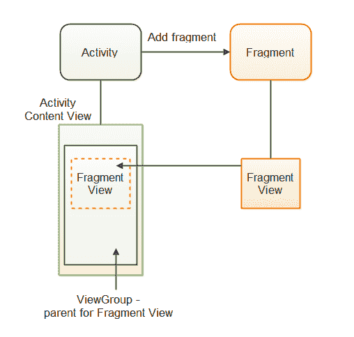

# 安卓保存状态的视图模型

> 原文：[https://www.geeksforgeeks.org/viewmodel-with-savedstate-in-android/](https://www.geeksforgeeks.org/viewmodel-with-savedstate-in-android/)

谷歌在 Google I/O 2018 上推出了 Android Jetpack，这是一个用于创建优秀 Android 应用的组件、工具和指南的捆绑包。它包括 LiveData、ViewModel、Room 数据库、WorkManager 和其他组件。`ViewModel` 将在本博客中讨论。在活动生命周期中，`ViewModel` 维护用户界面相关的数据。它使应用程序能够承受配置变化（如屏幕旋转）。

**`ViewModel` 主要用于：**

1.  为用户界面层准备数据。
2.  处理应用程序生命周期配置。



图 1，`ViewModel` 生命周期。

### 如何添加 `ViewModel`

```kt
class gfgViewModel : ViewModel() {
    val courses = MutableLiveData<List<courses>>()
    fun getCourses(): LiveData<List<courses>> {
        return courses
    }
    private fun loadCourses() {
        courses.value = // courses provided by gfg
    }
}
```

**然后将数据导入视图：**

```kt
class GeeksActivity : AppCompatActivity() {
    override fun onCreate(savedInstanceState: Bundle?) {
        // Starting the model
        val gfgSampleModel = ViewModelProviders.of(this).get(MainViewModel::class.java)
        gfgSampleModel.getCourses().observe(this, Observer<List<courses>>{ courses ->
            // do something like UI update
        })
    }
}
```

**我们必须在初始化视图（活动/片段）中的 `ViewModel`：**

```kt
val gfgSamplemodel = ViewModelProviders.of(this).get(GeeksModel::class.java)
```

#### 现在我们可以在用户界面中看到数据：

```kt
gfgModel.getCourses().observe(this, Observer<List<Courses>>{ courses ->
            // Do something here
}
```

这就是 `ViewModel` 在我们的视图中的使用方式。关于 `ViewModel` 的更多信息可以在这里找到。现在我们可以改变，但这是受限制的。为了管理它，我们可以使用 `onSaveInstanceState()` 返回到以前的状态。

每个安卓应用都在自己的 Linux 进程中运行，这被描述为系统启动进程死亡。当程序的部分代码必须被执行时，这个过程由程序启动，它将继续运行，直到不再需要它，并且系统需要恢复其内存以供其他应用程序使用。

> **GeekTip:** 如果你的程序不在前台，系统可以随时停止，释放系统 RAM 给其他进程使用。

1.  配置和系统启动的进程死亡都可以由 `onSaveInstanceState()` 包处理。
2.  然而，它只能保存有限的数据，并且高度依赖于速度和存储，因为**序列化需要大量的内存来存储数据。**
3.  序列化发生在主线程上，因此当配置发生变化时，用户界面屏幕可能会被阻止，应用程序也可能会冻结，产生 [ANRs（应用程序不响应）](https://www.geeksforgeeks.org/what-is-anr-and-how-it-can-be-prevented-in-android/)。
4.  **`onSaveInstanceState()`** 只能保存少量数据。

### `ViewModel` 的保存状态

因为用户界面数据总是从架构组件的 `ViewModel` 中引用，而不是从视图（活动/片段）中引用，所以 `ViewModel` 的保存状态可以被视为 `onSaveInstanceState()` 的替代。所以我们必须执行一些**代码来利用 `onSaveInstanceState()`。**

所以，作为 Jetpack 的一部分，谷歌推出了 `SavedState`，它允许我们在数据被系统启动的进程死亡杀死后，从保存的状态中保留和恢复数据。

> **极客提示 #2：** 需要注意的是，状态必须是基础且轻量级的。本地持久性应该用于复杂或大数据集。

将以下代码添加到您的 `build.gradle` 中，以集成项目中的 `SavedState`。

```kt
implementation 'androidx.lifecycle:lifecycle-viewmodel-savedstate:1.0.0-alpha01'
```

### 如何使用已保存的状态？

替换视图（活动/片段）的 `onCreate()` 函数中的以下代码片段。

```kt
val model = GeeksViewModel.of(this, savedVMState(this)).get(MainGfGViewModel::class.java)
```

**代替：**

```kt
val gfgModel= GeeksViewModel.of(this).get(MainGfGViewModel::class.java)
```

**此外，在 `ViewModel` 中：**

```kt
class GeeksViewModel(private val state: SavedStateHandle) : ViewModel() { ... }
```

如您所见，我们为 `ViewModel` 的主函数 `Object()` 提供了 `SavedStateHandle`。为了获得保存的数据句柄，我们使用 `SavedStateFactory()` 作为我们的 `ViewModelProvider` 中的工厂。

> **极客提示 #3：** 工厂是指导 `ViewModel` 如何构建 `ViewModel` 的接口。

请注意，它只是一个键值对。即使程序由于系统启动的进程死亡而死亡，数据仍然会被保存。

如您所见，我们为 `ViewModel` 的主函数 `Object()` 提供了 `SavedStateHandle`。为了获得保存状态句柄，我们使用 `SavedState()` 作为我们的 `GeeksViewModel.of` 中的工厂。

工厂是指导 `ViewModel` 如何构建 `ViewModel` 的接口。

1.  即使程序由于系统启动的进程死亡而死亡，数据仍然会被保存。
2.  `SavedStateHandle` 类似于安卓系统中的 `SharedPreferences`，因为它对键值对进行操作。
3.  让我们看一个例子：我们将创建一个具有三个用户界面组件（`EditText`、`Button` 和 `TextView`）的应用程序。
4.  当用户在 `EditText` 中输入用户名并点击 `Button` 时，用户名应该显示在 `TextView` 中。

#### 主 `ViewModel` 现在应该是这样的：

```kt
class GeeksVM(private val savedStateHandle: SavedStateHandle) : ViewModel(), BaseViewModel {
    override fun getCoursename(): LiveData<String> {
        return savedStateHandle.getLiveData(Constants.COURSE)
    }
    override fun saveCourse(username: String) {
        savedStateHandle.set(Constant.COURSE, course)
    }
}
```

在这里，

1.  数据是使用 `savedStateHandle.set(“key”, “value”)` 存储的。
2.  `getLiveData(“key”)` 方法用于检索 `String` 数据类型的 `LiveData`。

`MainViewModel` 类实现了 `BaseViewModel`，如下所示。

```kt
interface gfgViewModel {
    fun getCoursename(): LiveData<String>
    fun saveCourse(username: String)
}
```

### 验证

**执行步骤 – #1，您将不会在控制台中看到您的应用程序的软件包名称。**

当您重新打开程序时，您应该会看到输出被保存并显示在屏幕的 `TextView` 中。

**重要提示：**

如果您希望保留数据，请使用 `SavedStateHandle.set()`。

```kt
savedStateHandle.set("key_name","value")
```

如果希望从保存的数据中检索数据，请使用以下语法：

```kt
savedStateHandle.get("key_name")
```

如果您希望获取 `LiveData` 作为返回类型，请使用。

```kt
savedStateHandle.getLiveData("key_name")
```

如果您想查看 `SavedState` 中是否存在某个键，请使用以下代码。

```kt
savedState.contains("key_name")
```

如果您想找到保存状态中的所有键，请使用以下命令获取它们的列表。

```kt
savedState.keys()
```

您也可以通过键访问它来移除任何单个值。要执行以下操作：

```kt
savedState.remove("key_name")
```