# Laravel Artisan 命令指南

> 原文：[https://www.geeksforgeeks.org/laravel-artisan-commands-to-know-in-laravel/](https://www.geeksforgeeks.org/laravel-artisan-commands-to-know-in-laravel/)

## Artisan 简介

[Artisan](https://www.geeksforgeeks.org/laravel-artisan-console-introduction/) 是 Laravel 提供的命令行界面，旨在简化开发流程。它类似于 Linux 命令行，但其命令专为构建 Laravel 应用程序而设计。通过这个工具，我们可以创建模型、控制器、执行数据迁移等。首先，你需要将命令行控制台（Windows 上的 `cmd` 或 Linux/Mac 上的终端）或其他 CLI 软件的当前目录更改为你的 Laravel 应用程序目录。

## 创建命令

### 创建控制器
以下命令将创建一个控制器：

```php
php artisan make:controller ArticleController
```

**输出：**
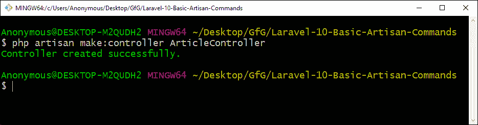

下面的命令将同时创建一个控制器和一个模型：

```php
php artisan make:controller ArticleController -m Article
```

**输出：**
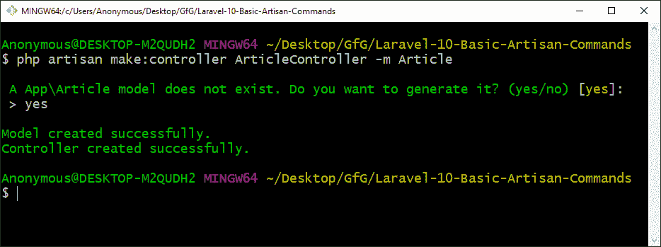

### 创建模型
以下命令将创建一个 Eloquent 模型：

```php
php artisan make:model Article
```

**输出：**
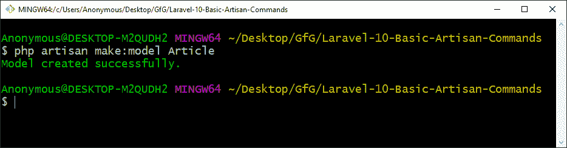

## 前端脚手架

### 创建前端脚手架
以下命令将为 Bootstrap 创建前端脚手架：

```php
php artisan ui bootstrap
```

**输出：**
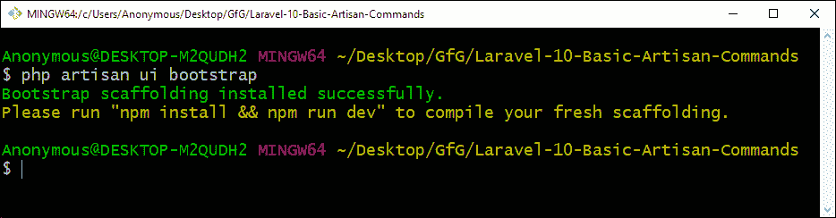

以下命令将为 Vue 创建前端脚手架：

```php
php artisan ui vue
```

**输出：**
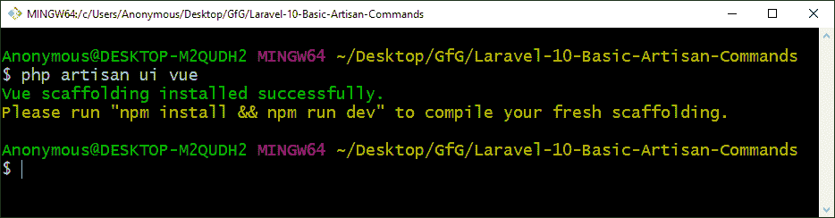

以下命令将为 React 创建前端脚手架：

```php
php artisan ui react
```

**输出：**


要移除脚手架，请使用以下命令：

```php
php artisan preset none
```

**输出：**
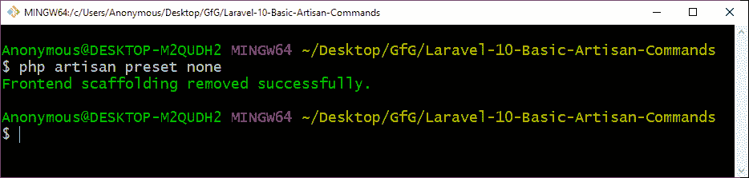

**注意：** 在使用上述命令之前，你需要运行 `composer require laravel/ui --dev` 来安装 `laravel/ui` 包。

### 认证配置
以下命令将创建一个完整的认证系统：

```php
php artisan ui vue --auth
```

**输出：**
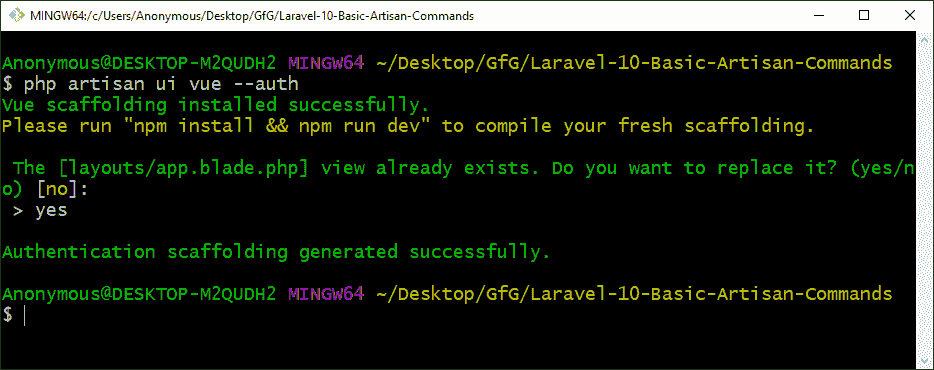

## 数据库与路由

### 创建数据迁移
以下命令将创建一个迁移文件：

```php
php artisan make:migration create_articles_table
```

**输出：**
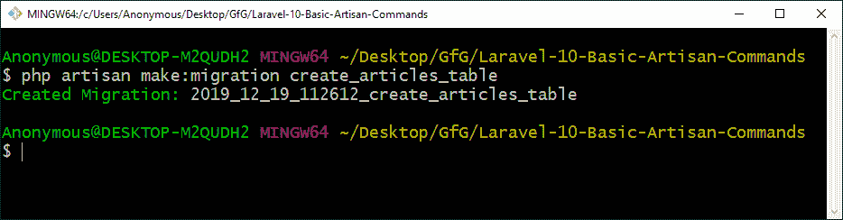

要对所有表执行数据库迁移，请运行以下命令：

```php
php artisan migrate
```

**输出：**
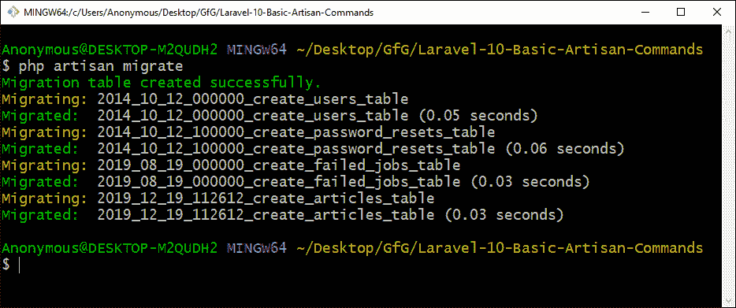

### 查看路由列表
以下命令将显示所有路由的列表：

```php
php artisan route:list
```

**输出：**
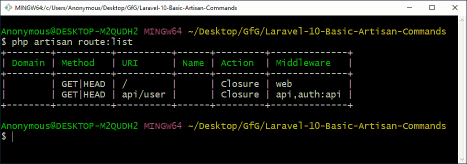

## 开发与维护

### 启动 Tinker
以下命令将启动 Tinker：

```php
php artisan tinker
```

**输出：**
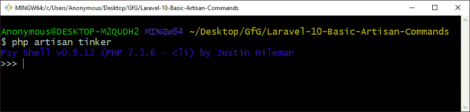

### 启动开发服务器
以下命令将启动 Laravel 开发服务器，并提供一个 URL 以访问正在运行的 Laravel 应用程序：

```php
php artisan serve
```

**输出：**
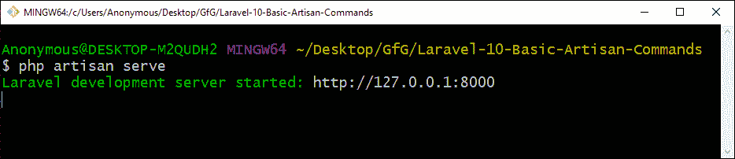

### 维护模式
以下命令可用于将 Laravel 应用程序切换至或退出维护模式：

**进入维护模式：**

```php
php artisan down
```

**输出：**
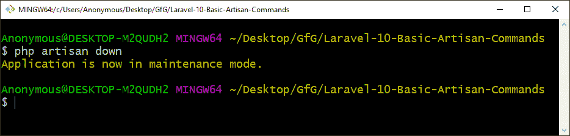

**退出维护模式：**

```php
php artisan up
```

**输出：**
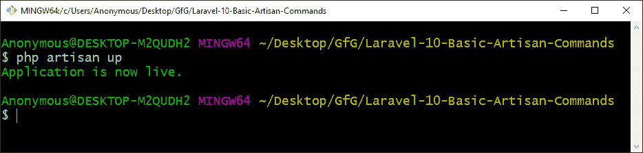

## 其他实用命令

### 列出所有命令
以下命令将显示所有可用命令的列表：

```php
php artisan list
```

**输出：**
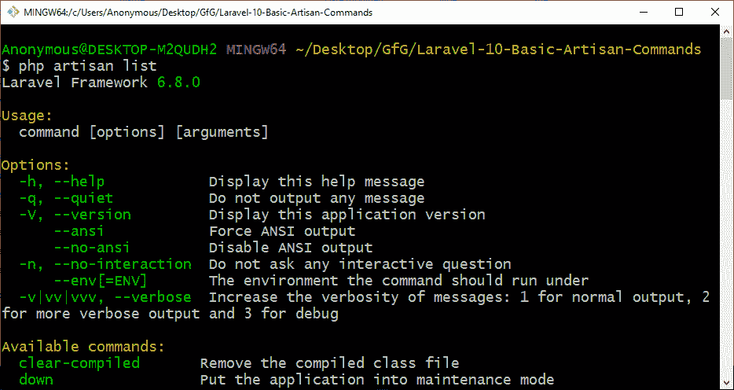

你也可以只写 `php artisan` 而不带 `list` 参数，效果相同，会列出所有 Artisan 命令。

**注意：** 要了解任何命令的更多信息，请在命令末尾使用 `-h` 或 `--help` 选项。