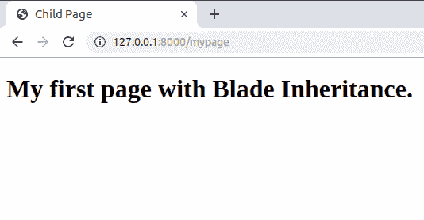

# Laravel Blade 模板继承

> 原文：[https://www.geeksforgeeks.org/laravel-blade-templates-inheritance/](https://www.geeksforgeks.org/laravel-blade-templates-inheritance/)

模板引擎使编写前端代码变得更容易，并有助于重用代码。所有的 Blade 文件都有一个扩展名 `.blade.php`。在 Laravel 中，大多数时间前端文件存储在 `resources/views` 目录中。Blade 文件支持 PHP，并被编译成普通的 PHP，缓存在服务器中，这样当用户再次访问页面时，我们就不必再做额外的编译模板的工作，因此使用 Blade 就像在前端使用 PHP 文件本身一样高效。

## 模板继承

在大多数现代网页中，所有网页都遵循一个固定的主题。因此，能够重用您的代码是非常有效的，这样您就不必再次编写代码中的重复部分，Blade 极大地帮助您实现这一点。

### 定义布局

让我们通过一个例子来实现，在 `resources/views` 目录中创建一个名为 `layout.blade.php` 的文件，如下所示：

```php
<!DOCTYPE html>
<html lang="en">
<head>
    <title>@yield('title')</title>
</head>
<body>
    <div>
        @yield('content')
    </div>
</body>
</html>
```

在上面给出的代码中，我们使用 `@yield` 指令告诉 Blade，我们将在子 Blade 页面中进一步扩展这一部分。此外，请注意，每个 `@yield` 指令都有一个名称，类似于第一个指令的 `title` 和第二个指令的 `content`。这些名称将在以后的子页面中使用，以表明此部分在此扩展。

### 扩展布局

现在，让我们也在 `resources/views` 目录中创建一个名为 `mypage.blade.php` 的页面，如下所示：

```php
@extends('layout')

@section('title')
    Child Page
@endsection

@section('content')
    <h1>My first page with Blade Inheritance.</h1>
@endsection
```

在这段代码中，我们首先使用 `@extends` 指令，该指令告诉我们从哪个 Blade 页面继承这个页面。在我们的例子中，它将是布局，因为我们将从我们之前创建的 `layout.blade.php` 继承这个页面。此外，我们使用 `@section` 指令来扩展父 Blade 文件的每个 `@yield` 指令。我们必须告诉每个 `@yield` 指令的名称，我们将在 `@section` 指令中进行扩展，就像我们在上面的代码中所做的那样。确保在编写完代码后，您以 `@endsection` 结束指令。所有 `@yield` 部分将被替换为子 Blade 页面中的相应代码。完成这项工作的最后一件事是在您的 `routes/web.php` 中添加如下所示的路由。

```php
Route::get('/mypage', function() {
    return view('mypage');
});
```

我们刚刚创建了一条通往 `/mypage` 的路由，在回调函数中，我们为 `mypage.blade.php` 提供服务。请注意，Blade 会自动在 `resources/views` 目录中查找文件。

### 输出



在输出中，您可以看到如何将 `@yield('title')` 替换为 `Child Page`，`@yield('content')` 替换为 `<h1>My first page with Blade Inheritance.</h1>`。