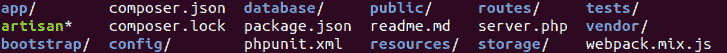

# Laravel 目录结构

> 原文：[https://www.geeksforgeeks.org/laravel-directory-structure/](https://www.geeksforgeeks.org/laravel-directory-structure/)

当你[创建](https://www.geeksforgeeks.org/laravel-installation-and-configuration/)你的新鲜 Laravel 应用程序时，它将包含大量的文件夹，如下图所示：

这些文件夹中的每一个都完成了框架整体功能的特定任务。下面解释了每个文件夹的用途，但在此之前，让我们先看一下每个文件夹：

## 目录结构

*   **app 目录**
*   **引导目录**
*   **配置目录**
*   **数据库目录**
*   **公共目录**
*   **资源目录**
*   **路由目录**
*   **存储目录**
*   **测试目录**
*   **供应商目录**

## 每个目录的用途

### 1. app 目录

这个目录是框架的核心，后端开发人员大多在这个目录上工作。它包含我们的网络应用程序的所有后端代码，如控制器、广播、提供者、定制工匠命令、中间件等。该目录还包含许多子目录，如下图所示：

**App 目录：**

| 目录 | 用途 |
| --- | --- |
| `console` | 此目录包含我们创建的所有 Artisan 命令。这些命令可以通过使用 `php artisan make:command` 命令生成。 |
| `exceptions` | 此目录包含应用程序的异常处理文件。在这里，你可以创建自己的特定异常并由我们的应用程序抛出。 |
| `http` | 此目录包含我们的控制器、中间件和表单请求。几乎所有处理进入我们应用程序的请求的后端都将放在这里。 |
| `providers` | 此目录包含应用程序的所有服务提供者。服务提供者通过注册服务来指导我们的应用程序。 |
| `broadcast` | 此目录默认不存在，但可以使用 `php artisan make:channel` 命令创建。它包含我们的应用程序广播事件的所有广播频道类。 |
| `events` | 此目录默认不存在，但可以使用 `php artisan make:event` 命令创建。此目录包含可用于向应用程序其他部分发出信号的事件类，反之亦然。 |
| `jobs` | 此目录默认不存在，但可以使用 `php artisan make:job` 命令创建。此目录包含我们应用程序的队列作业。 |
| `listeners` | 此目录默认不存在，但可以使用命令 `php artisan make:listener` 创建。此目录包含处理我们事件的类。 |
| `mail` | 此目录默认不存在，但可以使用 `php artisan make:mail` 命令创建。此目录包含我们代表应用程序发送的所有电子邮件类。 |
| `notifications` | 此目录默认不存在，但可以使用 `php artisan make:notification` 命令创建。此目录包含我们应用程序发送的所有“事务性”通知。 |
| `policies` | 此目录默认不存在，但可以使用 `php artisan make:policy` 命令创建。此目录包含授权策略类，用于确定用户是否可以访问或更改特定数据。 |
| `rules` | 此目录默认不存在，但可以使用 `php artisan make:rule` 命令创建。此目录包含自定义的验证规则对象，用于将复杂的验证逻辑封装在一个简单的对象中。 |

### 2. 引导目录

这个目录包含整个框架从哪里引导的 `app.php`。该目录还包含 `bootstrap/cache` 目录，用于存储框架生成的文件以优化性能。

### 3. 配置目录

该目录包含所有与数据库、邮件、会话、服务等相关的配置文件。

### 4. 数据库目录

该目录包含数据库迁移、模型工厂和种子。

### 5. 公共目录

该目录包含 `index.php` 文件，该文件是入口点，处理应用程序接收的所有请求，并配置自动加载。除此之外，该目录还包含应用程序中使用的资产，如图像、JavaScript 和 CSS。

### 6. 资源目录

这个目录包含应用程序的前端。构成应用程序前端的所有 HTML 代码都以 Blade 模板的形式呈现在这里，这是 Laravel 附带的模板引擎。

### 7. 路由目录

该目录包含应用程序的所有路由定义。

### 8. 存储目录

该目录包含编译后的 Blade 模板、基于文件的会话、文件缓存以及框架生成的其他文件。

### 9. 测试目录

这个目录包含了我们所有的自动化测试，这些测试是确保应用程序是否按照预期运行所必需的。

### 10. 供应商目录

这个目录包含了我们框架需要的所有通过 Composer 下载的依赖项。