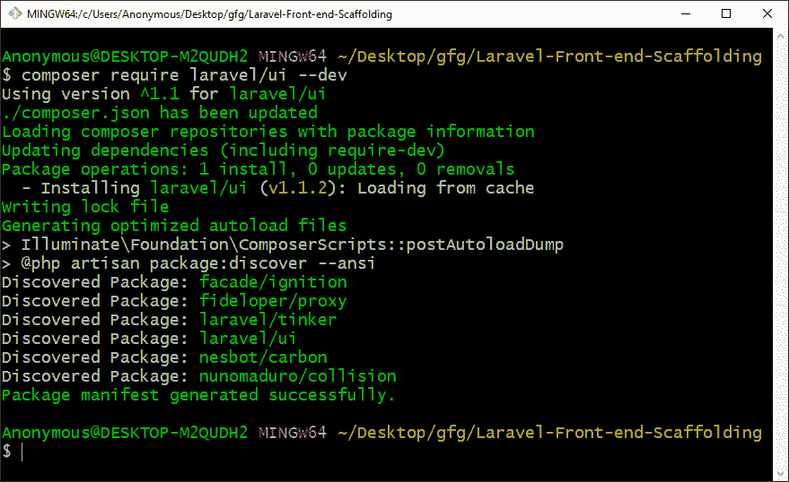
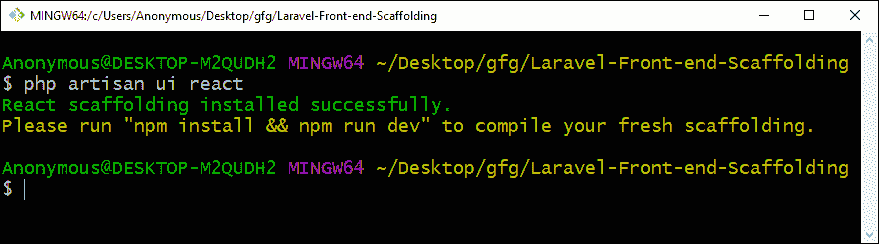
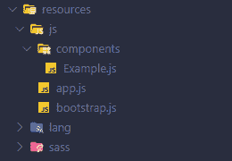
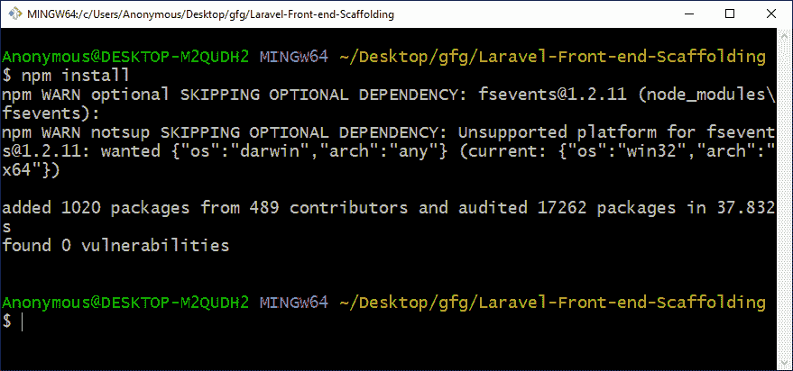
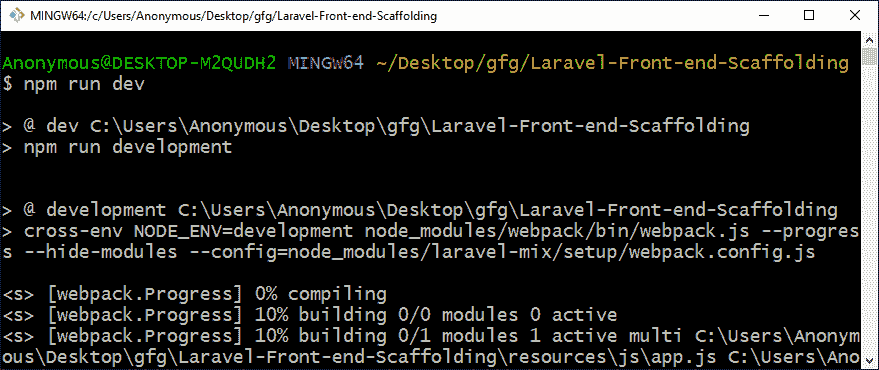
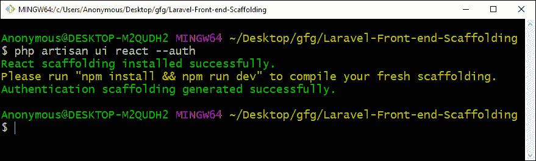
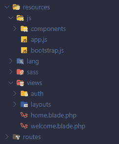
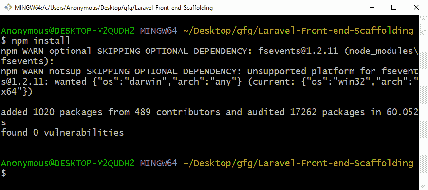
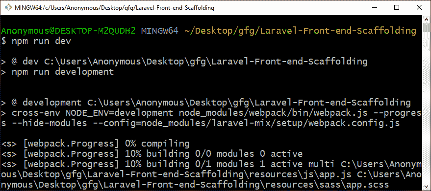
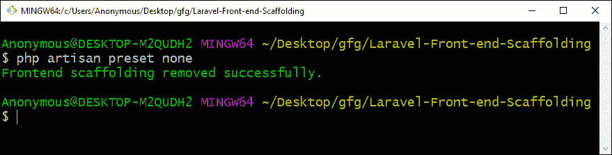

# Laravel 前端脚手架

> 原文：[https://www.geeksforgeeks.org/laravel-front-end-scaffolding/](https://www.geeksforgeeks.org/laravel-front-end-scaffolding/)

前端支架意味着为应用程序创建一个基本结构。Laravel 提供了一种非常简单的方法，可以使用任何其他可用的支架（如 `Bootstrap`、`Vue` 和 `React`）来更改前端预设/支架。

## 生成脚手架

**Step 1:** 要生成脚手架，我们首先需要安装 `laravel/ui`，这是一个 `composer` 包，为此我们必须运行以下 composer 命令。

```php
composer require laravel/ui --dev
```



**Step 2:** 之后，我们可以运行 `ui` artisan 命令来生成基础脚手架。正如我们之前讨论的，我们可以为 Bootstrap、Vue 或 React 生成脚手架，为此我们将运行以下 artisan 命令。
*   `Bootstrap`
*   `Vue`

```php
php artisan ui vue
```

*   `React`



这将在 `resources/js` 目录中创建一个 `components` 目录。



**Step 3:** 运行上述任何预设命令后，如果尚未安装 npm，我们将必须安装它，要安装请运行以下命令。

```php
npm install
```



**Step 4:** 现在我们必须运行以下 `npm` 命令来编译脚手架。

```php
npm run dev
```



## 通过身份验证生成支架

必须完成生成支架步骤 1，然后按照以下步骤操作。

**Step 1:** 要生成带有用于身份验证（如登录和注册）的视图文件的脚手架，那么我们只需在之前看到的命令末尾添加 `--auth`，如下所示：
*   `Bootstrap`
*   `Vue`

```php
php artisan ui vue --auth
```

*   `React`



这将在 `resources/js` 目录中创建 `components` 目录，并在 `resources/views` 目录中创建带有 `home.blade.php` 文件的 `auth` 和 `layouts` 目录。



**Step 2:** 运行上述任何预设命令后，如果尚未安装 npm，我们将必须安装它，要安装请运行以下命令。

```php
npm install
```



**Step 3:** 现在我们必须运行以下 npm 命令来编译脚手架。

```php
npm run dev
```



## 移除脚手架

要移除生成的脚手架，我们将运行以下 artisan 命令。

```php
php artisan preset none
```



**注意：** 这将删除 `components` 目录，该目录已创建，但不会删除 `resources/views` 目录中在 `auth` 支架期间创建的文件和目录。

**参考：** [https://laravel.com/docs/6.x/frontend](https://laravel.com/docs/6.x/frontend)