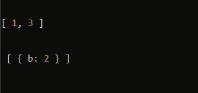

# Lodash _.differenceWith()方法

> 原文: [https://www.geeksforgeeks.org/lodash-_-differencewith-method/](https://www.geeksforgeeks.org/lodash-_-differencewith-method/)

`_.differenceWith()`方法类似于`_.difference()`方法，返回包含第一个数组中的值的数组，这些值不在第二个数组中，而是在`_.differenceWith()`中通过应用第三个参数提供的比较器，将第一个数组的所有元素与第二个数组进行比较。读这个可能会有点复杂，但是当你看到这个例子的时候就会变得简单了。

**语法:**
```javascript
_.differenceWith(array, [values], [comparator])
```

**参数:** 该方法接受三个参数，如上所述，如下所述:
* `array`: 此参数保存检查或检查值的数组。
* `values`: 该参数保存需要删除的值。
* `comparator`: 该参数保存每个元素调用的比较函数。

**返回值:** 这个方法根据上面解释的条件返回一个数组。

**例 1:**
```javascript
const _ = require('lodash')

let x = [1, 2, 3]

let y = [2, 4, 5]

let result = _.differenceWith(x, y, _.isEqual);

console.log(result);
```
这里，`const _ = require('lodash')`用于将lodash库导入文件。

**输出:**
```javascript
[1, 3]
```
因此，在这里，第一个数组的每个元素与第二个数组的每个元素根据第三个比较器进行比较，在我们的例子中是它的`_.isEqual`。所以，如果值变得相等，它就会移除它。

**例 2:**
```javascript
const _ = require('lodash');

let x = [{a: 1}, {b: 2}, 6]

let y = [{a: 1}, 7, 6]

let result = _.differenceWith(x, y, _.isEqual);

console.log(result);
```
**输出:**
```javascript
[{b: 2}]
```

**例 3:**
```javascript
const _ = require('lodash');

let x1 = [1, 2, 3]

let y1 = [2, 4, 5]

let result1 = _.differenceWith(x1, y1, _.isEqual);

console.log(result1);

let x2 = [{a: 1}, {b: 2}, 6]

let y2 = [{a: 1}, 7, 6]

let result2 = _.differenceWith(x2, y2, _.isEqual);

console.log('\n\n', result2);
```
**输出:**


**注意:** 这在正常的JavaScript中不会起作用，因为它需要安装库lodash。

**参考:** [https://lodash.com/docs/4.17.15#differenceWith](https://lodash.com/docs/4.17.15#differenceWith)