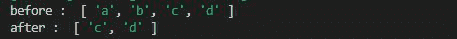
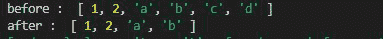
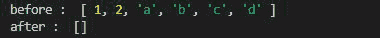

# Lodash _.drop()方法

> 原文: [https://www.geeksforgeeks.org/lodash-_-drop-method/](https://www.geeksforgeeks.org/lodash-_-drop-method/)

**Lodash** 是一个工作在下划线.js之上的JavaScript库，Lodash有助于处理数组、字符串、对象、数字等。
`_.drop()`方法用于放置给定数组中的元素。

## 语法

```
_.drop(array, number)
```

## 参数

*   `array`: 是要删除元素的原始数组。
*   `number`: 是要从数组中移除的元素数。

## 注意

元素从数组的索引0中移除。

## 返回值

返回分片数组。

## 示例 1

### JavaScript

```
// Requiring the lodash library
const _ = require("lodash");

// Original array
let array = ["a", "b", "c", "d"]

// Using drop() method to remove
// first two elements
let newArray = _.drop(array, 2)

// Printing original array
console.log("before : ", array)

// Printing array after applying
// drop function
console.log("after : ", newArray)
```

**输出:**



## 示例 2

如果要从数组右侧移除元素，我们使用`_.dropRight()`功能。

### JavaScript

```
// Requiring the lodash library
let lodash = require("lodash");

// Original array
let array = [1, 2, "a", "b", "c", "d"]

// Using dropRight() method to remove
// first 2 elements from right
let newArray = lodash.dropRight(array, 2)

// Printing original array
console.log("before : ", array)

// Printing array after applying
// drop function
console.log("after : ", newArray)
```

**输出:**



## 示例 3

如果数字大于给定的数组大小，则返回空数组，如下例所示。

### JavaScript

```
// Requiring the lodash library
let lodash = require("lodash");

// Original array
let array = [1, 2, "a", "b", "c", "d"]

// Using drop() method to remove
// first 10 elements
let newArray = lodash.drop(array, 10)

// Printing original array
console.log("before : ", array)

// Printing array after applying
// drop function
console.log("after : ", newArray)
```

**输出:**

