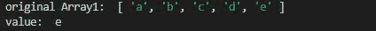
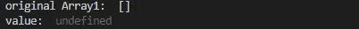

# Lodash _.last() 方法

> 原文: [https://www.geeksforgeeks.org/lodash-_-last-method/](https://www.geeksforgeeks.org/lodash-_-last-method/)

`Lodash` 是一个在 `underscore.js` 之上工作的 JavaScript 库，有助于处理数组、字符串、对象、数字等。`_.last()` 方法用于获取数组的最后一个元素，即第 (n-1) 个元素。

## 语法

```
_.last( array )
```

## 参数

该函数接受单个参数，即数组。

## 返回值

返回数组的最后一个元素。

## 注意

请在使用下面给出的代码之前，通过 `npm install lodash` 安装 `lodash` 模块。

### 例 1

```javascript
// Requiring the lodash library
const _ = require("lodash");

// Original array
let array1 = ["a", "b", "c", "d", "e"]

// Using _.last() method
let value = _.last(array1);

// Printing original Array
console.log("original Array1: ", array1)

// Printing the value
console.log("value: ", value)
```

**输出:**



### 例 2

```javascript
// Requiring the lodash library
const _ = require("lodash");

// Original array
let array1 = []

// Using _.last() method
let value = _.last(array1);

// Printing original Array
console.log("original Array1: ", array1)

// Printing the value
console.log("value: ", value)
```

**输出:**

