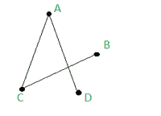
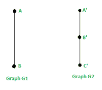
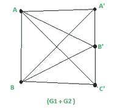
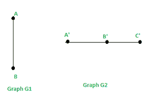
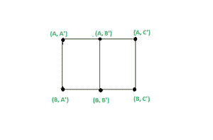
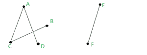

# 图的加法、乘积图的秩和零性

> 原文：[https://www.geeksforgeeks.org/addition-product-of-2-graphs-rank-and-nullity-of-a-graph/](https://www.geeksforgeeks.org/addition-product-of-2-graphs-rank-and-nullity-of-a-graph/)

## 简介
图 `G` 由顶点和边组成。边是连接图中任意两个节点的直线或圆弧，这些节点也称为顶点。

一个简单的图形 `G = (V, E)` 包括：
*   有限顶点集 `V`
*   边集 `E`

示例：
在下图中，图形 `G` 由以下部分组成：
`V = { A, B, C, D}`
`E = { {A, C}, {C, B}, {A, D}}`



## 两个图的相加
如果我们有两个图 `G1` 和 `G2`，使得它们的顶点交集为空 (`V(G1) ∪ V(G2) = ∅`)，那么和 `G1 + G2` 定义为顶点集 `V(G1 + G2)` 为 `V(G1) + V(G2)` 的图，边集由这些边组成，这些边就是 `G1` 中的边和 `G2` 中的边。

例：`G1` 和 `G2` 所示的 2 个图形相加为：

 

这里：`V(G1) ∩ V(G2) = ∅`

`G1` 中已经包含的边为 `E(G1) : {{A, B}}`，顶点为：`V(G1) = {A, B}`
`G2` 中已经包含的边为 `E(G2) : {{A', B'}, {B', C'}}`，顶点为：`V(G2) = {A', B', C'}`

`G1 + G2` 将有：
(i) 个顶点作为：`V(G1 + G2) = V(G1) + V(G2) = { A, B, A', B', C'}`
(ii) 和 `E(G1 + G2) = E(G1) + E(G2) + G1` 的每个顶点与 `G2` 的每个顶点相连的边 = `{ {A, B}, {A', B'}, {B', C'}, {A, A'}, {A, B'}, {A, C'}, {B, A'}, {B, B'}, {B, C'}}`

## 2 个图的乘积
我们把 2 个图的乘积 `G1 * G2` 定义为 `(G1 * G2)(V, E)` 这样：
(i) 顶点：`V(G1 * G2) = V(G1) × V(G2)` 是 `V(G1)` 和 `V(G2)` 的笛卡尔积。
(ii) 边：考虑图 `G1` 的顶点集 `V(G1)` 和 `G2` 的顶点集 `V(G2)` 的笛卡尔积中的任意 2 个顶点，说 `A` 和 `V` (注：`A` 和 `V` 是一对 2 元素的顶点) 这样：`A = (a1, a2)` 和 `V = (v1, v2)`，然后 `{A, V}` 是图形 `G1 * G2` 中的一条边，如果满足以下条件之一：
(I) `a1 = v1` (该对中的第一个元素相同)，`a2` 与 `v2` 相邻。
(II) `a2 = v2` (该对中的第二个元素相同)，`a1` 与 `v1` 相邻。

举例：考虑 2 个图形，`G1` 和 `G2` 这样：
`V(G1) = {A, B}`
`E(G1) = { {A, B} }`
`V(G2) = {A', B', C'}`
`E(G2) = { {A', B'}, {B', C'} }`



那么图 `G1 * G2` 将有：
(i) 顶点：`V(G1 * G2) = V(G1) × V(G2) = {(A, A'), (A, B'), (A, C'), (B, A'), (B, B'), (B, C')}`
(ii) 边：我们需要检查 `G1 * G2` 中的每一对顶点是否能形成边。我们知道，如果我们在 `G1 * G2` 中有 2 个顶点 `A` 和 `V`，使得：`A = (a1, a2)` 和 `V = (v1, v2)`，那么 `{A, V}` 就是图 `G1 * G2` 中的一条边，如果满足以下条件之一：
(I) `a1 = v1` (对的第一个元素相同) 并且 `a2` 与 `v2` 相邻。
(II) `a2 = v2` (对的第二个元素相同) 并且 `a1` 与 `v1` 相邻。



图表乘积 `G1 * G2`

我们发现：
1. `{ (A, A'), (A, B') }` 是边，因为在 `G2` 中，对的第一个元素相同 (`A = A`)，`A'` 与 `B'` 相邻。
2. `{ (A, C'), (A, B') }` 是边，因为在 `G2` 中，对的第一个元素相同 (`A = A`)，`C'` 与 `B'` 相邻。
3. `{ (B, A'), (B, B') }` 是边，因为在 `G2` 中，对的第一个元素相同 (`B = B`)，`A'` 与 `B'` 相邻。
4. `{ (B, C'), (B, B') }` 是边，因为在 `G2` 中，对的第一个元素相同 (`B = B`)，`C'` 与 `B'` 相邻。
5. `{ (A, A'), (B, A') }` 是边，因为对的第二个元素相同 (`A' = A'`)，`A` 在 `G1` 中与 `B` 相邻。
6. `{ (A, B'), (B, B') }` 是边，因为对的第二个元素相同 (`B' = B'`)，`A` 在 `G1` 中与 `B` 相邻。
7. `{ (A, C'), (B, C') }` 是一条边，因为该对中的第二个元素相同 (`C' = C'`)，`A` 在 `G1` 中与 `B` 相邻。

所以 `E(G1 * G2) = { { (A, A'), (A, B') }, { (A, C'), (A, B') }, { (B, A'), (B, B') }, { (B, C'), (B, B') }, { (A, A'), (B, A') }, { (A, B'), (B, B') }, { (A, C'), (B, C') } }`

这样我们就可以求出任意 2 个图的加法和乘积。

## 图的秩和零性
让 `G(V, E)` 是一个有 `n` 个顶点、`m` 条边和 `K` 个分量的图。
即：`|V(G)| = n` 和 `|E(G)| = m`。我们定义秩 `ρ(G)` 和零度 `μ(G)` 如下：

```
If G Is not connected : 
ρ(G) = Rank of G = n - k
μ(G) = Nullity of G = m - n + k

If G Is connected : 
ρ(G) = Rank of G = n - 1
μ(G) = Nullity of G = m - n + 1
```

示例 1：下图是连通的：


图表 `G`

`|V(G)| = n = 4` 和
`|E(G)| = m = 3`
`ρ(G) = G 的秩 = n - 1 = 4 - 1 = 3`
`μ(G) = G 的零性 = m - n + 1 = 3 - 4 + 1 = 0`

示例 2：下图未连通：



`|V(G)| = n = 6` 和
`|E(G)| = m = 4` 和
组件数量 `= k = 2`
`ρ(G) = G 的秩 = n - k = 6 - 2 = 4`
`μ(G) = G 的零性 = m - n + k = 4 - 6 + 2 = 0`