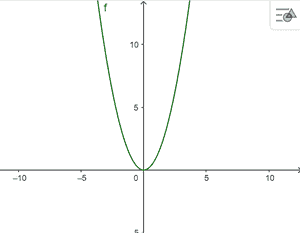
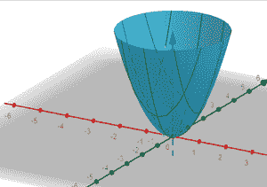
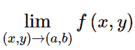
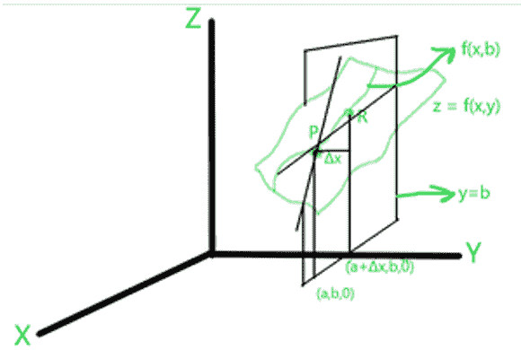
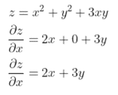
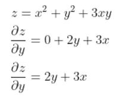
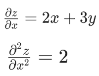
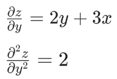
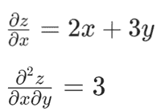
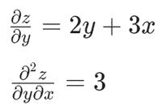

# 工程数学–偏导数

> 原文：[https://www.geeksforgeeks.org/engineering-mathematics-partial-derivatives/](https://www.geeksforgeeks.org/engineering-mathematics-partial-derivatives/)

一个[函数](https://www.geeksforgeeks.org/types-of-functions-class-12-maths/)就像一台机器，接受一些输入，给出一个输出。*例如*，`y = f(x)`是`x`中的一个函数。这里，我们说`x`是自变量，`y`是因变量，因为`y`的值取决于`x`。

**函数的一些例子有：**

1.  `f(x) = x^2 + 3` 是代数函数。
2.  `e^x` 为指数函数。
3.  `sin(x)`，`cos(x)`，`tan(x)`，…等。都是三角函数。

现在，所有这些函数都是单个变量的函数，即只有一个自变量。

要理解偏导数的概念，首先要看二元函数是什么意思。
考虑一个 `z = f(x, y)` 形式的函数，其中`x`和`y`是自变量，`z`是因变量。这个函数叫做双变量函数。类似地，也可以定义几个变量（即有 2 个以上独立变量）的函数。

**多变量函数或多变量函数的一些例子有：**

1.  `f(x, y) = x^2 + y`
2.  `f(x, y, z) = x - 3y + 4z`

让我们通过图形来形象化这个概念。首先我们考虑单变量函数 `f(x) = x^2`。

`f(x) = x^2` 图

与单变量函数不同，我们不能将多变量函数可视化为二维图形。为此，我们将其绘制在三维平面上。例如，考虑 `f(x, y) = x^2 + y^2` 的图形。

`f(x, y) = x^2 + y^2` 的曲线图

对于几个变量的函数，我们定义[极限](https://www.geeksforgeeks.org/formal-definition-of-limits/)如下：

这意味着，当`x`接近`a`和`y`接近`b`时，求`f(x)`的极限。

类似地，连续性和[可微性](https://www.geeksforgeeks.org/differentiability-of-a-function-class-12-maths/)的[定义可以从单变量函数的定义扩展而来。](https://www.geeksforgeeks.org/mathematics-limits-continuity-differentiability/)

回想一下，单变量 `y=f(x)` 函数的导数定义为：`f'(x) = dy/dx`。

对于两个变量的函数 `z = f(x, y)`，我们将导数定义为：`∂z/∂x`。

这意味着通过保持`y`不变来计算函数`z`相对于`x`的导数。同样，我们可以通过保持`x`不变来计算`z`相对于`y`的导数 `∂z/∂y`。

## 偏导数的几何解释

众所周知，对于单变量函数，导数的计算是通过曲线的切线的斜率。同样，我们可以理解多变量函数偏导数的几何解释。

考虑一个两个变量的函数，在三维平面上 `z = f(x, y)`，让平面 `y=b` 通过曲线 `f(x, y)`。

现在，我们画另一条曲线 `f(x, b)`，它位于垂直于平面 `y=b` 的 `z` 上。考虑这条曲线上的两个任意点 `P`，`R`，并画出穿过这些点的割线。

该割线的斜率使用如下第一原则计算：

`m = Δz/Δx = [f(x+Δx, b) - f(a, b)] / Δx`

当这两个点彼此靠近时，差值 `Δx` 接近 0，我们以极限的形式计算出来：

`lim(Δx→0) Δz/Δx = [f(a+Δx, b) - f(a, b)] / Δx`

该极限是`z`相对于`x`的偏导数，将`y`视为常数，即

`∂z/∂x = [f(a+Δx, b) - f(a, b)] / Δx`

## 计算给定函数的偏导数

计算给定函数偏导数的步骤：

1.  考虑 `z = f(x, y)`。
2.  通过将`y`视为常数，计算相对于`x`即 `∂z/∂x` 的偏导数，并对函数相对于`x`进行微分。
3.  通过将`x`视为常数，计算相对于`y`即 `∂z/∂y` 的偏导数，并对相对于`y`的函数进行微分。

*例*：`z = x^2 + y^2 + 3xy`

这里，对于给定的函数，我们计算两个偏导数如下：

**情况 1**：通过将`y`视为常数，即 `∂z/∂x` 来区分`x`。

通过处理`y`常量来区分`z`和`x`。

**情况 2**：通过将`x`视为常数，即 `∂z/∂y` 来区分`y`。

通过处理`x`常量来区分`z`和`y`。

## 二阶偏导数

与计算单变量函数的二阶导数类似，我们也可以计算多变量函数的二阶导数。

例如，我们考虑相同的函数 `z = x^2 + y^2 + 3xy`。

**案例 1**：我们再次区分 `∂z/∂x` 和`x`。

**案例 2**：我们再次区分 `∂z/∂y` 和`y`。

**案例 3**：我们再次区分 `∂z/∂x` 与`y`。

**案例 4**：我们再次区分 `∂z/∂y` 和`x`。

