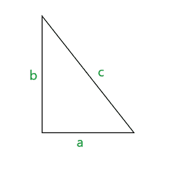
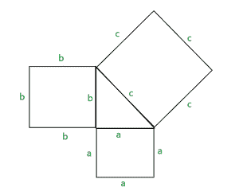
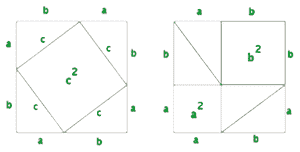

# 勾股定理背后的直觉

> 原文：[https://www.geeksforgeeks.org/intuition-behind-pythagoras-theorem/](https://www.geeksforgeeks.org/intuition-behind-pythagoras-theorem/)

毕达哥拉斯定理指出，在直角三角形中，`a`是三角形的底边，`b`是三角形的高度，`c`是三角形的斜边，那么`a^2 + b^2 = c^2`。

以下是这方面的说明–

## 示例

### 例1
如果直角三角形的底边是 3，高度是 4，那么它的斜边长度是多少？

**解–** 给定，`a=3`，`b=4`，`c=?`
利用勾股定理，
`a^2 + b^2 = c^2`
`3^2 + 4^2 = c^2`
`c = √(9+16)`
`c = 5`

### 例2
如果直角三角形的斜边是 13，高度是 5，那么它的底边长度是多少？

**解–**
给定，`a=?`，`b=5`，`c=13`
利用勾股定理，
`a^2 + b^2 = c^2`
`a^2 + 5^2 = 13^2`
`a = √(169-25)`
`a = 12`

## 毕达哥拉斯定理背后的直觉

让我们用图形来证明这个定理。
按照以下方式绘制对应于三角形每条边的正方形–

如果我们仔细看这个图，我们可以将勾股定理重新定义如下：
两个正方形的面积等于第三个正方形。
即 `a^2` 是第一个正方形的面积，`b^2` 是第二个正方形的面积，`c^2` 是第三个正方形的面积。

因此，`a^2 + b^2 = c^2`。

毕达哥拉斯定理的另一个证明可以通过重新排列三角形形成 2 个正方形来展示，如下所示：

如果我们比较两个正方形，可以发现两个正方形都有 `a+b` 边长，因此面积相同。
在每个正方形中，使用了四个直角三角形（尽管以不同的方式重新排列）。
因此，我们可以得出结论：

面积（第一个正方形）= 面积（第二个正方形）
`c^2 + 4 * (直角三角形的面积) = a^2 + b^2 + 4 * (直角三角形的面积)`
`c^2 = a^2 + b^2`（从两侧取消常用术语）

于是，毕达哥拉斯定理被证明了。