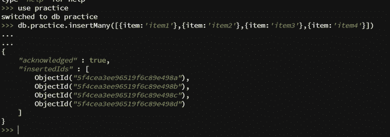
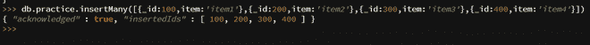
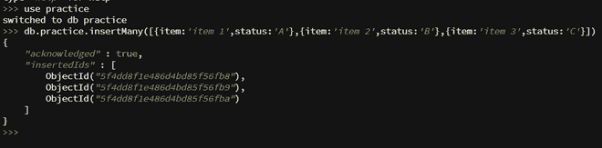
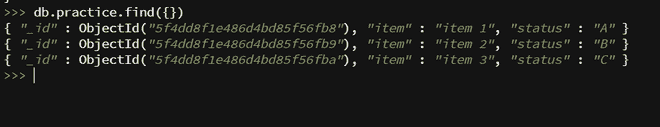
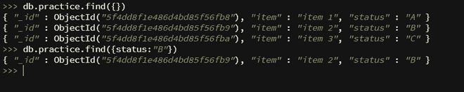
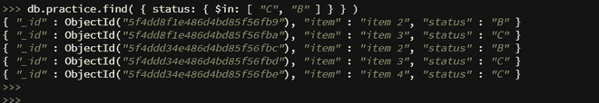
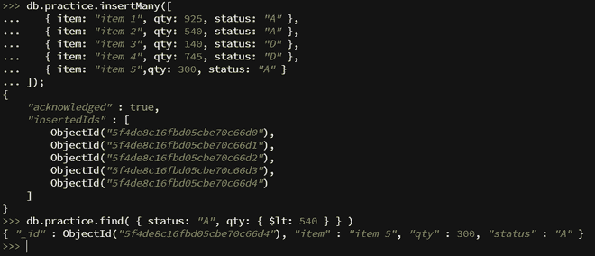
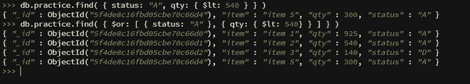
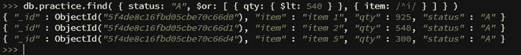

# 在 MongoDB 中添加和查询数据

> 原文: [https://www.geeksforgeeks.org/adding-and-querying-the-data-in-mongodb/](https://www.geeksforgeeks.org/adding-and-querying-the-data-in-mongodb/)

## 在 MongoDB 中添加数据

MongoDB 在 `BSON` 中存储文档，这是 `JSON` (JavaScript 对象符号)的二进制形式。这些文件被收藏起来。

要在 MongoDB 中插入文档，请执行以下步骤:

### 第一步: 创建集合

**语法:**

```
use collection_name
```

如果集合不存在，它将创建一个集合，否则它将返回现有集合。


要显示当前选择的集合，请使用如下所示的 `db` 命令:


### 第二步: 将数据插入集合

MongoDB 中的文档可以通过两种方法插入:

1.  `db.collection_name.insertOne()`: `db.collection_name.insertOne` 方法用于向集合中插入单个文档。

    **语法:**

    ```
    db.collection_name.insertOne({item:'item1'}) // OR
    db.collection_name.insert({item:'item1'})
    ```

    **示例:**

    

    在这里，我们可以指定 `_id` 字段，如果它没有指定，那么 MongoDB 会添加值为 `objectId` 的 `_id` 字段。

    

2.  `db.collection_name.insertMany()`: `db.collection_name.insertMany()` 可以将多个文档插入到一个集合中。只需要向此方法传递文档数组。

    **语法:**

    ```
    db.collection_name.insertMany([{item:'item1'}, {item:'item2'},
    {item:'item3'}, {item:'item4'}])
    ```

    **示例 1:** 插入多个没有 `_id` 的文档

    

    **示例 2:** 插入多个带有 `_id` 的文档

    

## 在 MongoDB 中查询数据

查询操作使用 MongoDB 中的 `db.collection.find()` 方法执行。要在 MongoDB 中查询文档，请执行以下步骤:

### 步骤 1: 使用 Mongo Shell

创建收藏并插入文档



### 第二步: 选择集合中的所有文档

要选择集合中的所有文档，将一个空文档作为查询过滤参数传递给 `find` 方法。这个语句类似于 `MySQL` 中的 `SELECT * FROM` 表语句。

**语法:**

```
db.collection_name.find({})
```



### 第三步: 指定相等条件

要过滤 `db.collection_name.find()` 方法的结果，需要为方法指定条件。

**语法:**

```
db.collection_name.find({ <field1>: <value1>, ... })
```



### 第四步: 使用查询运算符指定条件

查询过滤文档可以使用查询运算符指定条件。

**语法:**

```
db.collection_name.find({ <field1>: { <operator1>: <value1> }, ... })
```

1.  **`in` 运算符 (`$in`)**: 以下示例检索状态值为 “C” 或 “B” 的所有文档。

    

2.  **`AND` 运算符 (`,`)**: 一个复合查询可以为集合文档中的多个字段指定条件。隐式地，一个逻辑 `AND` 连接复合查询的子句，因此查询选择集合中匹配所有条件的文档。

    以下示例返回状态为 “A” 且数量小于 540 的文档。

    

3.  **`OR` 运算符 (`$or`)**: 使用 `$or` 运算符，您可以指定一个复合查询，用逻辑 `OR` 连接每个子句，因此查询选择集合中至少匹配一个条件的文档。

    以下示例返回状态为 “A” 或数量小于 540 的文档。

    

您可以同时使用 `AND` 和 `OR` 运算符，在以下示例中，查询返回状态等于 “A” 并且数量小于 540 或项目以字符 “I” 开头的文档。

