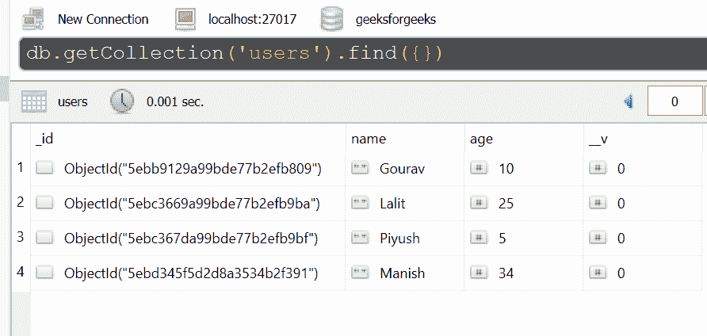

# query.prototype.intersects() 在 Mongoose 中是如何工作的？

> 原文: [https://www.geeksforgeeks.org/how-does-query-prototype-intersects-work-in-mongoose/](https://www.geeksforgeeks.org/how-does-query-prototype-intersects-work-in-mongoose/)

`query.prototype.intersects()` 函数用于声明几何图形的交集查询。该函数与 `geometry()` 函数一起广泛使用。

## 语法

```
Query.prototype.intersects()
```

## 参数

该功能有一个对象类型的参数。

## 返回值

此函数返回查询对象。

## 安装 Mongoose

```
npm install mongoose
```

安装 `mongoose` 模块后，可以使用命令在命令提示符下查看自己的 `mongoose` 版本。

```
npm mongoose --version
```

之后，您可以创建一个文件夹并添加一个文件，例如 `index.js`，如下所示。

## 数据库

这里使用的样本数据库如下所示。



## 项目结构

项目结构会是这样的:


## 例 1

```javascript
const mongoose = require('mongoose');

// Database connection
mongoose.connect('mongodb://127.0.0.1:27017/geeksforgeeks', {
    useNewUrlParser: true,
    useCreateIndex: true,
    useUnifiedTopology: true
});

// User model
const User = mongoose.model('User', { 
    name: { type: String },
    age: { type: Number }
});

const query = User.find();
query.where('path').intersects().geometry({
    type: 'LineString'
  , coordinates: [[180.0, 11.0], [180, 9.0]]
})

console.log(query._conditions)
```

使用以下命令运行 `index.js` 文件:

```
node index.js
```

**输出:**

```
{ path: { '$geoIntersects': { '$geometry': [Object] } } }
```

## 例 2

```javascript
const express = require('express');
const mongoose = require('mongoose');
const app = express()

// Database connection
mongoose.connect('mongodb://127.0.0.1:27017/geeksforgeeks', {
    useNewUrlParser: true,
    useCreateIndex: true,
    useUnifiedTopology: true
});

// User model
const User = mongoose.model('User', { 
    name: { type: String },
    age: { type: Number }
});

const query = User.find();
query.where('path').intersects().geometry({
    type: 'LineString'
  , coordinates: [[181.0, 12.0], [181, 10.0]]
})

console.log(query._conditions)

app.listen(3000, function(error ) {
    if(error) console.log(error)
    console.log("Server listening on PORT 3000")
});
```

使用以下命令运行 `index.js` 文件:

```
node index.js
```

**输出:**

```
Server listening on PORT 3000
{ path: { '$geoIntersects': { '$geometry': [Object] } } }
```

**参考:** [https://mongoosejs.com/docs/api/query.html#query_Query-intersects](https://mongoosejs.com/docs/api/query.html#query_Query-intersects)