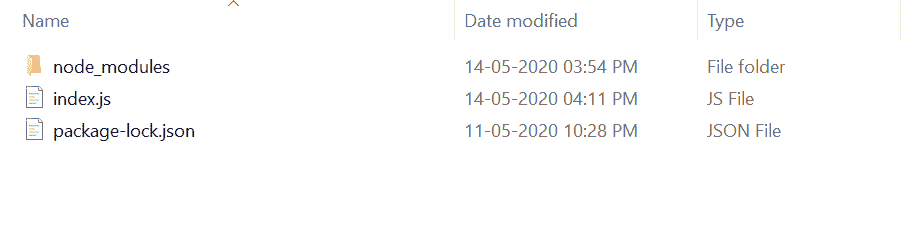
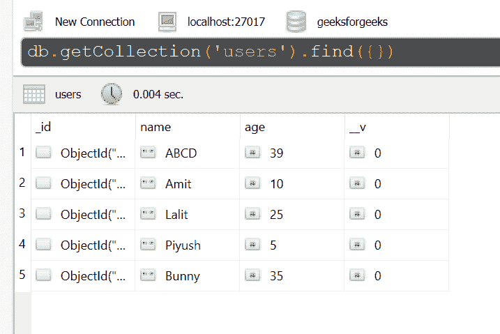
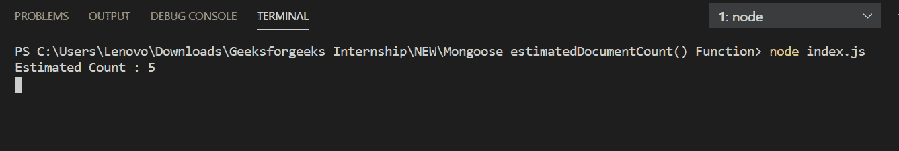

# Mongoose estimatedDocumentCount()函数

> 原文：[https://www.geeksforgeeks.org/mongoose-estimateddocumentcount-function/](https://www.geeksforgeeks.org/mongoose-estimateddocumentcount-function/)

`estimatedDocumentCount()`函数很快，因为它估计了 MongoDB 集合中的文档数。它用于大型集合，因为此函数使用集合元数据，而不是扫描整个集合。

## 安装 Mongoose 模块

1.  您可以访问[安装 Mongoose 模块](https://www.npmjs.com/package/mongoose)的链接。您可以使用此命令安装此软件包。
    ```
    npm install mongoose
    ```
2.  安装 Mongoose 模块后，您可以使用命令在命令提示符下检查您的 Mongoose 版本。
    ```
    npm version mongoose
    ```
3.  之后，您可以创建一个文件夹并添加一个文件，例如 `index.js`。
    ```
    node index.js
    ```

## 示例代码

**文件名：index.js**

```javascript
const mongoose = require('mongoose');

// Database Connection
mongoose.connect('mongodb://127.0.0.1:27017/geeksforgeeks', {
    useNewUrlParser: true,
    useCreateIndex: true,
    useUnifiedTopology: true
});

// User model
const User = mongoose.model('User', {
    name: { type: String },
    age: { type: Number }
});

User.estimatedDocumentCount(function (err, count) {
    if (err){
        console.log(err)
    }else{
        console.log("Estimated Count :", count)
    }
});
```

## 运行步骤

1.  项目结构会是这样的：
    
2.  确保您已经使用以下命令安装了 Mongoose 模块：
    ```
    npm install mongoose
    ```
3.  下面是函数执行前数据库中的样本数据，你可以使用任何 GUI 工具或终端查看数据库，就像我们已经使用的 Robo3T GUI 工具如下所示：
    
4.  使用以下命令运行 `index.js` 文件：
    ```
    node index.js
    ```
    

这就是如何使用 Mongoose `estimatedDocumentCount()` 函数来估计 MongoDB 集合中的文档数量。