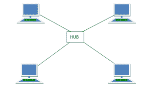

# 轮毂的优缺点

> 原文：[https://www.geeksforgeeks.org/advantages-and-disadvantages-of-hub/](https://www.geeksforgeeks.org/advantages-and-disadvantages-of-hub/)

集线器是连接多个主机设备到一个网络的[网络设备](https://www.geeksforgeeks.org/network-devices-hub-repeater-bridge-switch-router-gateways/)的中心点。它作为一个多端口中继器，允许数据在它们之间传输。为此，它使用光纤电缆或双绞线电缆。

它是一种网络设备，允许使用双绞线或光纤电缆连接多个[以太网](https://www.geeksforgeeks.org/ethernet-frame-format/)设备（即主机）。它在[物理层运行，即OSI堆栈](https://www.geeksforgeeks.org/layers-of-osi-model/)的第 1 层。一般来说，`Hub`工作在（物理层）有点像交换机，它也将计算机连接在一起。

它充当多端口中继器，将数据广播到设备连接的所有或任何端口。以下是网络`Hub`设备的功能：

*   在`半双工模式`下运行。
*   有 4 到 24 个端口可供选择。
*   主机有责任进行冲突检测。
*   有三种类型：`主动枢纽`、`被动枢纽`和`智能枢纽`。

## `Hub`优势

*   **连接性**
    `Hub`的主要功能是允许客户端连接到网络，以便共享和对话。为此，`Hub`使用`网络协议分析器`。

*   **性能**
    `Hub`被认为对网络的性能影响非常小。这通常是因为它使用很少影响网络的广播模式运行。

*   **成本**
    与交换机相比，`Hub`确实便宜。基本上得益于它的简单性。因此，它们会帮助你节省很多钱。而且由于它们的产品，它们在市场上随处可见。

*   **设备支持**
    `Hub`可以通过一个中央`Hub`同时连接不同类型的媒体。尽管媒体希望以不同的速度运行，但它们不会支持它们。

*   **区域覆盖**
    网络的区域覆盖被限制在一定距离内。`Hub`扩展了网络的空间，这样通信就容易形成。

## `Hub`的缺点

*   **冲突域**
    `冲突域`的功能和数据包的再次传输并不影响，实际上它增加了更多的域间碰撞的机会。

*   **全双工模式**
    `Hub`无法在`全双工模式`下通信，只能在`半双工模式`下运行。从本质上讲，`半双工模式`意味着数据通常在给定时间只传输一次。因此，`Hub`必须不断切换其模式。

*   **规范**
    `Hub`不能支持像`令牌环网`一样大的网络。这通常是因为`Hub`必须在网络中的所有设备之间共享数据。

*   **网络流量**
    由于附件是在数据包中收到的，因此无法减少流量。因此，`Hub`产生高水平的网络流量。

*   **带宽浪费**
    `Hub`无法为每台设备提供专用带宽，只能共享。当发送大量信息时，所有的带宽都将被两台计算机占用，从而使其他计算机的网络速度变慢。