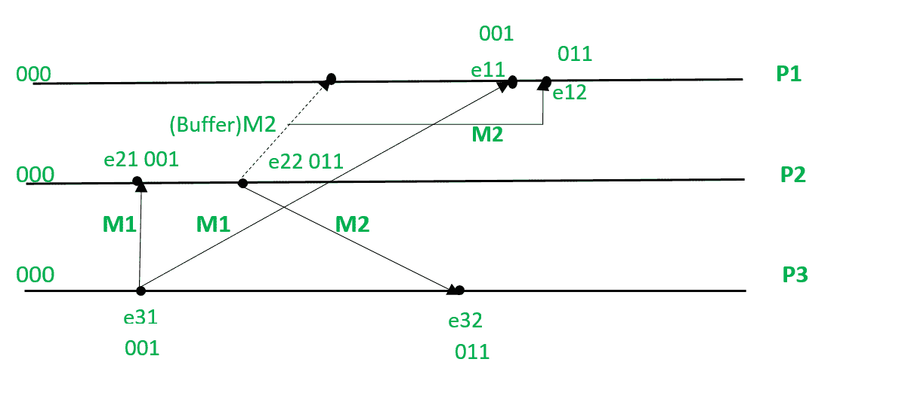

# 比尔曼·希珀·斯蒂芬森协议

> 哎哎哎:# t0]https://www . geeksforgeeks . org/birman-schper-Stephenson-protocol/

该[算法](https://www.geeksforgeeks.org/fundamentals-of-algorithms/)用于保持消息的因果顺序，即首先发送的消息应该首先被接收。如果`发送(M1)–>发送(M2)`，那么对于接收消息的所有进程，`M1`和`M2`应该在`M2`之前接收`M1`。

## 特征

*   基于广播的消息传递。
*   消息的大小很小。
*   发送的消息数量更多。
*   有限的状态信息。

## 要点

*   每个进程在发送消息时都会将其向量时钟增加 1。
*   如果一个进程已经收到了它之前的所有消息，那么这个消息就会被传递给这个进程。
*   否则缓冲消息。
*   更新进程的矢量时钟。

## 参考

*   流程:`P_i`
*   事件:`e_ij`，其中`i:process`为数字&`j:正在进行中的事件`。
*   `T_m`:消息`m`的矢量时间戳
*   `C_i`与进程`P_i`关联的矢量时钟；`j`第个元素是`C_i[j]`，包含`P_i`当前时间在过程`P_j`中的最新值

## 协议

**`P_i`向`P_j`–发送消息**

*   `P_i`递增`C_i[i]`并为消息`m`设置时间戳`t_m = C_i[i]`

**`P_j`收到来自`P_i`–的消息**

*   当`P_j`，`j != i`，接收到带有时间戳`t_m`的`m`，它延迟消息的传递，直到两者都如下。

```
Cj[i] = tm[i] - 1; and
for all k <= n and k != i, Cj[k] <= tm[k].
```

*   当消息传送到`P_j`时，更新`P_j`的矢量时钟。
*   检查缓冲区，看看是否有可以交付的。

## 示例



*   所有进程的初始状态都是`000`。
*   `M1`从`P3`向`P1`和`P2`广播。`e31`将矢量时钟更新为`(001)`并发送`P1`和`P2`。
*   `P2`接受带有时间戳`(001)`的`M1`，因为当它将其与其初始时间戳(即`000`)进行比较时，它发现`M1`是它接收的第一条消息。
*   现在我们考虑在`M1`到达`P1`之前，`P2`将`M2`发送到带有时间戳`(011)`的`P1`和`P3`。
*   `P1`无法接受`M2`，因为在将`M2`的时间戳与其初始时间戳进行比较时，发现了一个差异，因为`P1`没有较早收到时间戳为`(001)`的消息，所以`M2`存储在缓冲区中。
*   现在`M1`被`P1`接受了。
*   `M2`被从缓冲区中移除，并被`P1`接受。
*   `M2`被`P3`接受，因为时间戳没有差异。