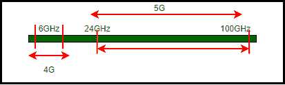
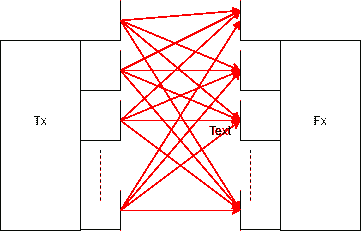

# 5G 的挑战

> 原文:[https://www.geeksforgeeks.org/challenges-for-5g/](https://www.geeksforgeeks.org/challenges-for-5g/)

[第五代(5G)网络](https://www.geeksforgeeks.org/what-is-5g-wireless-technology-and-how-it-works/)预计将支持巨大的数据流量。它旨在为数百万无线连接提供服务。通过使用某些先进技术，如小蜂窝、海量多输入多输出等，5G 可以支持广泛的设备和应用，这将进一步增强物联网的未来(IOT)。然而，这些技术有其自身的挑战，使得 5G 的建立变得困难。

## 技术和挑战

这些解释如下。

### 毫米波

5G 使用毫米波，之所以这么叫是因为它们的波长在 1 毫米到 10 毫米之间。

**Figure –** Range of Millimeter Waves for 5G

这些是高频波，范围在 3 GHz 到 300 GHz 之间，其中 24 GHz 到 100 GHz 的范围已被提议用于 5G。这将使大量设备和技术能够使用带宽，并带来更高质量的视频和其他多媒体内容的流畅播放。

然而，这进一步暴露了 5G 的某些障碍。
由于毫米波是高频波，因此更容易被建筑物、树木等结构堵塞。此外，它们会被云和雨削弱。出于这个原因，今天大规模使用的传统蜂窝塔可能会徒劳无功。之所以如此，是因为波频与天线尺寸成反比。这就是下一个技术的来源。

### 小蜂窝

‘小蜂窝’是一个术语，指用于为室内和室外区域提供服务的低功率无线电接入节点。小蜂窝天线的范围在 10 米到 2 公里之间。
为了扩展宏蜂窝的覆盖范围，分布式天线系统与蜂窝塔结合使用。分布式天线系统从基站获取信号并增强它，以扩大信号可覆盖的区域。小蜂窝将是 5G 网络的关键组成部分，因为它们增加了网络容量、密度、速度和覆盖范围。

除了小单元提供的所有便利之外，在它们的实现中还有一些挑战或缺点，它们是：

1.  小蜂窝必须是低成本的，因为它们是在较小的范围内为较少的用户建立的。
2.  建设 5G 网络所需的小蜂窝数量可能会使其难以在农村地区建立。
3.  对于移动网络运营商来说，诊断潜在问题和维护小小区应该很容易。
4.  它们应该体积小、重量轻，以便安装在路灯杆上、建筑物墙壁的侧面等。
5.  这些应该有很高的天气可靠性。

### 海量 MIMO

MIMO 是一种无线通信技术，代表多输入多输出。因为多输入多输出的基本框架是在发射机和接收机处具有多个天线。多输入多输出确保高数据速率下的可靠通信，因为它利用了不同发射机和接收机之间存在的多条路径。

对于较旧的技术，一个小区最多只能有 10 个天线，但是对于 5G，这个小区最多可以有 100 个天线，这意味着一个小区可以同时服务更多的用户，并且效率和速度更高。但任何事情都有代价，这意味着大规模多输入多输出有其自身的复杂性；天线同时向各个方向广播信息，这可能会造成巨大的干扰。这个问题可以通过使用另一种称为波束成形的 5G 技术来解决。

### 波束成形

波束成形是一种 MIMO 技术，其中发射器或天线将窄信号波束聚焦在接收器的方向上。它要求发射器知道无线信道。
在波束成形的工作原理中，部署了多个放置在邻近位置的天线，以略微变化的时间广播信号。重叠的波将产生相长或相消干涉，分别使信号变强或变弱。如果执行得当，波束成形会将信号聚焦到其路径上。

接入点形成窄波束，该波束在特定方向上具有高增益，而不是在宽角度上。该波束指向用户，从该用户接收数据，与用户波束相交并接收其数据。这些限制包括所需的计算资源，因为它们需要更多的时间和功率。波束形成在计算上是可以用来计算波束的元素的输出的线性组合。

### 非正交多址接入

NOMA 用于应对诸如高频谱效率和大规模连接等挑战。NOMA 的典型方法是将用户分组，并在传输该组信号之前，使用不同的发射功率叠加他们的数据信号，使用相同的波束成形。NOMA 在功率域叠加多个用户，尽管其基本信号波形可以基于正交频分多址接入。

这项技术有一定的局限性和挑战。这些是：

1.  码域复用具有提高频谱效率的潜力，但是需要高传输带宽，并且不容易适用于当前系统。
2.  在 NOMA 中，由于每个用户在解码自己的信号之前都需要解码一些用户的信号，因此与 OMA 相比，接收机的计算复杂度将会增加，从而导致更长的延迟。
3.  所有用户的信道增益信息应该反馈给基站，但是这导致了显著的信道状态信息反馈开销。
4.  此外，如果在任何用户的 SIC 过程中出现任何错误，则连续解码的错误概率将增加。

### 软件定义网络

在 SDN 中，控制平面与其各自的数据平面在物理上是隔离的，即应用层和操作系统层与硬件分离，集中其智能并抽象其架构。单个控制平面由所有单独的控制平面组成，它执行与之前完全相同的工作，只是作为一个整体为更多的设备服务，这意味着存在以集中方式定义的控制逻辑。两个平面之间的通信通过 API 完成。为了实现控制器到交换机的通信，可以使用像 OpenFlow 这样的协议。

SDN 的实现有两个主要挑战：
**(i) 规则放置问题**

*   SDN 中的转发是使用由中央控制器定义的流表来完成的。称为三进制内容可寻址存储器的存储器的大小是有限的。
*   除此之外 TCAM 很贵。
*   控制器根据需求定义流程规则，并且必须能够处理所有容易导致延迟的请求。
*   如果一个大网络的控制器非常少，它可能会变得拥挤。

尽管第五代网络已经为最先进的技术做好了准备，但还有大量其他挑战阻碍着 5G 在全球的成功建立。下面列出了这些内容：

*   全球频率缺乏协调。据观察，不同的国家有不同的频率。
*   对频率和带宽进行校准测量非常昂贵、耗时且需要大量专业知识。
*   由于 5G 自然资源和传统长期演进系统的频带接近，可能会导致互调失真。
*   能够覆盖大范围的地理频谱，并以高频率范围适应当今蜂窝网络的足迹，这本身就是一个巨大的挑战。
*   农村和郊区不太可能享受 5G 投资，这可能会扩大数字鸿沟。

然而，独立经济研究预测，5G 网络和服务将在本十年内带来非常显著的经济收益。