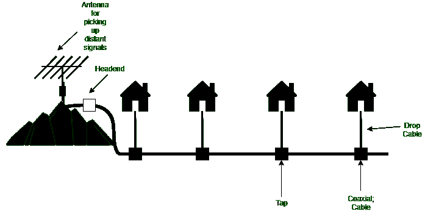

# 社区天线电视

> 原文:[https://www.geeksforgeeks.org/community-antenna-television/](https://www.geeksforgeeks.org/community-antenna-television/)

引入有线电视是为了给生活在农村或山区的人们提供更好的接收。最初，该系统由山顶上的一个大天线组成，用于从空中接收电视信号，一个称为`headend`的放大器用于增强信号，一根`coaxial cable`用于将信号传送到人们的家中。

早期的有线电视系统

## 有线电视系统术语

1.  `Antenna` –
    它被放置在像小山一样的一些高度上，这样它就可以接收远处的信号。它把电磁波转换成电信号。这是关键因素。
2.  `Headend` –
    是用于接收通信信号并将其分发到本地的设备。它接受信号并将其处理成电缆信号。
3.  `Taps` –
    它们用于连接引入电缆和配线电缆。
4.  `Coaxial Cable` –
    它是一种内部导体被绝缘材料隔开的导电屏蔽所包围的电缆。它们有保护性的外壳。它们以低损耗传输信号。
5.  `Drop Cable` –
    它们用于将各个家庭与同轴电缆连接起来，以便电缆能够到达个人家中。在早期，有线电视被称为`Community Antenna Television`。

## 有线电视系统特点

旨在为生活在农村和地势较高地区的人们提供有线电视服务。想要有线电视服务的人必须支付月费和建立费。

整个系统包括山上的一个天线，因此它可以接收信号。`headend`对信号进行放大、校正和增强。信号通过`coaxial cable`传输。在`drop cable`的帮助下，我们可以将同轴电缆与各个家庭和机构连接起来。随着用户数量的增长，需要增加额外的电缆和放大器。传输是从`headend`到用户的。

时代公司开始了一个新的频道，`Home Box Office`，新的内容通过有线传播。另一个有线电视频道专注于体育、烹饪和许多其他话题。

这一发展导致了该行业的两个变化。即大公司开始购买现有的电缆系统并铺设新的电缆以获得新的用户，现在需要连接多个系统。电缆公司开始在城市之间铺设电缆，将它们连接成一个单一的系统。