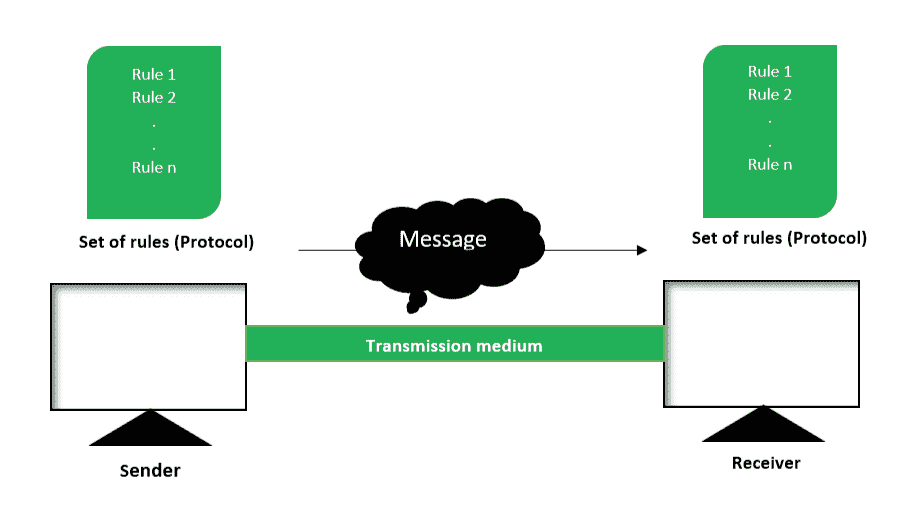

# 数据通信系统组件

> 原文：[https://www.geeksforgeeks.org/components-of-data-communication-system/](https://www.geeksforgeeks.org/components-of-data-communication-system/)

[数据通信](https://www.geeksforgeeks.org/difference-between-computer-network-and-data-communication/)定义为两个设备之间通过某种形式的传输介质（如电缆、电线或空气或真空）进行的数据交换。为了进行数据通信，通信设备必须是由硬件或软件设备和程序组合而成的通信系统的一部分。

## 数据通信系统组件

数据通信系统主要有五个组件：

1.  `Message`
2.  `Sender`
3.  `Receiver`
4.  `Transmission Medium`
5.  Set of rules (`Protocol`)

所有上述要素描述如下：

**Figure –** Components of Data Communication System

1.  **`Message`：**
    这是数据通信系统最有用的资产。消息简单地指要被通信的数据或信息片段。消息可以是任何形式，它可能是文本文件、音频文件、视频文件等形式。
2.  **`Sender`：**
    为了将消息从源传输到目的地，必须有一个扮演源角色的实体。发送者在数据通信系统中扮演源的角色。它是一个发送数据消息的简单设备。该设备可以是计算机、移动电话、笔记本电脑、摄像机或工作站等形式。
3.  **`Receiver`：**
    这是源发送的消息最终到达的目的地。它是一个接收消息的设备。与发送者类似，接收者也可以是计算机、电话、移动设备、工作站等形式。
4.  **[`Transmission Medium`](https://www.geeksforgeeks.org/types-transmission-media/)：**
    在整个数据通信过程中，必须有某种东西可以充当发送者和接收者之间的桥梁，传输介质就扮演了这个角色。它是数据或消息从发送者传输到接收者的物理路径。传输介质可以是有线的（guided）或无线的（unguided），例如双绞线电缆、光纤电缆、无线电波、微波等。
5.  **规则集（协议）：**
    为了管理数据通信，通信系统的设计者已经设计了各种规则集，它们代表了通信设备之间的一种协议。这些被定义为协议。简单来说，协议是一组管理数据通信的规则。如果连接了两个不同的设备，但是它们之间没有协议，那么这两个设备之间就不会有任何类型的通信。因此，该协议对于数据通信的发生是必要的。

数据通信系统的一个典型例子是发送电子邮件。发送电子邮件的用户充当发送者，消息是用户想要发送的数据，接收者是用户想要发送消息的人，整个过程涉及到很多协议，其中之一是[简单邮件传输协议（`SMTP`）](https://www.geeksforgeeks.org/simple-mail-transfer-protocol-smtp/)，发送者和接收者都必须有一个使用无线介质发送和接收电子邮件的互联网连接。