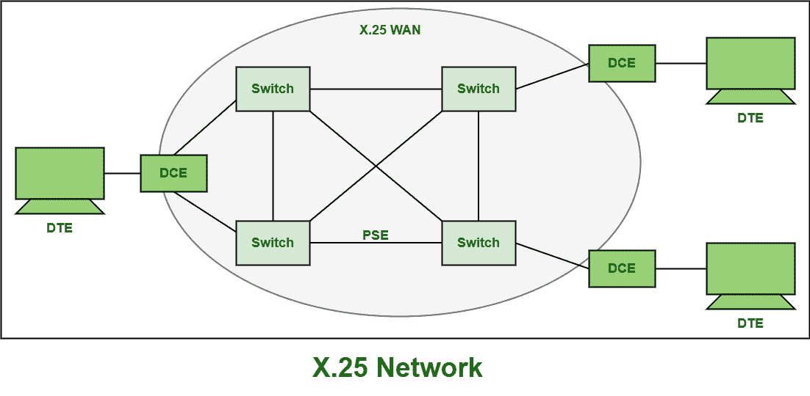

# X.25 网络组件

> 原文:[https://www.geeksforgeeks.org/components-of-x-25-network/](https://www.geeksforgeeks.org/components-of-x-25-network/)

`X.25` 是国际电信联盟电信标准化部门(`ITU-T`)协议标准，仅用于[广域网(`WAN`)](https://www.geeksforgeeks.org/wan-full-form/) 通信，基本上描述了用户设备和网络设备之间的连接是如何建立和维护的。

该协议也称为用户网络接口(`SNI`)协议。这是很久以前就使用的分组交换网络技术。它基本上允许所有远程设备通过高速数字链路相互通信，而无需单独租用线路。`X.25` 基本上是为用于终端或分时连接的计算机连接开发的。它还解释了节点终端如何连接到网络，以分组模式进行简单通信。它也是一个面向连接的协议，解释了[现场视察模型](https://www.geeksforgeeks.org/osi-model-full-form-in-computer-networking/)的三层，即物理层、数据链路层和网络层。它支持两种类型的虚电路，如下所示:

## 1. `Switched Virtual Circuit (SVC)`

这种虚电路是在计算机和网络之间建立的，当计算机向网络传输一个请求呼叫另一台计算机的数据包时建立。`SVC` 比 `PVC` 成本低。它通常是两个不同 `DTE` 之间的虚拟连接。`SVC` 在面向连接的系统（如模拟电话网络和 `ATM` 网络）中简单地实现和建立。一个 `SVC` 范围绝不允许与任何其他范围重叠。这些本质上是语音呼叫，是 `X.25` 网络的一部分。`SVC` 也与 `PVC` 类似，但它允许用户拨号进入虚电路网络。它们也用于偶尔需要的数据传输。

## 2. `Permanent Virtual Circuit (PVC)`

它是两个 `DTE` 之间的永久关联，只有当用户订阅公共网络时才能建立。`PVC` 比 `SVC` 贵。这也类似于用于链接所有数据设备的租用线路。还需要设置阶段，因为它是永久性的。它还支持在连续或频繁通信的所有节点之间的物理连接之上创建或开发逻辑连接。它基本上是广域网的一种电信服务形式，需要在电路交换网络中的两个节点之间提供专用交换电路。例子可以在异步传输模式(`ATM`)和帧中继网络中找到。`PVC` 主要是为繁忙的网络开发的，总是需要虚电路的服务。

# `X.25` 网络设备和组件

建立 `X.25` 网络还需要一些设备和条款。`X.25` 网络设备通常分为不同的类别，如下所示:

## 1. `Data Terminal Equipment (DTE)`

`DTE` 基本上是一种在数字通信中充当信源或目的地的仪器或设备，用于将用户信息或数据转换为信号，然后也将所有接收到的信号重新转换为用户信息。它还与 `DCE` 通信。通常，`DCE` 是终端设备或可能是语音或数据终端。它也可以是打印机、文件服务器、路由器等。

这些基本上是用于通过 `X.25` 网络进行通信的端系统。它甚至不需要知道数据是如何发送或接收的。`DTE` 通常需要 `DCE` 来相互通信。它本身不直接相互通信。它也使用任何用于为用户存储或生成数据的设备。

## 2. `Data Circuit-Terminating Equipment (DCE)`

`DCE` 有时也称为数据通信设备和数据载波设备。它是安装在 `DTE` 和数据传输电路之间的设备。所有关于发送和接收数据的通信细节都留给 `DCE` 处理。

一般是将信号从 `DTE` 转换成更适合通过传输通道传输的另一种形式的信号转换设备。它还将这些信号转换，并在电路的接收端转换回原始形式。它还负责通过串行链路提供时序。它还执行各种功能，例如信号转换、编码，甚至数据站中的线路时钟。

## 3. `Packet Switching Exchange (PSE)`

`PSE` 基本上是构成运营商网络主体的交换机，位于运营商的设施中。`PSE` 是同步的，即有一个时钟电路控制路由器之间通信的时序。这些 `PSE` 也是 `PAD`，它们甚至负责拆卸和重组数据包。

沿途可能有多个 `PSE` 节点，称为跳点。`PSE` 通常用于通过使用 `X.25` `PSN` 将数据从一个 `DTE` 设备传输到另一个设备，并被简单地视为 `X.25` 网络的骨干。

