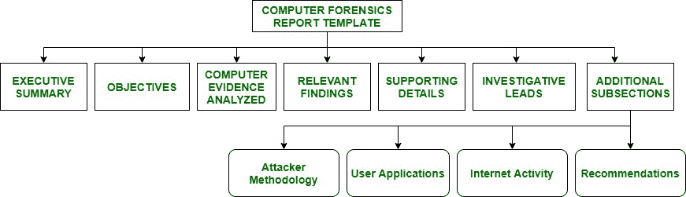

# 计算机取证报告格式

> 原文：[https://www.geeksforgeeks.org/computer-forensic-report-format/](https://www.geeksforgeeks.org/computer-forensic-report-format/)

[**计算机取证**](https://www.geeksforgeeks.org/introduction-of-computer-forensics/)的主要目标是在计算设备上执行结构化调查，以找出发生了什么或谁对发生的事情负责，同时在正式报告中维护适当的证据记录链。计算机取证报告的语法或模板如下：

## 1. 执行摘要
计算机取证报告模板的执行摘要部分提供了需要进行调查的条件的背景数据。高级管理层会阅读执行摘要或翻译摘要，因为他们不会阅读详细的报告。本节必须包含简短的描述、细节和重要提示。本节可以长达一页。执行摘要部分包括以下内容：
*   考虑到谁授权了法医检查。
*   简短详细的重要证据清单。
*   解释为什么需要对计算设备进行法医检查。
*   包括一个签名块，供执行工作的审查员使用。
*   与案件相关或涉及案件的所有人员的完整、合法和适当的姓名、职务、初次接触或沟通的日期。

## 2. 目标
目标部分用于概述调查计划完成的所有任务。在某些情况下，当审查媒体内容时，法医检查可能不会进行全面的调查。准备好的计划清单必须在任何法医分析之前由法律顾问、决策者和客户讨论并批准。该清单应包括检查员为每项任务所承担的任务和方法，以及报告结束时每项任务的状态。

## 3. 已分析的计算机证据
“已分析的计算机证据”部分介绍了所有收集的证据及其解释。它提供了有关证据标签编号分配、证据描述和媒体序列号的详细信息。

## 4. 相关发现
“相关发现”部分总结了具有**证明价值**的证据。当从犯罪现场恢复的法庭科学材料（例如，指纹、一缕头发、鞋印等）与案件嫌疑人提供的参考样本相匹配时，这种匹配被广泛认为是嫌疑人是所恢复材料来源的有力证据。然而，证据的证明价值可能因其表征方式和其相关假设而有很大差异。它回答了诸如“在案件调查中发现了哪些相关物品或项目？”之类的问题。

## 5. 支持性细节
“支持性细节”部分是对相关发现进行深入分析的地方。“我们如何得出在‘相关发现’中概述的结论？”由本节概述。它包含重要文件的完整路径名表格、字符串搜索结果、已审查的电子邮件/URL、已审查的文件数量以及任何其他相关数据。本节概述了为实现目标而承担的所有任务。在“支持性细节”中，我们更侧重于技术深度。它包括图表、表格和插图，因为它们传达的信息比书面文字更多。为了实现概述的目标，还包括许多小节。这是最长的部分。它从提供所分析媒体的背景细节开始。以人类可理解的语言报告已审查的文件数量和硬盘驱动器大小并不容易。因此，您的客户必须知道您希望审查多少数据才能得出结论。

## 6. 调查线索
“调查线索”执行有助于发现与案件调查相关的额外信息的行动项目。如果还有剩余时间，调查人员会执行所有未完成的任务以寻找额外信息。“调查线索”部分对执法部门至关重要。本节建议执行额外的任务，以发现推进案件所需的信息。例如，找出是否有任何防火墙日志可以追溯到足够久远的过去，以正确描绘可能发生的任何攻击。对于受雇的法医顾问来说，这一部分很重要。

## 7. 附加小节
法医报告中包含了各种附加小节。这些部分取决于客户的需求。以下小节在特定情况下很有用：
### 攻击者方法
帮助读者理解所执行的一般或确切攻击的附加简报在“攻击者方法”的这一部分给出。本节在计算机入侵情况下很有用。检查攻击是如何进行的，以及标准日志中的攻击片段是什么样子。
### 用户应用程序
在本节中，我们讨论安装在所分析介质上的相关应用程序，因为我们观察到，在许多情况下，系统上存在的应用程序非常相关。如果您正在调查攻击者使用的任何系统，例如网络攻击工具，请给这一部分起一个标题。
### 互联网活动
“互联网活动”或网页浏览历史部分给出被分析媒体用户的网页浏览历史。浏览历史对于暗示意图、恶意工具的下载、未分配的空间、在线研究、安全删除程序的下载或清除文件松弛和临时文件的证据移除类型程序也是有用的，这些文件通常藏有对调查非常重要的证据。
### 建议
本部分建议态势感知客户端为下一次计算机安全事件做好更多准备和培训。我们调查了一些基于主机、基于网络和程序的对策，以降低或消除事故安全风险。