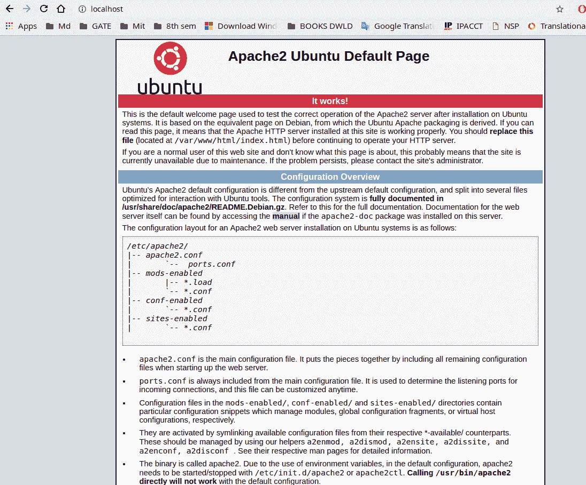
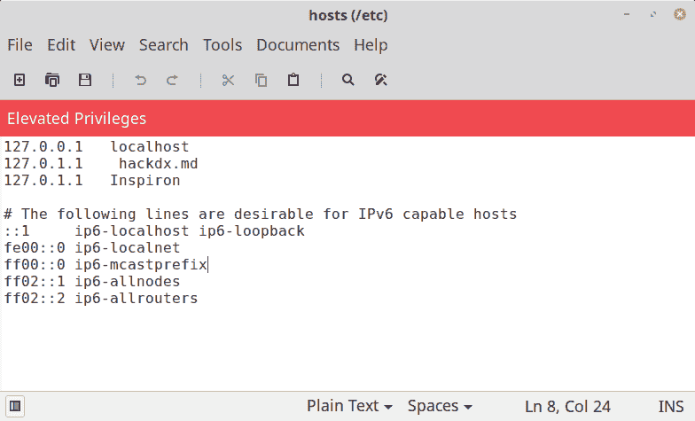
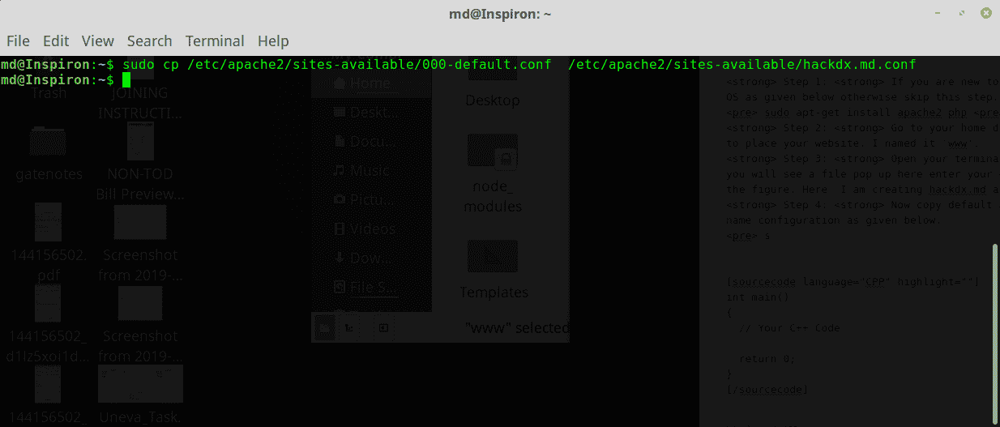
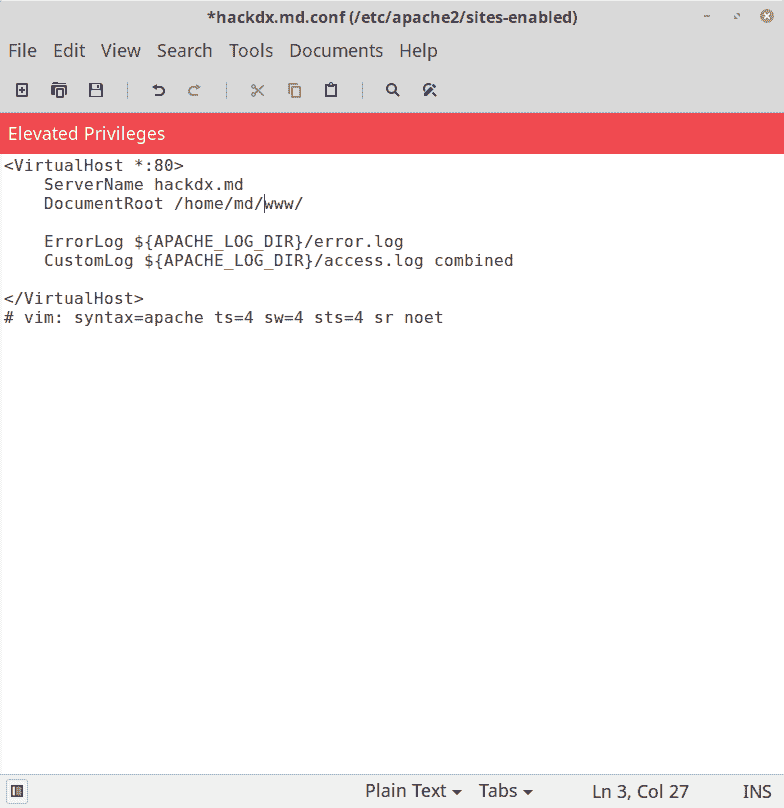
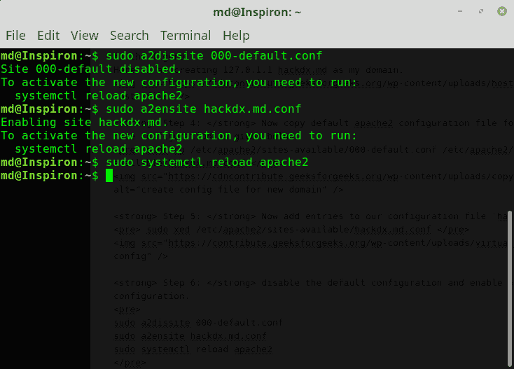
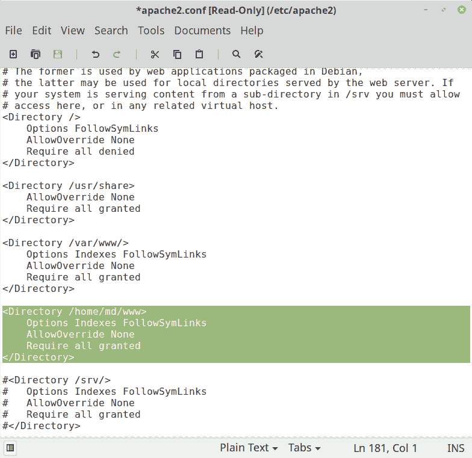

# 在 Ubuntu 中创建自定义域名而不是本地主机

> 原文：[https://www.geeksforgeeks.org/creating-custom-domain-name-instead-of-localhost-in-ubuntu/](https://www.geeksforgeeks.org/creating-custom-domain-name-instead-of-localhost-in-ubuntu/)

在 ubuntu 中，默认情况下，本地服务器被称为`localhost`。但是，您也可以为您的本地服务器创建一个自定义域名，而不是使用`localhost`。本文解释了创建自己的自定义域名而不是使用本地主机的过程。这里的`hackdx.md`是作为我们的域创建的，可以根据需要来取。

**注：** 本文以 Linux 用户为重点编写，但流程与 windows 用户类似，只是做了一些小改动。

## 以下是在 Ubuntu 中创建自己的自定义域名而不是使用 localhost 的步骤

### Step 1: 安装 Apache 服务器和 PHP
如果你刚接触 Linux，可以如下安装 Apache 服务器和 PHP，否则跳过此步。Apache 用于托管 PHP 脚本。如果已经安装，也请跳过此步。

```
sudo apt-get update
sudo apt-get install apache2 php
```

您可以通过在浏览器中键入`localhost`来检查您的服务器。如果你得到 apache ubuntu 默认页面，即你已经成功安装了 apache2 服务器。



### Step 2: 创建服务器根目录文件夹
创建一个文件夹用作您服务器的根目录。这里我使用`/home/md/www`作为我的根目录。您可以将其命名为任何喜欢的名字，命名为`www`不是必须的。


### Step 3: 在 hosts 文件中创建域名
现在是重要的一步，在`/etc/hosts`文件中创建域名。打开您的终端并键入以下内容。
*   如果尚未安装，请使用：

```
sudo apt install net-tools
```

*   然后执行此命令编辑主机文件

```
sudo gedit /etc/hosts
```

*   如图所示，在本地主机 IP 前面输入您的域名。这里我们使用的是`hackdx.md`，所以我们写的是`127.0.1.1 hackdx.md`。现在，您可以通过在浏览器中键入`hackdx.md`来查看默认的 apache 页面。



### Step 4: 复制默认的 Apache2 配置文件
现在为您的新域名配置复制默认的 apache2 配置文件。您可以为任意多个域执行此操作。此步骤是必需的，以便您可以在`hachdx.md`或您自己的域名下看到您新创建的域。您也可以添加到默认配置中，但建议创建新文件，因为您可能会弄乱原始的默认文件。

这可以通过以下命令完成：

```
sudo cp /etc/apache2/sites-available/000-default.conf /etc/apache2/sites-available/hackdx.md.conf
```



### Step 5: 向配置文件添加条目
现在如图所示，向我们的配置文件`hackdx.md.conf`添加条目。我们正在创建`/home/md/www`作为根目录，并将`hacdx.md`指定为域名或服务器名称。如果您想在其他位置创建，所有不同的域也可以添加到此文件中。例如`/home/md/sample`等，`/etc/hosts`文件中必须存在相应的条目。

```
sudo gedit /etc/apache2/sites-available/hackdx.md.conf
```



### Step 6: 禁用默认配置并启用新配置
为新创建的域`hackdx.md.conf`禁用默认配置并启用我们的新配置。

```
sudo a2dissite 000-default.conf
sudo a2ensite hackdx.md.conf
sudo systemctl reload apache2
```



### Step 7: 更新 Apache2 配置文件
以防您遇到 forbidden 错误，也需要更新 apache2 配置文件。您可能会遇到此错误，因为 apache2 无法识别新的根文档位置`/home/md/www`，通过添加这些行，apache 就能知道根位置。


运行此命令编辑`apache2.conf`：

```
sudo gedit /etc/apache2/apache2.conf
```

如图所示，将这些行添加到您的`apache2.conf`文件中。



### Step 8: 重新加载 Apache2 服务
最后，在终端中执行此命令来重新加载 apache2 服务。

```
sudo systemctl reload apache2
```

### Step 9: 测试
您现在已经准备就绪，可以通过在浏览器中输入您的 URL 来检查。您可以通过在`www`文件夹中编写一个简单的 PHP 脚本来进行测试。


现在你可以把你的文件放在`www`目录下，享受使用 PHP 服务器。