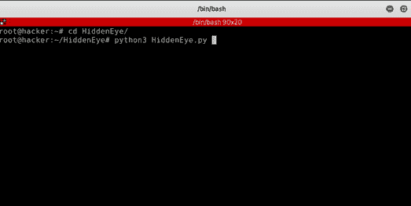
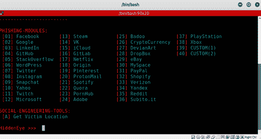
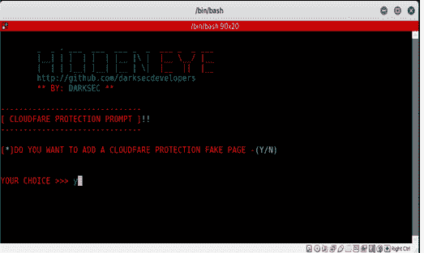
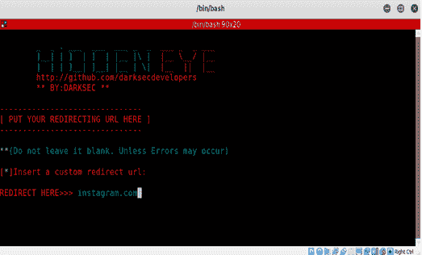
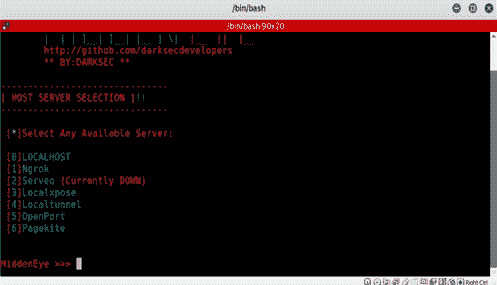
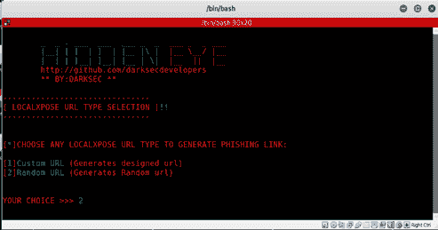
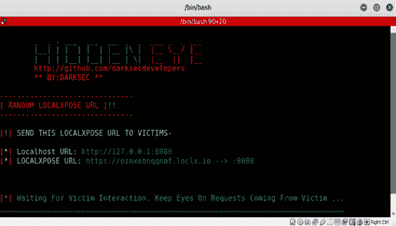
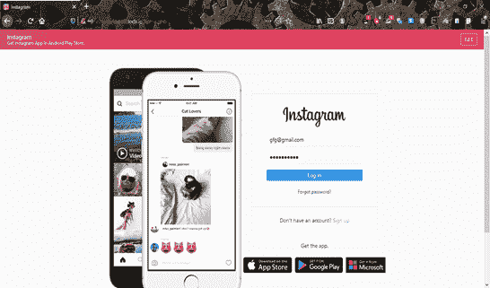
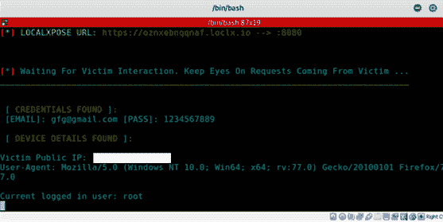

# 创建网站钓鱼页面

> 原文：[https://www.geeksforgeeks.org/creating-phishing-page-of-a-website/](https://www.geeksforgeeks.org/creating-phishing-page-of-a-website/)

先决条件 – [网络钓鱼](https://www.geeksforgeeks.org/phishing-in-ethical-hacking/)

**网络钓鱼**是一种社会工程攻击，诱骗个人输入用户名、密码和信用卡详细信息等敏感信息。它可以由任何个人完成，只需要对 `Kali Linux`（或任何其他 `Linux` 发行版）有一个基本的要求。

## 创建网络钓鱼页面的步骤

*   打开 `Kali Linux` 终端并粘贴以下代码：

```
git clone https://github.com/DarkSecDevelopers/HiddenEye.git
```

*   现在执行下面提到的步骤：

[](https://media.geeksforgeeks.org/wp-content/uploads/20200710131156/1.png)

*   现在你可以选择想要克隆的网站。

[](https://media.geeksforgeeks.org/wp-content/uploads/20200710131712/2.png)

*   你还可以添加一个键盘记录器或 `Cloudflare` 保护页面，使你的克隆网站看起来更合法。

[](https://media.geeksforgeeks.org/wp-content/uploads/20200710131713/3.png)

*   现在你需要输入重定向 `URL`，即你希望用户在成功执行网络钓鱼攻击后被重定向到的 `URL`。你还需要选择一个你喜欢的服务器，并可以制作一个看起来合法的钓鱼 `URL`，或者选择随机 `URL`。

[](https://media.geeksforgeeks.org/wp-content/uploads/20200710131714/4.png)

[](https://media.geeksforgeeks.org/wp-content/uploads/20200710131715/5.jpg)

[](https://media.geeksforgeeks.org/wp-content/uploads/20200710131716/6.png)

[](https://media.geeksforgeeks.org/wp-content/uploads/20200710131720/7.png)

*   你现在需要将钓鱼 `URL` 发送给你的用户，当他点击它时，他将被重定向到你克隆的网站。

[](https://media.geeksforgeeks.org/wp-content/uploads/20200801183327/9.png)

*   一旦用户输入详细信息，他将被重定向到我们选择的网址，我们将能够钓鱼用户的所有凭据。

[](https://media.geeksforgeeks.org/wp-content/uploads/20200710134235/10.png)

## 预防措施

*   切勿打开可疑的电子邮件附件。
*   不要点击可疑的电子邮件链接。
*   切勿通过电子邮件、电话或短信提供机密信息。
*   永远不要在社交媒体上公开发布你的个人数据，比如你的电子邮件地址或电话号码。
*   始终检查发件人希望您重定向到的网址的真实性。

要使用 `PHP` 创建脸书钓鱼网页，请参考。