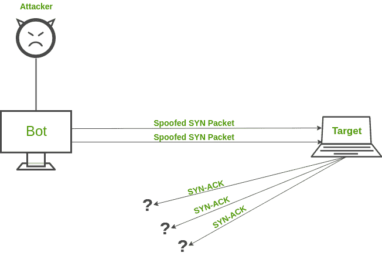
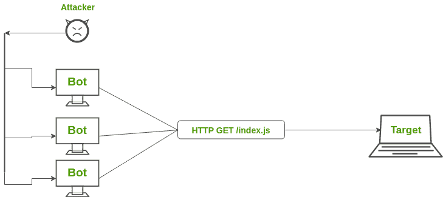
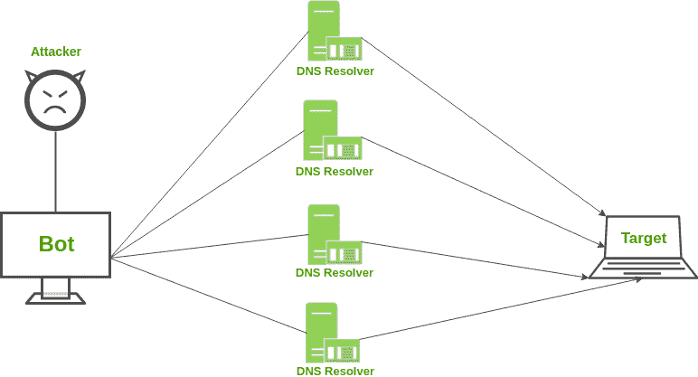

# 拒绝服务 DDoS 攻击

> 原文：[https://www.geeksforgeeks.org/denial-of-service-ddos-attack/](https://www.geeksforgeeks.org/denial-of-service-ddos-attack/)

想象一个场景，你正在访问一些网站，其中一个似乎有点慢。你可能会责怪他们的服务器提高了他们的可伸缩性，因为他们的网站上可能有大量的用户流量。大多数网站已经事先考虑到了这个问题。很有可能，他们是被称为分布式拒绝服务攻击的受害者。参见–[拒绝服务和预防](https://www.geeksforgeeks.org/deniel-service-prevention/)

在 `DDoS` 攻击中，攻击者试图通过引导来自多个终端系统的连续且巨大的流量来使特定的服务不可用。由于这种巨大的流量，网络资源被用于服务那些伪终端系统的请求，使得合法用户不能为他/她自己访问资源。

## DDoS 攻击的类型

`DDoS` 攻击可以分为三大类：

### 1. 应用层攻击

这些攻击侧重于攻击 `OSI` 模型的第 `7` 层，该层根据最终用户发起的请求生成网页。对于客户端来说，生成请求并不需要很大的负载，它可以轻松地向服务器生成多个请求。另一方面，响应请求对服务器来说需要相当大的负载，因为它必须构建所有页面、计算任何查询并根据请求从数据库加载结果。

**举例：** `HTTP` 洪水攻击和对 `DNS` 服务的攻击。

### 2. 协议攻击

它们也被称为状态耗尽攻击。这些攻击侧重于协议栈第 `3` 层和第 `4` 层中的漏洞。这类攻击消耗服务器、防火墙和负载均衡器等资源。

**举例：** `SYN` 洪水攻击和死亡之 `Ping`。

### 3. 体积攻击

体积攻击侧重于消耗网络带宽，并通过放大或僵尸网络使其饱和，以阻碍其对用户的可用性。它们很容易通过将大量流量导向目标服务器而产生。

**举例：** `NTP` 放大、`DNS` 放大、`UDP` 洪水攻击、`TCP` 洪水攻击。

## 常见的 DDoS 攻击

### SYN Flood 攻击

`SYN Flood` 攻击的工作方式类似于一个淘气的孩子不停地按门铃（请求）然后跑开。里面的老人出来开门，却看不到任何人（没有响应）。最终，在频繁发生这种情况后，老人筋疲力尽，甚至不给真正的人开门。`SYN` 攻击利用 `TCP` 握手，发送带有伪造 `IP` 地址的 `SYN` 消息。受害服务器不断响应，但没有收到最终的确认。

```
客户端 -> 服务器: SYN (seq=x)
服务器 -> 客户端: SYN-ACK (seq=y, ack=x+1)
客户端 -> 服务器: [无 ACK]
服务器 -> 客户端: [等待 ACK，连接半开]
... (重复多次)
服务器资源耗尽
```



### HTTP Flood 攻击

在 `HTTP` 洪水攻击中，会同时生成多个 `HTTP` 请求来攻击目标服务器。这导致该服务器的网络资源耗尽，从而无法为实际用户的请求提供服务。`HTTP` 洪水攻击的变体是 `HTTP GET` 攻击和 `HTTP POST` 攻击。

```
攻击者 -> 目标服务器: 大量 HTTP GET/POST 请求
目标服务器: 处理请求，资源耗尽
合法用户 -> 目标服务器: 请求被拒绝或超时
```



### DNS 放大

假设一个场景，你给必胜客打电话，让他们给你回一个电话号码，告诉你他们所有的披萨组合以及配料和甜点。您用很小的输入生成了很大的输出。但是，问题是你给他们的号码不是你的。同样，域名系统放大的工作原理是从一个欺骗的 `IP` 地址请求域名系统服务器，并对您的请求进行结构化，以便域名系统服务器向目标受害者发送大量数据。

```
攻击者 (伪造受害者IP) -> 公共 DNS 服务器: 小查询 (如 "ANY .com")
DNS 服务器 -> 受害者 (伪造IP): 大响应 (包含完整区域数据)
```



## DDoS 缓解

防止 `DDoS` 攻击比 `DoS` 攻击更难，因为流量来自多个来源，实际上很难将恶意主机与非恶意主机区分开来。可以使用的一些缓解技术有：

### 1. 黑洞路由

在黑洞路由中，网络流量被导向一个“黑洞”。在这种情况下，恶意流量和非恶意流量都会在黑洞中丢失。当服务器遭受 `DDoS` 攻击，并且所有流量都被转移用于维护网络时，此对策非常有用。

### 2. 速率限制

速率限制包括控制网络接口发送或接收的流量速率。它可以有效地降低网页抓取器的速度以及暴力登录的工作量。但是，仅仅限制速率不太可能阻止复合 `DDoS` 攻击。

### 3. 黑名单/白名单

黑名单是屏蔽 `IP` 地址、`URL`、域名等的机制，并允许来自所有其他来源的流量。另一方面，白名单是指允许所有的 `IP` 地址、`URL`、域名等的机制，并拒绝所有其他来源访问网络资源。