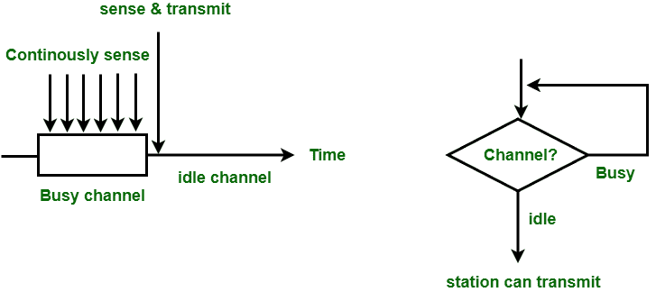
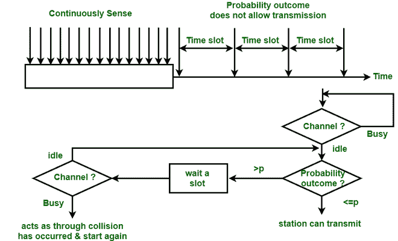
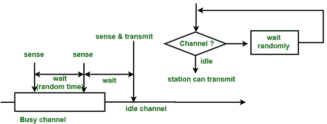

# 1-持久、p-持久和非持久 CSMA 之间的差异

> 原文: [https://www.geeksforgeeks.org/difference-between-1-persistent-p-persistent-and-non-persistent-csma/](https://www.geeksforgeeks.org/difference-between-1-persistent-p-persistent-and-non-persistent-csma/)

先决条件 – [载波侦听多路访问 (CSMA)](https://www.geeksforgeeks.org/carrier-sense-multiple-access-csma/)

## 1-持久 CSMA
在 `1-持久 CSMA` 中，站连续感测信道以检查其状态，即空闲或忙碌，以便它可以传输数据或不传输数据。万一频道忙，电台将等待频道空闲。当站点发现空闲信道时，它会将帧无延迟地发送到该信道。它以概率 `1` 传输帧。由于概率 `1`，它被称为 `1-持久 CSMA`。

这种方法的问题在于，冲突的可能性很大，因为两个或多个站同时发现处于空闲状态的信道和发送帧时，存在冲突的可能性。当冲突发生时，站必须等待信道空闲的随机时间，然后重新开始。

**Figure –** 1-persistent CSMA

## p-持久 CSMA
这种方法用于信道具有时隙且该时隙持续时间等于或大于最大传播延迟时间的情况。当站点准备好发送帧时，它将感测信道。如果发现信道忙，则等待下一个时隙。如果发现信道空闲，它以概率 `p` 发送帧，因此对于剩余的概率 `q`（等于 `1-p`），站点将等待下一个时隙的开始。如果下一个时隙也空闲，它将以概率 `p` 发送或再次以概率 `q` 等待。此过程重复，直到帧被发送或另一个站开始发送。

**Figure –** p-persistent CSMA

## 非持久 CSMA
在这种方法中，只有有帧要发送的站才会感测信道。如果信道空闲，它会立即发送帧。如果信道忙，它会等待随机时间，然后再次感测信道状态是空闲还是忙。在这种方法中，站不会仅为了在检测到前一次传输结束时捕获信道而立即感测信道。使用这种方法的主要优点是减少了冲突的机会。其问题是它降低了网络的效率。

**Figure –** Non-persistent CSMA

## 1-持久、p-持久和非持久 CSMA 的区别

| 参数 | 1-持久 CSMA | p-持久 CSMA | 非持久 CSMA |
| --- | --- | --- | --- |
| 载波侦听 | 当信道空闲时，它以概率 `1` 发送。 | 当信道空闲时，它以概率 `p` 发送。 | 它在信道空闲时发送。 |
| 等待 | 它持续感知频道或载波。 | 它等待下一个时隙。 | 它将等待随机的时间量来检查载体。 |
| 碰撞的机会 | 在这种情况下碰撞的可能性最高。 | 与 `1-持久` 和 `p-持久` 相比，机会更少。 | 与 `1-持久` 相比，机会较少，但比 `p-持久` 多。 |
| 利用 | 它的利用率高于 `ALOHA`，因为只有在信道空闲时才会发送帧。 | 它的利用率取决于概率 `p`。 | 它的利用率高于 `1-持久`，因为不是所有的电台都在同一时间不断检查频道。 |
| 延迟低负载 | 当信道空闲时发送帧时，该值较低。 | 当 `p` 很小时，它很大，因为当信道空闲时，站不会总是发送。 | 它很小，因为只要发现信道空闲，站就会发送，但比 `1-持久` 长，因为它在忙时检查随机时间。 |
| 延迟高负载 | 由于碰撞，它很高。 | 当信道空闲且信道很少空闲时，发送的概率 `p` 较小时，该概率较大。 | 它长于 `1-持久`，因为通道在繁忙时会被随机检查。 |

