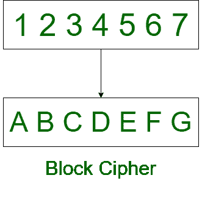
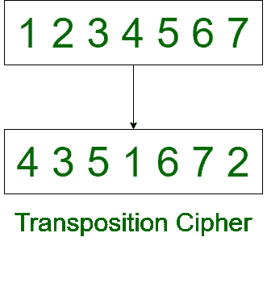

# 分组密码和换位密码的区别

> 原文：[https://www.geeksforgeeks.org/difference-between-block-cipher-and-transposition-cipher/](https://www.geeksforgeeks.org/difference-between-block-cipher-and-transposition-cipher/)

## 1. `分组密码`
`分组密码`是用于将明文转换为密文的对称密钥密码。它使用一个简单的替换过程，或者有时是置换过程，在置换过程中，纯文本块被任意位的密文替换。

## 2. `换位密码`
`换位密码`重新排列纯文本的字符位置。它改变角色的位置，但不改变角色的身份。

以下是`分组密码`和`换位密码`的区别：

| 分组密码 | 移位密码 |
| --- | --- |
| 在`分组密码`中，一个明文块被视为一个整体。 | 在`换位密码`中，纯文本被记为一个序列。 |
| 它产生等长纯文本的密文块。 | 它以行的形式读取序列。 |
| 在`分组密码`中，传输一个分组的错误不会影响其他分组。 | `换位密码`中，一个字母的错误会影响整个密文。 |
| `分组密码`的加密过程很慢。 | 加密过程是`换位密码`中的脂肪。 |
| `分组密码`的安全性取决于加密函数的设计。 | 通过进行多次换位，可以使其更加安全。 |
| 纯文本被分成块，算法独立地对每个块进行操作。 | 纯文本被分解成字母，算法对每个字母独立操作。 |
| `分组密码`的复杂性很简单。 | 而`换位密码`更复杂。 |
| 在`分组密码`中，字符会失去身份。 | 字符在`换位密码`中不会失去身份。 |