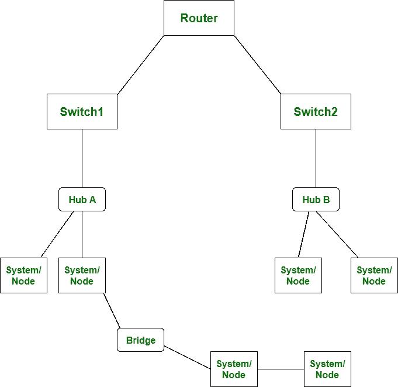

# 网桥和路由器的区别

> 原文：[https://www.geeksforgeeks.org/difference-between-bridge-and-router/](https://www.geeksforgeeks.org/difference-between-bridge-and-router/)

## 前提
[网络设备](https://www.geeksforgeeks.org/network-devices-hub-repeater-bridge-switch-router-gateways/)
**网桥**是网络设备，工作在`数据链路层`。通过网桥，数据或信息以`数据包`的形式存储和发送。而**路由器**也是工作在`网络层`的网络设备。通过路由器，数据或信息以`数据包`的形式存储和发送。

网桥和路由器的主要区别在于，网桥研究或扫描设备的 `MAC 地址`。另一方面，路由器研究或扫描设备的 `IP 地址`。

## 让我们看看下面给出的网桥和路由器之间的区别

| S.NO | 桥 | 路由器 |
| :--- | :--- | :--- |
| 1. | `网桥`工作在`数据链路层`。 | 而`路由器`工作在`网络层`。 |
| 2. | 通过`网桥`，数据或信息不以`包`的形式存储和发送。 | 而通过`路由器`，数据或信息以`数据包`的形式存储和发送。 |
| 3. | `桥`上只有两个端口。 | 而`路由器`中有两个以上的端口。 |
| 4. | `网桥`连接两个不同的`局域网`。 | 而`路由器`被`局域网`和`城域网`用来连接。 |
| 5. | 在`网桥`中，不使用`路由表`。 | 而在`路由器`中，则使用`路由表`。 |
| 6. | `网桥`在单个`广播域`上工作。 | 而`路由器`工作在多个`广播域`上。 |
| 7. | `网桥`很容易配置。 | 而`路由器`很难设置和配置。 |
| 8. | `网桥`侧重于`媒体访问控制地址`。 | 而`路由器`侧重于`协议地址`。 |
| 9. | `桥`相对便宜。 | 而`路由器`是相对昂贵的设备。 |
| 10. | `网桥`有利于分段网络并扩展现有网络。 | 而`路由器`很适合加入远程网络。 |