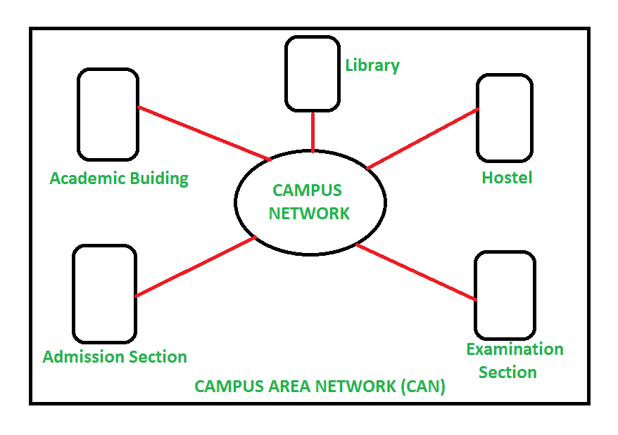
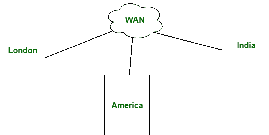

# CAN 和 WAN 的区别

> 原文:[https://www . geesforgeks . org/can 和 wan 的区别/](https://www.geeksforgeeks.org/difference-between-can-and-wan/)

## 1. `校园网(CAN)`
`校园网(CAN)`是指在有限的地理区域内，如学校校园、大学校园、军事基地或组织校园、公司大楼等，相互连接的一组局域网(`LAN`)。`校园网`比`局域网`大，但比`城域网`和`广域网`小。

## 2. `广域网`
`广域网`比`局域网`和`城域网`覆盖的面积更大，如:国家/大陆等。`广域网`很贵，应该或不应该由一个组织拥有。`PSTN`或卫星媒体用于`广域网`。

## `CAN` 和 `WAN` 的区别

| 没有。 | `CAN` | `广域网` |
| :--- | :--- | :--- |
| 1. | `CAN`代表`校园网`。 | `广域网`代表`广域网`。 |
| 2. | 连接校园内的两个或多个`局域网`。 | 连接地理上分开的`局域网`。 |
| 3. | 它涵盖了一个私人拥有的校园，面积为`5 至 10 公里`。 | 跨越`100 多公里`的大地理区域。 |
| 4. | 数据传输速率是可变的。 | 数据传输速率从`64Kbps`到`150 Mbps`。 |
| 5. | 它比`局域网`贵。 | 这是最贵的。 |
| 6. | 它没有使用`国际电联`的标准。 | 它使用`国际电联`的标准。 |
| 7. | 使用集线器、交换机、网桥和网关等网络设备。 | 使用集线器、交换机、网桥和网关等网络设备。 |
| 8. | 它包含比`广域网`更少的拥塞。 | 与`CAN`相比，它包含大多数拥塞网络。 |