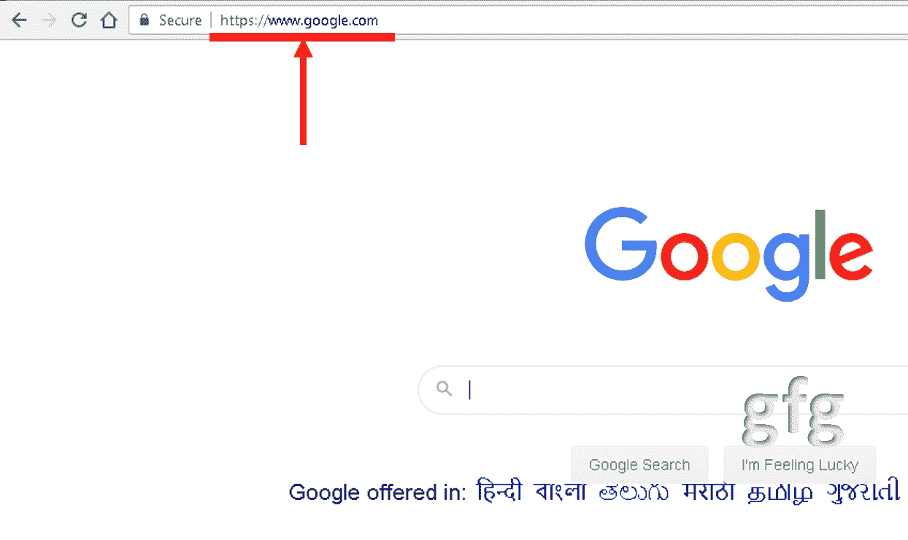

# .com 和 .org 域名之间的区别

> 原文: [https://www.geeksforgeeks.org/difference-between-com-and-org-domain/](https://www.geeksforgeeks.org/difference-between-com-and-org-domain/)

**1. .com 域名：**
互联网利用了`.com` [域名](https://www.geeksforgeeks.org/domain-name-server-dns-in-application-layer/)非常受欢迎。它非常受欢迎，在最新的键盘按键上也能看到。`.com` 是顶级域名。它是最早的通用域之一（与赞助域和受限域相对）。它基本上是为商业实体使用而引入的，但是，由于该域的非限制性性质，它可以被个人和非商业实体使用。`.com` 域名的价格由于受欢迎程度相当高。`www.google.com`、`www.bbn.com`、`www.think.com`、`www.mcc.com`、`www.dec.com`、`www.northrop.com`、`www.xerox.com`。

**谷歌有一个`.com` 域**



**2. .org 域名：**
`.org` 域名来源于 organisation 这个词。它是为非营利组织实体制作的。由于它变得不受限制，现在它对所有类型的实体开放使用。它也是最早形成的领域之一，也是一个通用的顶级领域。通用名称表明它不用于任何特定或赞助用途。

`.org` 域名的例子有 `www.geeksforgeeks.org`、`www.mitre.org`、`www.src.org`、`www.super.org`、`www.aero.org`、`www.mcnc.org`、`www.mn.org` 和 `www.rti.org`。

**GeeksforGeeks 有一个`.org` 域**


**.com 和 .org 域名之间的区别：**

```
| 序号 | .com | .org |
| --- | --- | --- |
| 1. | 用于通用和商业网站（由营利性实体使用）。 | 它用于学校、开源项目、社区以及一些盈利和非政府组织。 |
| 2. | `.com` 比 `.org` 更受欢迎。 | 它没有 `.com` 受欢迎。 |
| 3. | 注册由 Verisign 处理。这些域名可以由其他注册服务商（例如谷歌、Go Daddy）处理，但是，它们最终与 Verisign 有合作关系或从属关系。 | `.org` 由公共利益登记处（PIR）处理。这些域名可以由其他注册服务商（如谷歌、Go Daddy）处理，但它们最终会与 PIR 建立合作关系或附属关系。 |
| 4. | 它比 `.org` 贵（由于 Verisign 注册中心的盈利性质）。 | 它比 `.com` 便宜（由于 PIR 注册管理机构的非营利性质）。 |
| 5. | 例如：`www.google.com`、`www.bbn.com`、`www.think.com`、`www.mcc.com`、`www.dec.com`、`www.northrop.com`、`www.xerox.com` | 例如：`www.geeksforgeeks.org`、`www.mitre.org`、`www.src.org`、`www.super.org`、`www.aero.org`、`www.mcnc.org`、`www.mn.org`、`www.rti.org` |
| 6. | 它旨在供商业实体使用。 | 它被介绍给各种各样的组织使用，不适合其他类别。 |
| 7. | 它来源于商业这个词。它是为商业实体设计的。 | 它来源于组织这个词。它是为非营利实体设计的。 |
| 8. | 注册网站是 `www.verisign.com` | `.org` 域名的注册表网站是 `www.pir.com` |
| 9. | 第一个在 `.com` 域名下注册的网站是 `www.symbolics.com`。 | 第一个在 `.org` 域名下注册的网站是 `www.mitre.org`。 |
```