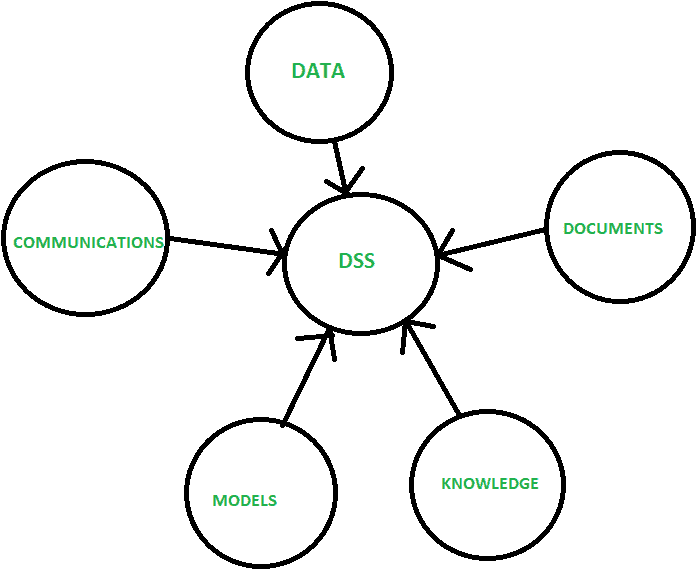
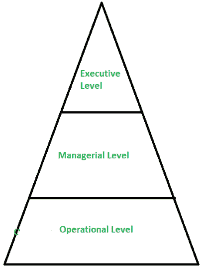

# DSS 和 ESS 的区别

> 原文: [https://www.geeksforgeeks.org/difference-between-dss-and-ess/](https://www.geeksforgeeks.org/difference-between-dss-and-ess/)

## 1. `决策支持系统(DSS)`

这是一个基于计算机的系统，帮助决策过程。它是一个交互式、灵活和适应性强的计算机系统。它是专门为支持非结构化管理问题的解决而开发的，以改进决策制定。
决策支持系统是支持业务和组织决策活动的一类特定的计算机化信息系统。

**优势:**

1.  它节省时间。
2.  提高效率
3.  降低成本
4.  它提高了个人效率
5.  它增加了决策者的满意度。

**缺点:**

1.  信息过载
2.  地位降低
3.  过度强调决策。

## 2. 行政支持系统(`ESS`)

`ESS` 旨在整合新税法或竞争对手等外部事件的数据，但它们也从内部 `管理信息系统(MIS)` 和 `决策支持系统(DSS)` 中提取汇总信息。他们过滤、压缩和跟踪关键数据，强调减少获取对高管有用的信息所需的时间和精力。它采用最先进的图形软件，可以将来自许多来源的图形和数据立即传递给高级管理人员。

**优势:**

1.  增强个人思维。
2.  易于高层管理人员使用。
3.  更好的报告系统。
4.  提高办公自动化。

**缺点:**

1.  依赖于系统。
2.  功能有限。
3.  信息超载。

## `DSS` 和 `ESS` 的区别

| 决策支持系统(`DSS`) | 行政支持系统(`ESS`) |
| --- | --- |
| 它代表决策支持系统。 | 它代表行政支持系统。 |
| 它使用数据分析意料之外的情况。 | 它以灵活、易用的图形格式呈现摘要信息，专为高层管理人员设计。 |
| 它提供了详细的信息。 | 它提供精确的信息。 |
| 它使用内部数据。 | 它同时使用内部和外部数据。 |
| 它支持结构化和半结构化数据。 | 它支持结构化问题。 |
| 是给中层管理的。 | 是给高层管理的。 |