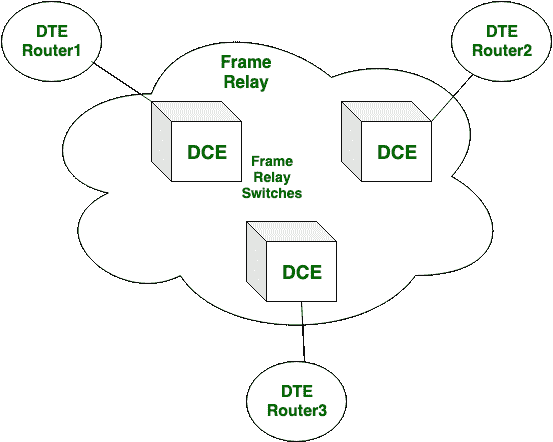
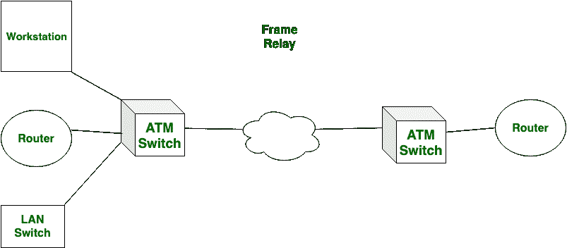

# 帧中继和 ATM 的区别

> 原文:[https://www.geeksforgeeks.org/difference-between-frame-relay-and-atm/](https://www.geeksforgeeks.org/difference-between-frame-relay-and-atm/)

## 帧中继

`帧中继`是以数据包的形式通过电路层传输信息的传输模式。它提供从 Kbps 到 Mbps 的信息速度。`帧中继`的数据包大小可变。它没有给出错误管理和流程管理。`帧中继`的责任较小。

## 异步传输模式

`ATM`已装入数据包大小。它提供 155.5 兆位/秒或 622 兆位/秒的信息速度。`ATM`提供错误管理和流量管理。它比`帧中继`可靠得多。

## 区别对比

让我们看看`帧中继`和`ATM`的区别:

| S.NO | 帧中继 | 异步传输模式 |
| :--- | :--- | :--- |
| 1. | `帧中继`的数据包大小可变。 | 而`ATM`有固定的包大小。 |
| 2. | `帧中继`的成本很低。 | 虽然它比`帧中继`贵。 |
| 3. | 在`帧中继`中，数据包延迟更多。 | 在这种情况下，数据包延迟很低或更低。 |
| 4. | `帧中继`的可靠性较差。 | 虽然它是一个好的可靠的。 |
| 5. | `帧中继`的数据包传输速度较低。 | 而`ATM`的包传输速度较高。 |
| 6. | `帧中继`的吞吐量适中。 | 虽然它的吞吐量很高。 |
| 7. | `帧中继`不提供错误控制和流量控制。 | 而`ATM`提供差错控制和流量控制。 |