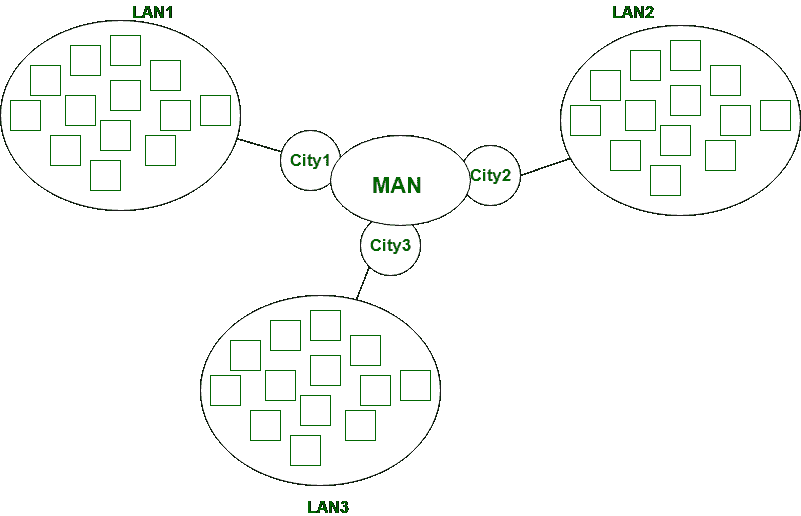

# 城域网和广域网的区别

> 原文：[https://www.geeksforgeeks.org/difference-between-man-and-wan/](https://www.geeksforgeeks.org/difference-between-man-and-wan/)

先决条件：[区域网络类型–局域网、城域网和广域网](https://www.geeksforgeeks.org/computer-network-types-area-networks-lan-man-wan/)

## 城域网 (MAN)

`MAN` 覆盖面积比局域网大，如：小城镇、城市等。`MAN` 连接 2 台或多台计算机，这些计算机以区域为单位分开，但位于相同或完全不同的城市。`MAN` 是昂贵的，应该或不应该由一个组织拥有。

## 广域网 (WAN)

`WAN` 比局域网和 `MAN` 覆盖的面积更大，如：国家/大陆等。`WAN` 很贵，应该或不应该由一个组织拥有。`PSTN` 或卫星媒体用于 `WAN`。

## 区别

让我们看看 `MAN` 和 `WAN` 的区别：

| S.NO | MAN | WAN |
| :--- | :--- | :--- |
| 1. | `MAN` 代表城域网。 | `WAN` 代表广域网。 |
| 2. | `MAN` 可能不属于一个组织。 | 而 `WAN` 也可能不属于一个组织。 |
| 3. | `MAN` 有中等传播延迟。 | 而 `WAN` 有很长的传播延迟。 |
| 4. | `MAN` 的传输速度比 `WAN` 快。 | 而 `WAN` 的传输速度较低。 |
| 5. | `MAN` 的设计和维护比局域网难。 | 而 `WAN` 的设计和维护也比局域网和 `MAN` 困难。 |
| 6. | 与 `WAN` 相比，`MAN` 的噪声和误差更小。 | 而 `WAN` 比局域网和 `MAN` 有更多的噪声和错误。 |
| 7. | `MAN` 覆盖的面积比局域网大，但比 `WAN` 小。 | 而 `WAN` 比局域网和 `MAN` 占地面积更大。 |
| 8. | `MAN` 支持中等带宽的数据传输。 | `WAN` 支持低范围的带宽。 |
| 9. | 安装 `MAN` 的成本适中。 | 与局域网和 `MAN` 相比，安装 `WAN` 的成本非常高。 |