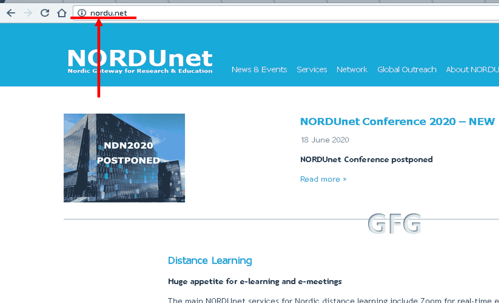

# .net 和 .org 域名之间的区别

> 原文: [https://www.geeksforgeeks.org/difference-between-net-and-org-domain/](https://www.geeksforgeeks.org/difference-between-net-and-org-domain/)

## 1. .net 域名

`.net` 是一个通用的顶级[域名](https://www.geeksforgeeks.org/domain-name-server-dns-in-application-layer/)，提供给网络实体或提供数据库或互联网服务的实体。由于 `.net` 域名的非限制性，它现在已经对所有实体和个人开放。如今，各种组织和实体也可以使用它。当 `.com` 域名不可用时，人们更喜欢用 `.net` 域名。

例如，`www.behance.net`、`www.broken.net`、`www.nsf.net`、`www.nyser.net`、`www.uu.net`、`www.sesqui.net`、`www.mr.net`、`www.oar.net`

**Nordu.net 是在 .net 下注册的第一个域名**

**Source –** `www.nordu.net`

## 2. .org 域名

`.org` 域名来源于 organisation 这个词。它是为非营利组织实体制作的。由于它变得不受限制，现在它对所有类型的实体开放使用。它也是最早形成的域名之一，也是一个通用的顶级域名。通用名称表明它不用于任何特定或赞助用途。

`.org` 域名的例子有 `www.geeksforgeeks.org`、`www.mitre.org`、`www.src.org`、`www.super.org`、`www.aero.org`、`www.mcnc.org`、`www.mn.org` 和 `www.rti.org`

**GeeksforGeeks 拥有 .org 域名**

## .net 和 .org 之间的区别

| 编号 | .net | .org |
| --- | --- | --- |
| 1. | 它用于通用和网络站点。 | 它用于学校、开源项目、社区和一些盈利和非政府组织。 |
| 2. | 第一个在 `.net` 域名下注册的网站是 `www.nordu.net`。 | 第一个在 `.org` 域名下注册的网站是 `www.mitre.org`。 |
| 3. | 注册由 `Verisign` 处理。这些域名可以由其他注册服务商（例如谷歌、Go Daddy）处理，但是，它们最终与 `Verisign` 有合作关系或从属关系。 | `.org` 由公共利益登记处（`PIR`）处理。这些域名可以由其他注册服务商（如谷歌、Go Daddy）处理，但它们最终会与 `PIR` 建立合作关系或附属关系。 |
| 4. | 它比 `.org` 贵（由于 `Verisign` 注册管理机构的盈利性质）。 | 它比 `.net` 便宜（由于 `PIR` 注册管理机构的非营利性质）。 |
| 5. | 例如：`www.behance.net`、`www.broken.net`、`www.nsf.net`、`www.nyser.net`、`www.uu.net`、`www.sesqui.net`、`www.mr.net`、`www.oar.net`。 | 例如：`www.geeksforgeeks.org`、`www.mitre.org`、`www.src.org`、`www.super.org`、`www.aero.org`、`www.mcnc.org`、`www.mn.org`、`www.rti.org`。 |
| 6. | 它只打算由像数据库这样的网络实体使用。网络、互联网服务和主机提供商。 | 它被介绍给各种各样的组织使用，不适合其他类别。 |
| 7. | 它来源于网络这个词。它面向基于网络的实体。 | 它来源于组织这个词。它是为非营利实体设计的。 |
| 8. | 注册网站是 `www.verisign.com`。 | `.org` 域名的注册表网站是 `www.pir.com`。 |