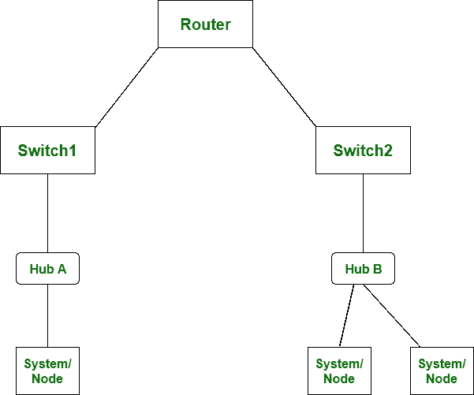

# 路由器和交换机的区别

> 原文:[https://www.geeksforgeeks.org/difference-between-router-and-switch/](https://www.geeksforgeeks.org/difference-between-router-and-switch/)

先决条件–[网络设备](https://www.geeksforgeeks.org/network-devices-hub-repeater-bridge-switch-router-gateways/)

`路由器`和`交换机`都是网络中的连接设备。`路由器`被用来确定数据包到达目的地的最小路径。

`路由器`的主要目标是同时连接各种网络，工作在`网络层`，而`交换机`的主要目标是同时连接各种设备，工作在`数据链路层`。

让我们看看`路由器`和`交换机`的区别:

| 不，先生。 | 路由器 | 转换 |
| --- | --- | --- |
| 1. | `路由器`的主要目标是同时连接各种网络。 | 而`交换机`的主要目标是同时连接各种设备。 |
| 2. | 它在`网络层`工作。 | 当它在`数据链路层`工作时。 |
| 3. | `局域网`和`城域网`都使用`路由器`。 | 而`交换机`仅由`局域网`使用。 |
| 4. | 通过`路由器`，数据以数据包的形式发送。 | 而通过`交换机`，数据以数据包和帧的形式发送。 |
| 5. | `路由器`中发生冲突较少。 | 而全双工交换中没有冲突发生。 |
| 6. | `路由器`兼容`NAT`。 | 而它与`NAT`不兼容。 |
| 7. | 路由的类型有:`自适应路由`和`非自适应路由`。 | 交换的类型有:`电路交换`、`分组交换`和`消息交换`。 |