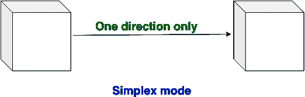
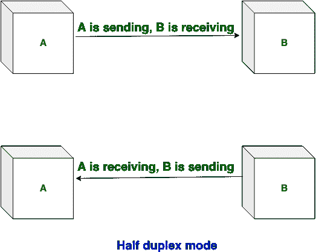
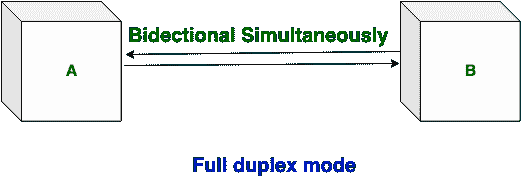

# 单工、半双工和全双工传输模式的区别

> 原文: [https://www.geeksforgeeks.org/difference-between-simplex-half-duplex-and-full-duplex-transmission-modes/](https://www.geeksforgeeks.org/difference-between-simplex-half-duplex-and-full-duplex-transmission-modes/)

## 先决条件
[计算机网络中的传输模式](https://www.geeksforgeeks.org/transmission-modes-computer-networks/)

有 3 种传输模式，如下所示：`Simplex mode`、`Half-duplex mode` 和 `Full-duplex mode`。这些解释如下。

### 1. Simplex mode:
在 `Simplex mode` 中，`Sender` 可以发送数据，但该 `Sender` 不能接收数据。这是一种单向通信。

### 2. 半双工模式:
在 `Half-duplex mode` 下，`Sender` 可以发送数据，也可以接收数据，但一次只能接收一个数据。这是双向通信，但一次只能有一个方向。

### 3. Full duplex mode:
在 `Full duplex mode` 中，`Sender` 可以发送数据，也可以同时接收数据。这是同时进行的双向通信。

## 单工、半双工和全双工传输模式的区别:

| 单工模式 | 半双工模式 | 全双工模式 |
| :--- | :--- | :--- |
| `Simplex mode` 是单向通信。 | `Half-duplex mode` 是双向通信，但一次只能进行一个方向。 | `Full-duplex mode` 同时是双向通信。 |
| 在 `Simplex mode` 下，`Sender` 可以发送数据，但不能接收数据。 | 在 `Half-duplex mode` 下，`Sender` 可以发送数据，也可以一次只接收一个数据。 | 在 `Full-duplex mode` 下，`Sender` 可以发送数据，也可以同时接收数据。 |
| `Simplex mode` 提供的性能不如 `Half-duplex` 和 `Full-duplex`。 | `Half-duplex mode` 提供的性能低于 `Full-duplex mode`。 | `Full-duplex` 比 `Simplex` 和 `Half-duplex` 模式提供更好的性能。 |
| `Simplex mode` 例子有：键盘和显示器。 | `Half-duplex mode` 的例子是：对讲机。 | `Full-duplex mode` 的例子是：电话。 |